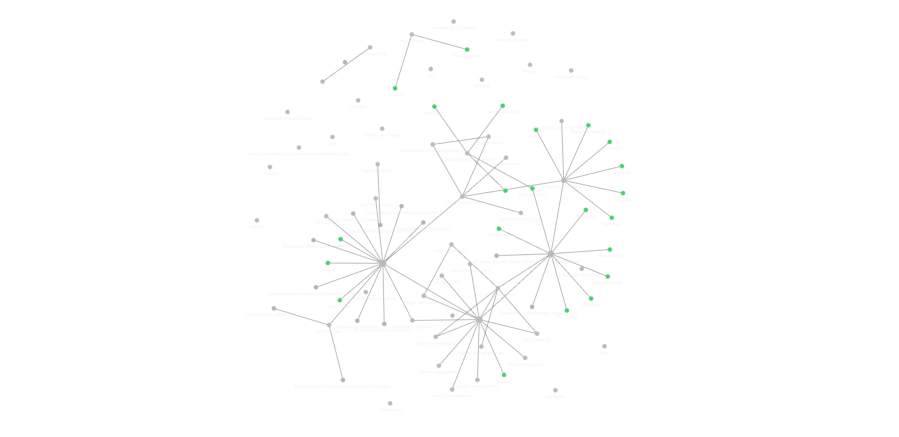

# fog-documentation

Documentation for FOG 1.X

This gets built by readthedocs via this readthedocs project [https://readthedocs.org/projects/fogproject/](https://readthedocs.org/projects/fogproject/)

The latest version will be available at [https://docs.fogproject.org/](https://docs.fogproject.org/)

See also for more discussion - [https://forums.fogproject.org/topic/14794/improve-documentation?_=1602258264683](https://forums.fogproject.org/topic/14794/improve-documentation?_=1602258264683)

The documentation is written in Markdown (put a link here) and built with mkdocs (put a link here) and hosted via readthedocs (put a link here). We use the mkDocs material theme (put a link here) and try to be compatible with viewing and editing via obsidian (links here)

# Editing in Obsidian

[Obsidian](https://obsidian.md) is a markdown note taking app that makes linking pages and images super simple. We've designed this repo to be able to be edited and viewed in obsidian or the mkdocs based website hosted on read the docs.

To open in obsidian, simply clone the repo or download and extract the zip. Then open the `docs` folder as a vault in obsidian.

You can then utilize graph view to see how all the documentation connects. This is a screenshot of the work in progress obsidian graph view




## Quirks

There are some quirks with creating this compatibility.

* Links in obsidian will default to filename format, which needs to be lower-case-with-dashes.md and that's not the friendliest look. So you need to add a friendly name for each link i.e.
	* Link to a specific heading of a page: `[[file-name#Heading name|Friendly Name For Link]]` 
	* Link to a Page: `[[file-name|Title Of Page]]`
		* If you have aliases defined in the [front matter](#Markdown-Front-matter), the friendly display name of the link will autofill when you add a link using the link insert/search tool (auto starts when you type `[[` in obsidian)
	* Link to an image `![[imageName.extension]]`
		* The image links don't need a friendly name. All images should be organized somewhere in the docs/assets/img folder. Each image should have a unique name, this makes it so you don't have to define the full path to the image, just the name and it wi
* Admonitions like these https://squidfunk.github.io/mkdocs-material/reference/admonitions/ should be created as obsidian callouts https://help.obsidian.md/How+to/Format+your+notes#Callouts  like this (We use a mkdocs plugin to convert callouts to admonitions at build time)

```
>[!note]
>Contents
```

That's pretty much it

# Converting to Markdown

Previously we were using RST for this documentation but we are migrating to markdown. An initial conversion was handled using pandoc on a local machine. The original rst files are still present. As markdown files are updated to have any links and image references fixed, as well as any other content updates, the relative rst of the markdown file can be deleted to signify it is fully converted and ready to move forward.

## Converting from mediawiki

The easiest way is to simply copy and paste the normal view of the wiki into an obsidian page

## Markdown front matter

We can put various things in our front matter, here's a basic example that should be at the top of each md page
This adds tags and titles that work in both obsidian and mkdocs. In obsidian, be sure to switch to view mode to hide the front matter

```
--- 
title: Can and should match first title heading
description: brief description of the page
aliases:
	- These are searchable alias titles
	- They autofill as the link display text when selected
	- making links even simpler while maintaining a lower-case-file-name-scheme
	- Should include the title above as one, and any other titles this page might need in links or searches
tags:
    - labels
    - for
    - category
    - searching
    - and
    - linking
---
```

# Rst Styling rules for the project

**This needs to be updated as we now use markdown with mkdocs and the mkdocs-material theme. Leaving it here for reference as we convert the RST files to md**

The goal of the below rules is to make it so adding a new page to a section is as simple as adding a new rst file, plopping in the proper headings and doing a git push. There are some special cases that we will try to document as we find them, but that is the general idea for adding docs.

As is noted below, you should always put `.. include:: ../includes.rst` at the top of your files so that you have access to all the _static resources and can easily add images, css, videos, etc.

## Index and ToC

In order for Table of contents to work properly it needs to only be made once per section and there needs to be only 1 master index.
To create the caption headings for each section we make a panel in the root index following this format

```:rst

   .. Link to main page for section. Follow this example to create a link with the text of the section name but it goes to specific page and heading 
   .. that you might consider the main starting page of the section. We aren't maintaining a homepage for each section as it creates circular toc issues

   :ref:`Installation <installation/install_fog_server:Install FOG server>`
   
   .. Create a bulleted list summary of what is found in the section

   - Documentation on the installation of fogserver
      
   .. Hidden Table of contents for section (displayed in left sidebar under given caption)
   .. Using the glob makes it so we can use the wildcard. However this also makes it alphabetical, you have to manually put in each file path if you
   .. want to specify a specific display order. Make sure to set the 'Caption' to the name of the section then list the folder name appended with '/*'
   .. to get all the top level files into that toc

   .. toctree::
      :maxdepth: 6
      :hidden:
      :glob:
      :caption: Installation
      
      installation/*

  .. The '---' signifies the end of a panel 

   ---
```


## Headings

Below are examples of how to define the titles and headings and where they should be separated into new pages
Anything defined as a heading or title can be linked to from anywhere else with the following syntax

- If you want to reference a heading within the same page use this syntax

```:rst
`Heading Name`_
```

- if you want to cross-reference a section from a different page/section use this syntax. The below example links to the install instructions for CentOS/Rhel 7
  - See also [Cross-Referencing with Sphinx - Auto label sections](https://docs.readthedocs.io/en/stable/guides/cross-referencing-with-sphinx.html#automatically-label-sections)

```:rst
:ref:`installation/install_fog_server:CentOS 7 or RHEL 7`
```

- Same reference but renaming it

```:rst
:ref:`Whatever you want it to say <installation/install_fog_server:CentOS 7 or RHEL 7>`
```

### Title/heading 1

```:rst
==============
Title/Heading1
==============
```

**These should be converted to `# Title/Heading1`**

Titles go with top level title pages that match the root folder structure.
These are only listed in the main index.rst page and at that to be the title at the very top of the documentation tree that everything else is under.
This may need to be used for breaking out sections further but not yet known.

### SubTitle/Heading 2

```:rst
------------------
SubTitle/Heading 2
------------------
```

**These should be converted to `## SubTitle/Heading2`**


For every subtitle/heading 2 you should have a rst file.
The Subtitle doesn't need to match the file name exactly but they should be similar, avoiding spaces in filenames is always good practice.
This makes editing the pages and finding specific sections much easier.
This also helps to avoid merge conflicts as many will contribute to this documentation.

#### Heading 3

```:rst
Heading 3
=========
```

**These should be converted to `### Heading3`**


Heading 3 is where you break up your sub-section into scannable headings.
There are typically a good number of these in your single rst files as they make up the bulk of the layout once you're in a subsection.

#### Heading 4

```:rst
Heading 4
---------
```

**These should be converted to `#### Heading4`**


These are for when you need another linkable level under a heading 3.

#### Heading 5

```:rst
Heading 5
#########
```

**These should be converted to `##### Heading5`**


This level of heading is less common, but can be handy when outlining a list with sections that may need to be linked to.

#### Heading 6

```:rst
Heading 6
^^^^^^^^^
```

**These should be converted to `###### Heading6`**


This heading level should rarely be used, but it is provided so that you have at least 4 levels to traverse through when writing out a section of documentation.

## Formatting

### Code Block

```
::

    Code line 1
    Code line 2
    
```

Shoud be converted to, or just indented without the preceeding :: should also work

```
    ```
    code
    ```
```

The text needs a blank line before and after. Each line needs to be tabbed at 4 spaces.

### Lists

```
This is an unordered list:

- Item 1
- Item 2
   - Subitem 1
   - Subitem 2
   
   ```
   
   Note the blank line before and after the list.
   
### References (Internal links)

```
:ref:`Instructions for using vi text editor <reference/vi:vi>`
```

**These should be changed to obsidian wikilinks**

Easiest method is 

```
[[pageFilename]]
```

or 

```
[[pageFileName#HeadingName]] 
```

Same thing for images anywhere in the assets folder 

```
![[imageName]]
```

You can change the display of links like so 

```
[display name](path\to\file#headingName)
```

NOTE: This must point to a heading within a file (page), not simply a file.
- We start with :ref: to say it's a reference.
- Without spaces, start a block quote/back tick quote for the whole thing
- Put in the display text (Instructions for using vi text editor)
- Then within a <> put in the contextual path to the file with a : followed by the heading to link to.
- End with a closing back tick. 
   
## Including images, css, videos, javascript, etc

At the top of every index.rst we have the line `.. include:: ../includes.rst`
This is a file at the root of the project that includes all the indexes in the `_static` directory.
This makes it so you have access to all the shared images, roles (aka css classes), and videos via simple `|labelNames|`
Below is outlined how to create and or view these label names.

### Images

Images are stored and organized by relatable sections at `/assets/img`
For every image you add you should add substitution label for it in the `assets/img/images.rst`

These should look like this referencing the full path

```:rst
.. Comment saying what image folder the file is in (keep things alphabetical)

.. |AllHosts| Image:: /assets/img/management/All_Hosts.png
```

The label name and the image path are case sensitive.

### Roles/Css Classes

There is a single css file located at `/_static/css/custom.css` which allows us to add things like colored text.
It is included in the project build via the conf.py files by these lines

```:python
html_static_path = ['_static']
html_css_files = [
    'css/custom.css',
    'js/custom.js'
]
```

The static path defines the root folder name `_static` (which is the default/standard naming) and the second array defines the relative paths to css and js files. We don't currently have anything in the custom.js file, it's there as a place holder just in case we need it later.

#### Using css roles
  
in the `/_static/css/roles.rst` file we can define roles like this

```:rst
`.. role:: red`
```

This role can be referenced inline in rst like this

```:rst
This field is :red:`required` for everyone
```

This would apply the css class `red` to the word 'required'
So we define something for the `red` class in the `custom.css` file like this

```:css
.red {
    color: red;
}
```

Thus resulting in red text for the word 'required'.

We have added classes/roles for red, yellow, and orange

#### Additional CSS Rules

We can also use additional css rules to override things in the built-in theme.
For example, we have this class defined

```:css
/* Override default theme max width of 800px so wide screens can view more content responsively */
.wy-nav-content {
    max-width: 1500px;
    width: auto;
}
```

Which, as the comment states, allows the body of the documentation text to expand more on wider screens.
Additional rules can be added at our leisure.

### Videos

Videos are hosted on our [FogProject youtube channel](https://www.youtube.com/channel/UCrvOQPcm1SDIfIrzWZ9K3bA/videos).
For every video in that channel we should add a substitution label in the video index.rst at `/_static/video/index.rst`
The format of the label is like this

```:rst
.. |videoName-vid| raw:: html

    <div style="text-align: center; margin-bottom: 2em;">
    <iframe width="100%" height="350" src="https://www.youtube-nocookie.com/embed/VIDEOID?rel=0" frameborder="0" allow="autoplay; encrypted-media" allowfullscreen></iframe>
    </div>
```

Make sure to use the embed video link with the privacy-enhanced mode enabled.

It is also good practice to add the `-vid` to the label name so that we keep images and videos differentiated

# Additional Info

Below are resources for writing in rst and building locally

## Other tips for writing in rst

- You can create a note with

```:rst
.. note:: note contents
```

**This should be converted to obsidian callouts**

```
>[!note] optional-note-title
>contents
>and more contents
```

You can also create warnings, tips, etc by replacing 'note' from above example

- You can create a warning with

```:rst
.. warning:: this is a warning
```

## Resources for writing in rst

These links are some good references for how to write in rst and how to configure and customize the readthedocs site

- [https://www.sphinx-doc.org/en/master/usage/restructuredtext/index.html](https://www.sphinx-doc.org/en/master/usage/restructuredtext/index.html)
- [https://www.ericholscher.com/blog/2016/jul/1/sphinx-and-rtd-for-writers/](https://www.ericholscher.com/blog/2016/jul/1/sphinx-and-rtd-for-writers/)
- [https://docs.readthedocs.io/en/stable/intro/getting-started-with-sphinx.html](https://docs.readthedocs.io/en/stable/intro/getting-started-with-sphinx.html)
- [https://docs.readthedocs.io/en/stable/guides/adding-custom-css.html?highlight=css](https://docs.readthedocs.io/en/stable/guides/adding-custom-css.html?highlight=css)
- [https://docs.readthedocs.io/en/stable/custom_domains.html?highlight=domain](https://docs.readthedocs.io/en/stable/custom_domains.html?highlight=domain)

## Building locally

see also [https://docs.readthedocs.io/en/stable/intro/getting-started-with-sphinx.html](https://docs.readthedocs.io/en/stable/intro/getting-started-with-sphinx.html)

To test and build documemtation locally you need the following

- Python 3.7+ (can install from python.org, windows store, apt-get, yum, chocolatey, etc.)
- sphinx (`pip install sphinx`)
- sphinx_rtd_theme (`pip install sphinx_rtd_theme`)

Once you have those pre-reqs installed follow these steps

- Clone the repo
- Add additional .rst documentation following the existing structure
- run `make.ps1` from the root of the repo
  - This will create your `.\_build` directory and run `make html` with the project's settings
  - This is just a powershell version of the autogenerated make.bat file. It has some built-in error handling to help find the sphinx-build.exe if it isn't added to your path
- note: at some point the `make.ps1` may have added functionality such as auto-creating the _static index.rst's from the included files.

You will now have the files for the html site in you `_build` directory (the `_build` directory is excluded via .gitignore)
You can then open the `index.html` file from `.\_build\html` to browse the site locally.

You can edit in whatever you so desire, but if you're on windows it is reccomennded to use microsoft vscode with the [lextudio restructuredtext](https://marketplace.visualstudio.com/items?itemName=lextudio.restructuredtext) extension. This helps with easy rst snippets and a live view.
