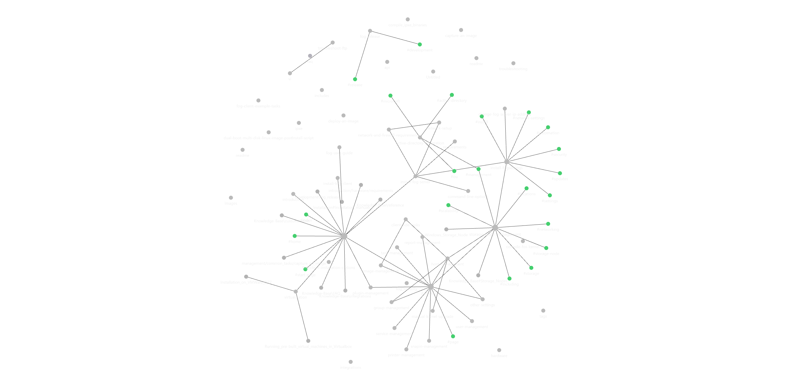

# fog-documentation

Documentation for FOG 1.X

This gets built by readthedocs via this readthedocs project [https://readthedocs.org/projects/fogproject/](https://readthedocs.org/projects/fogproject/)

The latest version will be available at [https://docs.fogproject.org/](https://docs.fogproject.org/)

See also for more discussion - [https://forums.fogproject.org/topic/14794/improve-documentation?_=1602258264683](https://forums.fogproject.org/topic/14794/improve-documentation?_=1602258264683)

The documentation is written in [Markdown](https://www.markdownguide.org/) and built with [MkDocs](https://www.mkdocs.org/) and hosted via [Read the Docs](https://readthedocs.org/). We use the [MkDocs Material theme](https://squidfunk.github.io/mkdocs-material/) and try to be compatible with viewing and editing via [Obsidian](https://obsidian.md).

# Editing in Obsidian

NOTE: Editing in obsidian is not required, it is just where a lot of our style rules derive from for compatibility and to provide a WYSIWYG option for a simpler entry point for anyone wanting to contribute. You can edit/write markdown in any editor and do a pull request, even right in the github web editor. 

[Obsidian](https://obsidian.md) is a markdown note taking app that makes linking pages and images super simple. We've designed this repo to be able to be edited and viewed in obsidian or the mkdocs based website hosted on read the docs.

To open in obsidian, simply clone the repo or download and extract the zip. Then open the `docs` folder as a vault in obsidian.

You can then utilize graph view to see how all the documentation connects. This is a screenshot of the work in progress obsidian graph view




## General Style/Structure Rules

While adhering to the style guide is appreciated, getting content into to docs (existing and new) is more important. So if you make a pull request with valid content we'll add style guide formatting and bring it in. 

* Every Page should have front matter aka metadata that defines
	* title (should match the title heading)
	* context_id (typically same as title, creates permanent link) 
	* description
	* aliases (for friendly link names, should include at least one that matches title)
	* tags
* Every md file should be named in all-lower-case-with-dashes-not-spaces
* Every folder should have a `README.md` file with the above mentioned front matter that serves as the index page with a simple description of that's in that folder

There's an obsidian compatible markdown template of this front matter available here https://github.com/FOGProject/fog-docs/blob/master/docs%2Fassets%2Ftemplates%2Fmetadata-template.md
	* i.e. a simple index page for a folder can look like this
```
---
title: Installation
context_id: Installation
aliases:
    - Installation
description: index page for installation
tags:
    - installation
---

# Installation

These are articles related to the installation and setup of FOG in your network, on your server and the service on your clients
```
	
- Links should be in the format `[[file-name|Alias name]]` These can be auto-completed by searching for the alias when editing in obsidian. 

## Quirks

There are some quirks with creating this compatibility.

* Links in obsidian are `[[wikilinks]]` which are enabled in mkdocs via the roaming links plugin. These provide a simpler formatting of links that allows you to move internal pages without breaking internal links.
* Links in obsidian will default to filename format, which needs to be lower-case-with-dashes.md and that's not the friendliest look. So you need to add a friendly name for each link i.e. 
	* Link to a specific heading of a page: `[[file-name#Heading name|Friendly Name For Link]]` 
	* Link to a Page: `[[file-name|Title Of Page]]`
		* If you have aliases defined in the [front matter](#Markdown-Front-matter), the friendly display name of the link will autofill when you add a link using the link insert/search tool (auto starts when you type `[[` in obsidian)
	* Link to an image `![[imageName.extension]]`
		* The image links don't need a friendly name. All images should be organized somewhere in the docs/assets/img folder. Each image should have a unique name, this makes it so you don't have to define the full path to the image, just the name and it will find it within the docs
* Admonitions like these https://squidfunk.github.io/mkdocs-material/reference/admonitions/ should be created as obsidian callouts https://help.obsidian.md/How+to/Format+your+notes#Callouts  like this (We use a mkdocs plugin to convert callouts to admonitions at build time)

```
>[!note]
>Contents
```

That's pretty much it

# Converting to Markdown

This documentation was previously written in RST and built with Sphinx; it has since been migrated to Markdown built with MkDocs. The original `.rst` source files were kept alongside the converted `.md` during the migration and have now been removed — Markdown is the only source format. The full git history still contains the old `.rst` files if you ever need to reference them.

## Converting from mediawiki

The easiest way is to simply copy and paste the normal view of the wiki into an obsidian page

## Markdown front matter

We can put various things in our front matter, here's a basic example that should be at the top of each md page
This adds tags and titles that work in both obsidian and mkdocs. In obsidian, be sure to switch to view mode to hide the front matter

```
--- 
title: Can and should match first title heading
description: brief description of the page
aliases:
	- These are searchable alias titles
	- They autofill as the link display text when selected
	- making links even simpler while maintaining a lower-case-file-name-scheme
	- Should include the title above as one, and any other titles this page might need in links or searches
tags:
    - labels
    - for
    - category
    - searching
    - and
    - linking
---
```

# Building locally

The site is built with [MkDocs](https://www.mkdocs.org/) using the
[Material theme](https://squidfunk.github.io/mkdocs-material/). To preview your
changes locally:

- Install [Python](https://www.python.org/) 3.8 or newer.
- Install the requirements: `pip install -r requirements.txt`
- From the root of the repo, run a live-reloading preview with `mkdocs serve`,
  then open <http://127.0.0.1:8000>.
- To produce a static build instead, run `mkdocs build` (the output directory is
  git-ignored).

On Windows you can instead run `make.ps1` from the repo root, which installs the
requirements and builds the site for you.

For page conventions — front matter, file naming, wikilinks, images, and
callouts — follow the style guide near the top of this README.
