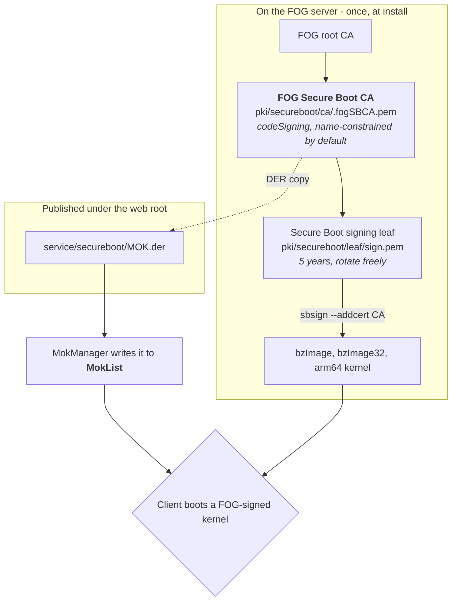

>[!info] This page describes FOG 1.5.
>See the [[1.6/kb/reference/secure-boot-trust-stores|1.6 version]] of this page for FOG 1.6.

# Secure Boot: the two trust stores (1.5)

Almost every confusing Secure Boot failure comes down to one thing: there are
**two independent trust stores**, the certificate you enrolled went into one of
them, and the way the machine booted consulted the other. Nothing errors. The
enrollment reads back as successful. The machine simply refuses to boot the
next stage.

This page is the mental model — it's UEFI/shim behavior, not anything FOG
1.5 does differently from 1.6. For what to actually run, see
[[1.5/kb/how-tos/secure-boot-mok-enrollment|MOK enrollment (1.5)]] — the only
enrollment route on this line, there is no Setup Mode alternative on 1.5. For
the concepts behind signing, see
[[1.5/kb/how-tos/secure-boot-signing|Secure Boot signing (1.5)]].

---

## What checks what

| Store | Lives in | Read by | Written by |
| --- | --- | --- | --- |
| `PK` (Platform Key) | UEFI NVRAM | firmware | the platform owner, once. Deleting it is what enters Setup Mode |
| `KEK` (Key Exchange Key) | UEFI NVRAM | firmware | a `PK`-signed update |
| `db` | UEFI NVRAM | **firmware, on every `LoadImage()`** | a `KEK`-signed update, or anything at all while in Setup Mode |
| `dbx` | UEFI NVRAM | firmware | as `db` — the revocation list |
| `MokList` | UEFI NVRAM | **shim, and only shim** | MokManager, after a console confirmation |

`MokList` is stored in firmware variables, which is exactly why it looks like a
firmware feature. It is not. It is shim's private store, in the same way a
config file in `/etc` is your application's and not the filesystem's.

>[!important] Firmware never reads `MokList`
>This is the single fact the rest of the page hangs off. A certificate in
>`MokList` and no shim in the boot chain is a certificate that will never be
>consulted by anything.

The reason a MOK works at all is that shim, once loaded, **installs itself as
the authority that later `LoadImage()` calls go through** — overriding the
firmware's own EFI security architecture protocol. So every stage loaded *after*
shim is checked against `MokList` (plus shim's built-in vendor certificate)
rather than against `db`. That override survives into iPXE, which is what lets
iPXE load a MOK-signed FOS kernel.

---

## FOG 1.5 has one enrollment route: MOK

>[!info] Setup Mode enrollment is a FOG 1.6 addition
>1.6 can also write directly into `db`/`KEK`/`PK` ("Setup Mode" enrollment),
>skipping shim entirely and requiring no human at the console. **FOG 1.5 has
>no equivalent** — MOK enrollment, requiring a person at the console once per
>machine, is the only route. Everything below describes that route.

| | MOK enrollment |
| --- | --- |
| Trust lands in | `MokList` — shim's list |
| Needs a shim in the chain | **yes** |
| Human at the console | **yes, once per machine** |
| Requires | any machine that can boot a shim |
| FOG publishes | `service/secureboot/MOK.der` |
| Guide | [[1.5/kb/how-tos/secure-boot-mok-enrollment\|MOK enrollment (1.5)]] |

`db` itself is still worth knowing about even though 1.5 has no built-in way
to enroll into it: a certificate in `db` works *whether or not* a shim is in
front, because shim also falls back to the firmware's own verification for
anything `MokList` does not cover. If your firmware lets you add to `db`
directly through its own Setup/Custom mode UI, you can do that by hand with
FOG 1.5's `MOK.der` — FOG just doesn't automate that step the way 1.6's
Setup Mode enrollment does.

---

## Which model applies is decided by what DHCP serves

Not by which key you generated, and not by which enrollment route you ran. The
boot file the client is handed determines whether a shim is ever in the chain,
and therefore which store gets consulted:

| DHCP boot file | Shim in the chain? | Certificate must be in |
| --- | --- | --- |
| `secureboot/snponly-shimx64.efi` | yes | `MokList` **or** `db` |
| `snponly.efi` (FOG's own, TFTP root) | no | `db` |
| `fog-ipxe\fogipxe.efi` from a local ESP | no | `db` |

This is the trap, and it is silent from end to end:

>[!danger] Enrolling a MOK while serving a shim-less boot file does nothing
>`mokutil --import` succeeds. `mokutil --test-key` reports the key enrolled.
>MokManager showed it. `MokList` reads back correctly. And the machine still
>refuses the first image it is handed, because the firmware went straight to
>`db`, found nothing, and stopped. There is no message anywhere that connects
>the two.

Serving the signed chain is covered in
[[1.5/kb/reference/secure-boot-technical-details#serve-the-signed-chain|Secure Boot technical details (1.5)]].

---

## How FOG 1.5's own enrollment works, end to end

The certificate enrolled is this server's Secure Boot CA — the same
two-tier CA/leaf split 1.6 uses, ported to 1.5 too:

Reading that in order:

1. **The installer mints a CA and a leaf under it**, once. The CA is *never*
   regenerated on later installs — a fresh one would silently strand every
   machine that already trusted the old one.
2. **The leaf signs the FOS kernels**, with `sbsign --addcert` embedding the CA
   certificate inside the signature so the verifier can build the chain.
   Neither private key is reachable by the web server; kernel downloads from
   the UI are signed by a root-only helper that takes no arguments.
3. **`MOK.der` is a DER copy of the CA certificate** — byte-identical to
   `pki/secureboot/ca/.fogSBCA.der`. That is the file you enroll.
4. **The client enrolls it** via MokManager into `MokList`. That's the only
   route on 1.5 — no Setup Mode alternative writes it into `db` for you.
5. **At boot**, the verifier sees a kernel signed by the leaf, follows
   `--addcert` up to the CA, finds the CA enrolled, and accepts it.

The PXE menu item fetches `MOK.der` over the network with `imgfetch`, straight
into iPXE's memory, where MokManager's *Enroll key from disk* browser can see
it. Details in
[[1.5/kb/how-tos/secure-boot-mok-enrollment#route-b--from-the-fog-boot-menu-no-operating-system-and-no-usb-stick|Route B (1.5)]].

---

## One certificate, the whole fleet

>[!note] There is no per-machine certificate, and no per-machine key
>Every client enrolls the identical `MOK.der`. Enrollment is not a
>registration: the client does not contact the server for something issued to
>it, and holds no private key afterwards. What it gains is a public
>certificate in a trust store.

- **A compromised client leaks nothing.** The only Secure Boot material on it
  is a public certificate that is already published over HTTP on your FOG
  server. There is no per-machine secret to steal and therefore no per-machine
  key to rotate.
- **The thing worth protecting is on the server.** Whoever holds
  `leaf/sign.key` can sign a kernel your fleet will boot. Whoever holds
  `ca/.fogSBCA.key` can mint a new signer your fleet will boot, indefinitely,
  without touching a single client. Back up `pki/secureboot/` the way you
  would a root password, and consider taking the CA key offline — see
  [[1.5/kb/reference/pki-zones|FOG's Certificate Zones (1.5)]].

### What the CA/leaf split actually buys

| Rotate | Cost |
| --- | --- |
| the **leaf** (`sign.key`/`sign.pem`) | re-sign the kernels. **No client is touched** — firmware trusts the issuer, not the signer |
| the **CA** (`.fogSBCA.*`) | re-enroll **every machine**, by hand, at each console. There is no remote path |

That is the whole reason the enrolled certificate is the CA rather than the
signer — see
[[1.5/kb/reference/pki-glossary#mok-cert-vs-signing-cert|MOK cert vs. signing cert (1.5)]]
and
[[1.5/kb/how-tos/secure-boot-signing#rotating-or-removing-a-key|Rotating or removing a key (1.5)]].

If you brought your own Secure Boot key via `--secure-boot-key`/
`--secure-boot-cert` with no CA above it (the only option 1.5 offers for a
supplied key — see
[[1.5/kb/reference/bringing-your-own-ca|Bringing your own CA (1.5)]]), you do
not get this: that flat leaf is both anchor and signer, so rotating it means
re-enrolling every machine, the same as rotating the CA above.

>[!warning] Revocation is still the hard part
>Nothing above gives you remote revocation. Removing trust from one machine is
>`mokutil --delete MOK.der` plus a console confirmation on that machine;
>removing trust fleet-wide means re-enrolling fleet-wide. Plan the CA key's
>custody accordingly — it is the one that cannot be rotated cheaply.

---

## Which file is which

| File | What it is |
| --- | --- |
| `pki/secureboot/ca/.fogSBCA.pem` / `.der` | **the Secure Boot CA.** The certificate that gets enrolled |
| `service/secureboot/MOK.der` | the published copy of that CA, for handing to clients. Same bytes as `.fogSBCA.der` |
| `pki/secureboot/leaf/sign.pem` | the signing leaf. Signs kernels; never enrolled anywhere |
| `pki/secureboot/MOK.key` / `MOK.pem` | the superseded flat MOK — a self-signed cert that was both anchor and signer, left over from a server that ran the pre-split layout |

---

## See also

- [[1.5/kb/how-tos/secure-boot-signing|Secure Boot signing (1.5)]] — the concepts, and the signing key
- [[1.5/kb/how-tos/secure-boot-mok-enrollment|MOK enrollment (1.5)]] — Routes A and B
- [[1.5/kb/reference/secure-boot-technical-details|Secure Boot technical details (1.5)]] — serving the chain
- [[1.5/kb/reference/pki-zones|FOG's Certificate Zones (1.5)]]
- [[1.5/kb/reference/pki-glossary|PKI & Secure Boot Glossary (1.5)]]
