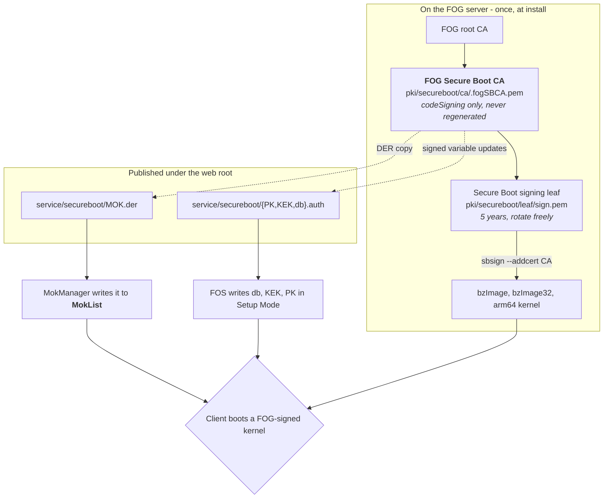

>[!info] Most of this page also applies to FOG 1.5
>The `db`/`MokList` mental model and FOG's MOK enrollment mechanics are the
>same on 1.5 — the only difference is Setup Mode enrollment (1.6-only). See
>the [[1.5/kb/reference/secure-boot-trust-stores|1.5 version]] of this page.

# Secure Boot: the two trust stores

Almost every confusing Secure Boot failure comes down to one thing: there are
**two independent trust stores**, the certificate you enrolled went into one of
them, and the way the machine booted consulted the other. Nothing errors. The
enrollment reads back as successful. The machine simply refuses to boot the
next stage.

This page is the mental model. For what to actually run, see
[[1.6/kb/how-tos/secure-boot-mok-enrollment|MOK enrollment]] and
[[secure-boot-setup-mode-enrollment|Setup Mode enrollment]]; for the concepts
behind signing, [[1.6/kb/how-tos/secure-boot-signing|Secure Boot signing]].

---

## What checks what

| Store | Lives in | Read by | Written by |
| --- | --- | --- | --- |
| `PK` (Platform Key) | UEFI NVRAM | firmware | the platform owner, once. Deleting it is what enters Setup Mode |
| `KEK` (Key Exchange Key) | UEFI NVRAM | firmware | a `PK`-signed update |
| `db` | UEFI NVRAM | **firmware, on every `LoadImage()`** | a `KEK`-signed update, or anything at all while in Setup Mode |
| `dbx` | UEFI NVRAM | firmware | as `db` — the revocation list |
| `MokList` | UEFI NVRAM | **shim, and only shim** | MokManager, after a console confirmation |

`MokList` is stored in firmware variables, which is exactly why it looks like a
firmware feature. It is not. It is shim's private store, in the same way a
config file in `/etc` is your application's and not the filesystem's.

>[!important] Firmware never reads `MokList`
>This is the single fact the rest of the page hangs off. A certificate in
>`MokList` and no shim in the boot chain is a certificate that will never be
>consulted by anything.

The reason a MOK works at all is that shim, once loaded, **installs itself as
the authority that later `LoadImage()` calls go through** — overriding the
firmware's own EFI security architecture protocol. So every stage loaded *after*
shim is checked against `MokList` (plus shim's built-in vendor certificate)
rather than against `db`. That override survives into iPXE, which is what lets
iPXE load a MOK-signed FOS kernel.

---

## The two enrollment models

| | Setup Mode enrollment | MOK enrollment |
| --- | --- | --- |
| Trust lands in | `db` — the firmware's own list | `MokList` — shim's list |
| Needs a shim in the chain | **no** | **yes** |
| Human at the console | no | **yes, once per machine** |
| Requires | firmware that can enter Setup Mode (often labelled *Custom*) | any machine that can boot a shim |
| Also replaces | `PK` and `KEK` — you become the platform owner | nothing |
| FOG publishes | `service/secureboot/{PK,KEK,db}.auth` | `service/secureboot/MOK.der` |
| FOG release | 1.6 | any |
| Guide | [[secure-boot-setup-mode-enrollment\|Setup Mode enrollment]] | [[1.6/kb/how-tos/secure-boot-mok-enrollment\|MOK enrollment]] |

They are **not alternatives that conflict**. A machine can hold the same
certificate in both stores, and some will. They are two delivery routes for one
certificate, chosen by what the firmware in front of you will let you do.

>[!warning] Setup Mode enrollment replaces the platform's trust anchor
>Writing a new `PK` means whatever is *not* in the `db` you wrote stops being
>bootable. This is why FOG's `db.auth` carries Microsoft's published CAs
>alongside FOG's own certificate — omit them and you break both the installed
>Windows and FOG's own shim, having just enrolled a key for the sake of
>FOG's shim. See
>[[secure-boot-setup-mode-enrollment#requirements|Setup Mode enrollment]].

---

## Which model applies is decided by what DHCP serves

Not by which key you generated, and not by which enrollment route you ran. The
boot file the client is handed determines whether a shim is ever in the chain,
and therefore which store gets consulted:

| DHCP boot file | Shim in the chain? | Certificate must be in |
| --- | --- | --- |
| `secureboot/snponly-shimx64.efi` | yes | `MokList` **or** `db` |
| `snponly.efi` (FOG's own, TFTP root) | no | `db` |
| `fog-ipxe\fogipxe.efi` from a local ESP | no | `db` |

This is the trap, and it is silent from end to end:

>[!danger] Enrolling a MOK while serving a shim-less boot file does nothing
>`mokutil --import` succeeds. `mokutil --test-key` reports the key enrolled.
>MokManager showed it. `MokList` reads back correctly. And the machine still
>refuses the first image it is handed, because the firmware went straight to
>`db`, found nothing, and stopped. There is no message anywhere that connects
>the two.

The reverse case is fine and worth knowing: a certificate in `db` works
*whether or not* a shim is in front, because shim also falls back to the
firmware's own verification for anything `MokList` does not cover. `db` is the
broader answer; MOK is the one you can reach without owning the `PK`.

Serving the signed chain is covered in
[[1.6/kb/reference/secure-boot-technical-details#serve-the-signed-chain|Secure Boot technical details]],
and the shim-less local-boot case in [[local-esp-boot|Local ESP boot]].

---

## How FOG's own enrollment works, end to end

Both routes enroll **the same certificate**: this server's Secure Boot CA.

Reading that in order:

1. **The installer mints a CA and a leaf under it**, once. The CA is *never*
   regenerated on later installs — a fresh one would silently strand every
   machine that already trusted the old one.
2. **The leaf signs the FOS kernels**, with `sbsign --addcert` embedding the CA
   certificate inside the signature so the verifier can build the chain.
   Neither private key is reachable by the web server; kernel downloads from
   the UI are signed by a root-only helper that takes no arguments.
3. **`MOK.der` is a DER copy of the CA certificate** — byte-identical to
   `pki/secureboot/ca/.fogSBCA.der`. That is the file you enroll, by either
   route. `db.auth` carries the same certificate.
4. **The client enrolls it** — via MokManager into `MokList`, or via FOS into
   `db`. Either way the client stores a *public certificate* and nothing else.
5. **At boot**, the verifier sees a kernel signed by the leaf, follows
   `--addcert` up to the CA, finds the CA enrolled, and accepts it.

The PXE menu item fetches `MOK.der` over the network with `imgfetch`, straight
into iPXE's memory, where MokManager's *Enroll key from disk* browser can see
it — which is why Route B needs no USB stick. Details in
[[1.6/kb/how-tos/secure-boot-mok-enrollment#route-b--from-the-fog-boot-menu-no-operating-system-and-no-usb-stick|Route B]].

---

## One certificate, the whole fleet

>[!note] There is no per-machine certificate, and no per-machine key
>Every client enrolls the identical `MOK.der`. Enrollment is not a
>registration: the client does not contact the server for something issued to
>it, and holds no private key afterwards. What it gains is a public
>certificate in a trust store.

This surprises people who expect the fog-client model, where each host does get
its own material. Secure Boot is not that shape, and it does not need to be:

- **A compromised client leaks nothing.** The only Secure Boot material on it
  is a public certificate that is already published over HTTP on your FOG
  server. There is no per-machine secret to steal and therefore no per-machine
  key to rotate.
- **The thing worth protecting is on the server.** Whoever holds
  `leaf/sign.key` can sign a kernel your fleet will boot. Whoever holds
  `ca/.fogSBCA.key` can mint a new signer your fleet will boot, indefinitely,
  without touching a single client. Back up `pki/secureboot/` the way you would
  a root password, and consider taking the CA key offline —
  see [[1.6/kb/reference/pki-zones|FOG's Certificate Zones]].

### What the CA/leaf split actually buys

The split does deliver "you do not have to rekey the fleet" — but for
**signing-key rotation**, not for containing a client compromise:

| Rotate | Cost |
| --- | --- |
| the **leaf** (`sign.key`/`sign.pem`) | re-sign the kernels. **No client is touched** — firmware trusts the issuer, not the signer |
| the **CA** (`.fogSBCA.*`) | re-enroll **every machine**, by hand, at each console. There is no remote path |

That is the whole reason the enrolled certificate is the CA rather than the
signer. Before the split, FOG enrolled a self-signed leaf — the same object was
both the thing you must never change and the thing you want to rotate, so
rotating the signer meant a physical trip to every machine. See
[[1.6/kb/reference/pki-glossary#mok-cert-vs-signing-cert|MOK cert vs. signing cert]] and
[[1.6/kb/how-tos/secure-boot-signing#rotating-or-removing-a-key|Rotating or removing a key]].

>[!warning] Revocation is still the hard part
>Nothing above gives you remote revocation. Removing trust from one machine is
>`mokutil --delete MOK.der` plus a console confirmation on that machine;
>removing trust fleet-wide means re-enrolling fleet-wide. Plan the CA key's
>custody accordingly — it is the one that cannot be rotated cheaply.

---

## Which file is which

Four filenames in this area look alike and mean different things:

| File | What it is |
| --- | --- |
| `pki/secureboot/ca/.fogSBCA.pem` / `.der` | **the Secure Boot CA.** The certificate that gets enrolled |
| `service/secureboot/MOK.der` | the published copy of that CA, for handing to clients. Same bytes as `.fogSBCA.der` |
| `pki/secureboot/leaf/sign.pem` | the signing leaf. Signs kernels; never enrolled anywhere |
| `pki/secureboot/admin-MOK.pem` | **not per-machine.** The installer's own copy of a pair you supplied with `--secure-boot-key`/`--secure-boot-cert`, kept out of the web root so a reinstall cannot delete it. Named `admin-` only to avoid overwriting FOG's generated `MOK.*` |
| `pki/secureboot/MOK.key` / `MOK.pem` | the superseded [[1.6/kb/reference/pki-glossary#flat-mok\|flat MOK]] — a self-signed cert that was both anchor and signer. Left on disk, no longer used for new signing |

---

## See also

- [[1.6/kb/how-tos/secure-boot-signing|Secure Boot signing]] — the concepts, and the signing key
- [[1.6/kb/how-tos/secure-boot-mok-enrollment|MOK enrollment]] — Routes A and B
- [[secure-boot-setup-mode-enrollment|Setup Mode enrollment]] — the unattended route
- [[1.6/kb/reference/secure-boot-technical-details|Secure Boot technical details]] — serving the chain
- [[local-esp-boot|Local ESP boot]] — the shim-less case
- [[1.6/kb/reference/pki-zones|FOG's Certificate Zones]]
- [[1.6/kb/reference/pki-glossary|PKI & Secure Boot Glossary]]
