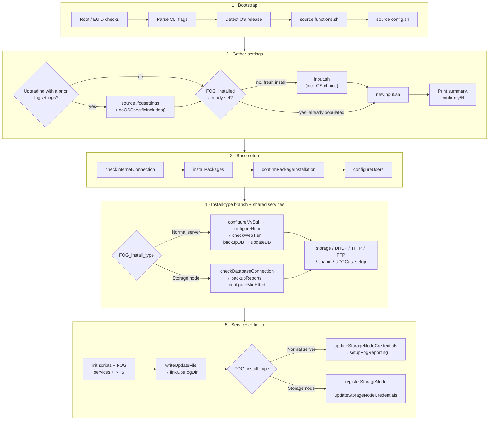
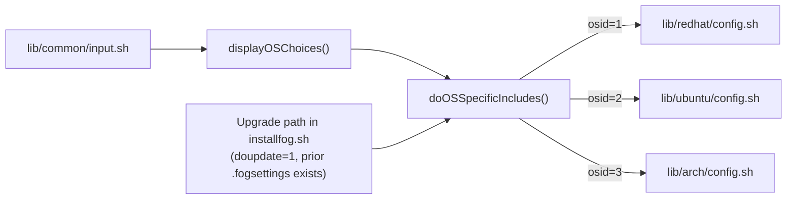

# Install Script Architecture

FOG's server installer is [`bin/installfog.sh`](https://github.com/FOGProject/fogproject/blob/dev-branch/bin/installfog.sh)
in the main `fogproject` repository, plus a handful of files it sources from
`lib/`. This page maps how those pieces fit together, for anyone debugging a
failed install, changing installer behavior, or adding support for a new
Linux distribution. It intentionally does **not** repeat what's already
documented for end users:

- For running the installer and what it asks you, see
  [[installation/server/install-fog-server|Install FOG Server]].
- For every CLI flag, see
  [[installation/server/command-line-options|Fog installer command line options]].
- For the persisted settings file the installer reads/writes, see
  [[management/server/install-fogsettings|The .fogsettings file]].

## Where the code lives

| File | Role |
|---|---|
| [`bin/installfog.sh`](https://github.com/FOGProject/fogproject/blob/dev-branch/bin/installfog.sh) | Entry point. Root/OS checks, CLI parsing, orchestrates everything else. |
| [`lib/common/functions.sh`](https://github.com/FOGProject/fogproject/blob/dev-branch/lib/common/functions.sh) | ~3,000 lines — almost every function the installer calls lives here. |
| [`lib/common/config.sh`](https://github.com/FOGProject/fogproject/blob/dev-branch/lib/common/config.sh) | OS-agnostic path/service defaults, plus systemd-vs-init.d detection. |
| [`lib/common/input.sh`](https://github.com/FOGProject/fogproject/blob/dev-branch/lib/common/input.sh) | Interactive prompts for a fresh install (interface, DHCP, HTTPS, install type, OS choice, …). |
| [`lib/common/newinput.sh`](https://github.com/FOGProject/fogproject/blob/dev-branch/lib/common/newinput.sh) | A small, unconditional prompt set (certificate hostname, usage reporting) — see [why it's separate](#interactive-input-inputsh-vs-newinputsh). |
| [`lib/common/utils.sh`](https://github.com/FOGProject/fogproject/blob/dev-branch/lib/common/utils.sh) | **Not** part of the main install flow — a standalone "what version of FOG is installed" helper script that reuses `functions.sh`'s `displayBanner`/`dots`. |
| [`lib/redhat/config.sh`](https://github.com/FOGProject/fogproject/blob/dev-branch/lib/redhat/config.sh), [`lib/ubuntu/config.sh`](https://github.com/FOGProject/fogproject/blob/dev-branch/lib/ubuntu/config.sh), [`lib/arch/config.sh`](https://github.com/FOGProject/fogproject/blob/dev-branch/lib/arch/config.sh) | The per-OS abstraction layer — see [below](#the-per-os-abstraction-layer). |

## High-level install flow

Read this as five rows, top to bottom — each row itself flows left to right:

The two `FOG_install_type` branches diverge for a reason: a **Normal server**
owns the database (`configureMySql`, `checkWebTier`, `backupDB`, `updateDB`
deploy/verify the schema itself), while a **Storage Node** talks to an
*existing* master instead (`checkDatabaseConnection` just pings it,
`configureMinHttpd` installs a stub `index.php` that refuses to serve the
web UI, and `registerStorageNode` announces the new node to that master).
Both paths converge on the same storage/DHCP/TFTP/FTP/snapin/service setup
in the middle, and both eventually call `updateStorageNodeCredentials` to
keep the node's own login in sync.

## The per-OS abstraction layer

`functions.sh` and `installfog.sh` are written OS-agnostically — anywhere
they need a package name, service name, or config path, they read a
variable instead of hardcoding one. Those variables are supplied by exactly
one of three files, dispatched by `doOSSpecificIncludes()`
(defined in `functions.sh`) based on `$osid`:

`doOSSpecificIncludes()` runs from **two** places, not one: once from inside
`displayOSChoices()` during the normal interactive flow (`input.sh` → OS
prompt → this dispatch), and once directly from `installfog.sh` right after
sourcing a prior `.fogsettings` on the upgrade path — because that upgrade
fast-path can skip `input.sh` entirely (see
[below](#interactive-input-inputsh-vs-newinputsh)), which would otherwise
mean the per-OS variables never get (re-)loaded for that run. Arch is also
special-cased here: `doOSSpecificIncludes()` force-sets `systemctl="yes"`
for `osid=3` regardless of what `lib/common/config.sh`'s systemd detection
found.

### The contract every OS file implements

All three files follow the same idiom — `[[ -z $var ]] && var="default"` —
so a value already set (by a CLI flag, or by a prior `.fogsettings` on
upgrade) is always left alone rather than overwritten. The variables every
one of them defines:

`packageQuery`, `FOG_packages`, `packageinstaller`, `packagelist`,
`packageupdater`, `packmanUpdate`, `langPackages`, `dhcpname`,
`webdirdest`/`WEB_docroot`, `webredirect`, `apacheuser`, `apachelogdir`,
`apacheerrlog`, `apacheacclog`, `etcconf`, `STORAGE_image_share_path`,
`storageLocationCapture`, `dhcpconfig`, `dhcpconfigother`, `tftpdirdst`,
`ftpconfig`, `snapindir`, `DHCP_service_name`, `iscservice`, `keapackage`,
`keaservice`.

A few variables are **not** universal — an implementation adding a fourth
OS should treat these as optional extras the other files happen to need,
not required interface members: `repoenable` (RedHat only), `phpfpm`
(RedHat only — Debian's php-fpm is handled by package naming alone),
`nfsexportsopts` (RedHat's Mageia branch only), `tftpconfigupstartdefaults`
(Ubuntu only), and `tftpconfig`/`ftpxinetd`/`httpdconf` (Arch only, because
Arch is the one OS here that still supervises tftp/ftp through `xinetd`
instead of a standalone daemon).

### What meaningfully differs between the three

| Concern | RedHat family (`osid=1`) | Ubuntu/Debian family (`osid=2`) | Arch (`osid=3`) |
|---|---|---|---|
| Package manager | `dnf` or `yum`, auto-detected; **hard-fails if neither exists** | `apt-get`/`dpkg`, assumed unconditionally | `pacman`, assumed unconditionally |
| DB engine naming | Hardcoded `mysql`/`mariadb` names per distro branch | **Runtime-probes** whether `mysql-server` is already installed to pick MySQL vs. MariaDB package names | Hardcoded `mariadb` names |
| DHCP service name | `dhcpd` / `dhcp-server` (RHEL 8+) vs. `dhcp` (RHEL 7-) | `isc-dhcp-server` (same name for package and service) | `dhcpd4` |
| Default web docroot | `/var/www/html/` | `/var/www/html/`, falling back to `/var/www/` if that doesn't exist | `/srv/http/` |
| Apache run-as user | `apache` | `www-data` | `http` |
| TFTP root | `/tftpboot` (Mageia: `/var/lib/tftpboot`) | `/tftpboot` | `/srv/tftp` |
| Service supervision | systemd or `chkconfig`/`init.d` | systemd or `sysv-rc-conf`/`insserv` | systemd (forced) **+** `xinetd` for tftp/ftp |
| Internal OS branching | Richest — a Mageia sub-case, plus `$OSVersion`-gated package renames | One branch covering ubuntu/debian/mint uniformly (doesn't distinguish Debian from Ubuntu at all) | None — Arch is treated as one flat target |

Kea DHCP support (an alternative to ISC-DHCP) is nominally available on all
three — each sets `keapackage`/`keaservice` — but availability is actually
decided at install time by `resolveDHCPEngine()` probing whether the named
package installs, not by anything in the per-OS files themselves.

## Interactive input: `input.sh` vs `newinput.sh`

Both files use the same idiom: a `while [[ -z $var ]]; do … done` loop per
question, which is skipped entirely if the variable is already set (by a
CLI flag or `.fogsettings`) and otherwise prompts with a computed default
that can be accepted with a bare `<Enter>` (unless `-d`/`--no-defaults` is
passed, or `-y`/`--autoaccept` skips the prompt altogether).

`input.sh` is the bulk of the interactive flow: network interface, router,
DNS, DHCP range, install language, install type, storage-node DB
credentials, HTTPS. But it's only sourced when
`[[ ! $doupdate -eq 1 || ! $FOG_installed -eq 1 ]]` — i.e. it's **skipped
entirely on an upgrade** where the loaded `.fogsettings` already has
`FOG_installed=1`.

`newinput.sh` has no such guard — `installfog.sh` always sources it. It
exists specifically so a prompt introduced *after* someone's `.fogsettings`
was last written still gets asked on their next upgrade, even though the
bulk of `input.sh` gets bypassed for them. It currently asks exactly two
things: the hostname used for the generated TLS certificate's CN (not the
system hostname), and whether to opt in to anonymous usage reporting
(OS name, OS version, FOG version only). Any newly-added prompt that needs
to reach existing installs on upgrade belongs here, not in `input.sh`.

## Function reference by concern

Nearly everything below lives in `lib/common/functions.sh`; a function is
called "internal" if nothing in `installfog.sh` calls it directly — only
other functions in the library do.

### Package installation & repos

| Function | Purpose |
|---|---|
| `installPackages()` | Builds the final `$packages` list per OS/version (MySQL-vs-MariaDB naming, language packs, EPEL/Remi or PPA repo setup), calls `resolveDHCPEngine`, installs everything. |
| `confirmPackageInstallation()` | Re-queries every package in `$packages` to confirm it actually landed. |
| `addOndrejRepo()` | *Internal.* Debian/Ubuntu-only PHP/Apache PPA setup, called from `installPackages`. |
| `resolveDHCPEngine()` | *Internal.* Chooses ISC-DHCP vs. Kea for the FOG-hosted DHCP service — see [DHCP](#dhcp-isc-vs-kea) below. |

### MySQL/MariaDB & schema deploy

| Function | Purpose |
|---|---|
| `configureMySql()` | The largest function in the file. Resolves the right DB systemd unit, detects and secures a passwordless root account, creates/rotates the `fogstorage` user, and (unless external-DB mode) does first-run `mysql_install_db` on Arch. |
| `checkDatabaseConnection()` | Storage-node path: pings the master DB with the configured credentials. |
| `backupDB()` | Downloads a `.sql` backup via the web tier before an upgrade; no-ops in external-DB mode. |
| `updateDB()` | Orchestrates the schema deploy — POSTs the schema-update request with an install token, or prints login/token instructions for a manual browser-driven update, then verifies it landed. |
| `schemaVersionInDB()`, `fogUserCount()` | *Internal*, both only called from `updateDB`. Echo a number or **nothing** — callers must treat empty as "unknown," never as zero (see [gotchas](#design-decisions-worth-knowing-before-you-touch-this-file)). |
| `verifySchemaDeploy()` | *Internal.* Confirms the deployed schema version actually matches what the code expects. |

### Apache/httpd & the web tier

| Function | Purpose |
|---|---|
| `configureHttpd()` | Stops httpd/php-fpm, deploys the web files, generates the per-install schema bootstrap token, writes `config.class.php`, and (Arch only) rewrites `httpd.conf`/`php.ini` since Arch ships most modules disabled by default. |
| `configureMinHttpd()` | Storage-node variant — calls `configureHttpd()` then overwrites `management/index.php` with a stub that refuses to serve the UI. |
| `createSSLCA()` | *Internal.* Creates/reuses the self-signed CA and server cert, writes the Apache vhost, tunes php-fpm's pool config. |
| `downloadfiles()` | *Internal.* Downloads kernel/init/iPXE/client binaries from GitHub Releases with SHA-256 verification and retries. |
| `checkWebTier()` | Probes the web UI for an actual non-empty response before trusting anything else that talks to it — see [gotchas](#design-decisions-worth-knowing-before-you-touch-this-file). |

### DHCP (ISC vs. Kea)

| Function | Purpose |
|---|---|
| `configureDHCP()` | Top-level entry point. If FOG isn't hosting DHCP, just drops a reference Kea config (`writeKeaSample`) for admins running DHCP elsewhere. Otherwise computes the subnet/range and writes either an ISC `dhcpd.conf` (with one `class` block per boot architecture) or hands off to Kea. |
| `configureKeaDHCP()` | *Internal.* Writes the live Kea config in two tiers — the base architecture classes must pass `kea-dhcp4 -t`, but the Apple BSDP class addition is best-effort and silently dropped if Kea rejects it. |
| `writeKeaSample()`, `_writeKeaConfig()`, `_keaBaseClasses()`, `_keaAppleClass()` | *Internal.* Shared helpers so the live Kea config and the copy-ready sample can't drift apart — deliberately mirroring the ISC `class` blocks in `configureDHCP()`. |

### TFTP/PXE, NFS, FTP, UDPCast

| Function | Purpose |
|---|---|
| `configureTFTPandPXE()` | Rebuilds iPXE (trusting the site CA if HTTPS is on), deploys the TFTP tree, and sets up the TFTP service — `tftpd-hpa` on Debian-family, or a hand-written `fog-tftp.service`/`.socket` pair elsewhere. |
| `configureDefaultiPXEfile()` | *Internal.* Writes the iPXE boot script that chains to `service/ipxe/boot.php`. |
| `configureNFS()` | Rewrites `/etc/exports` (unless `-E`/`--no-exportbuild`) mapping to the FOG user, and warns explicitly if an existing export still has `no_root_squash`. |
| `configureFTP()` | Writes `vsftpd.conf`, adding `seccomp_sandbox=NO` on vsftpd ≥3.2. |
| `configureUDPCast()` | Extracts the vendored UDPCast source and builds/installs it, with a Broadcom-CPU-specific `config.guess`/`config.sub` refresh. |

### Services & init scripts

| Function | Purpose |
|---|---|
| `installFOGServices()` | Copies the FOG background service binaries into place. |
| `installInitScript()` | Deploys the systemd units / init.d scripts, then calls `enableInitScript`. |
| `enableInitScript()`, `startInitScript()`, `stopInitScript()` | *Internal.* Enable/start/stop every service in `$serviceList`, branching on `$systemctl` and (for the non-systemd fallback) `$osid`. |
| `configureFOGService()` | Writes the services' `config.php` webroot setting. |

### Users, SELinux, firewall

| Function | Purpose |
|---|---|
| `configureUsers()` | Creates the `fogproject` system account, installs a login-warning script so nobody mistakes it for an interactive account, and sets/validates its password. |
| `checkPasswordChars()`, `generatePassword()` | *Internal*, called from `configureUsers`/`configureMySql`. Enforce/generate passwords the installer's own tooling can safely handle. |
| `checkSELinux()` | Offers to set SELinux to permissive (defaults to **yes**). |
| `checkFirewall()` | Detects a non-default iptables ruleset or a running firewalld and offers to disable it (defaults to **no**, unlike SELinux). |

### Network/IP-math helpers

*All internal*, used while computing DHCP ranges and validating interface config: `validip()`, `getCidr()`, `mask2cidr()`, `cidr2mask()`, `mask2network()`, `interface2broadcast()`, `subtract1fromAddress()`, `addToAddress()`, `getAllNetworkInterfaces()` (called from `input.sh`, not from within `functions.sh` itself).

### Storage node, settings, and misc

| Function | Purpose |
|---|---|
| `registerStorageNode()`, `updateStorageNodeCredentials()` | Register a new storage node with an existing master, and keep its login in sync on every run. |
| `writeUpdateFile()` | Writes `/opt/fog/.fogsettings` — see [[install-fogsettings\|The .fogsettings file]] for the format itself. Maintains one canonical list of managed keys so the fresh-write and in-place-upgrade-merge paths can't drift apart. |
| `configureStorage()`, `configureSnapins()`, `linkOptFogDir()` | Create/permission the image storage, snapin, and `/opt/fog` symlink locations. |
| `checkInternetConnection()` | DNS/HTTP/HTTPS reachability probe against a small set of well-known hosts, with distro-specific troubleshooting hints on failure. |
| `setupFogReporting()` | Installs the randomized-schedule cron job behind the anonymous usage-reporting opt-in from `newinput.sh`. |
| `dots()`, `errorStat()` | The `" * Doing thing........."` progress UI and the centralized pass/fail handler nearly every other function calls. |
| `diffconfig()`, `linkIfAbsent()` | Config-file-safe-write helpers — see [gotchas](#design-decisions-worth-knowing-before-you-touch-this-file). |

## Design decisions worth knowing before you touch this file

`functions.sh` carries unusually detailed inline comments explaining *why*
something is done a certain way, usually because it wasn't done that way
before and that caused a real, reported problem. These are the ones worth
reading before changing the surrounding code:

- **`linkIfAbsent()` (not `ln -sf`).** A bare `ln -s` used to log a scary
  "File exists" error on every re-install because the link from the
  previous run was still there — harmless, but it read as a failed upgrade
  and sent at least one user chasing a phantom bug ([forums topic
  18204](https://forums.fogproject.org/topic/18204)). `ln -sf` isn't used
  either, because some distros ship these paths themselves (Fedora ships
  its own `mysql.service`), and clobbering a packaged file is worse than
  skipping a link that wasn't needed. It does replace a *dangling* link,
  though — one FOG created itself on an older version, which is useless to
  systemd and can shadow a working unit.
- **`checkWebTier()` catches a zero-byte 500.** A PHP fatal in FOG's boot
  chain returns an empty HTTP 500, which every other check in the installer
  used to treat as success — that's how an install could print
  "Setup complete" over a completely dead site. This probe checks that
  bytes actually came back, not just the exit code.
- **`schemaVersionInDB()` / `fogUserCount()` — empty means "unknown," never
  "zero."** Guessing "fresh install" for an established one would print a
  live install token where an attacker could see it; guessing "established"
  for a genuinely fresh one would strand it with no way to bootstrap. Every
  caller has to handle "I couldn't tell" as its own case.
- **`updateDB()` defaults to the automatic schema update.** It used to only
  set `dbupdate` from the `-y` flag, so every interactive install fell
  through to a "press Enter when you've updated it in the browser" path
  that verified nothing and printed the install token to the terminal.
  Automatic is now the default; declining it is a deliberate opt-out.
- **The `mariadb.service` unit aliasing exists for a subtle reason.**
  `lib/common/config.sh` symlinks `mariadb.service` onto `mysql.service`/
  `mysqld.service` names so `configureMySql()`'s unit lookup finds it
  whatever the distro calls it — but the lookup itself has to prefer a real
  unit over an alias, because on a fresh install (before the DB has ever
  started) `systemctl list-unit-files` returns the alias symlinks
  *alongside* the real unit, and `grep -o` doesn't rank matches by
  preference.
- **No `a2enmod php` on Debian.** Debian/Ubuntu name that module
  `php7.4`/`php8.3`/etc., never plain `php`, so this call only ever failed —
  and enabling it would be wrong anyway, since FOG serves PHP through FPM
  via `proxy_fcgi`, and `mod_php` forces the incompatible `mpm_prefork`.
- **ISC and Kea DHCP configs are generated from shared helpers** (
  `_keaBaseClasses()`, `_keaAppleClass()`) specifically so the live Kea
  config and its ISC counterpart in `configureDHCP()` can't drift apart —
  the architecture-to-boot-file mapping has to stay identical between them.
- **`configureNFS()` warns explicitly about `no_root_squash`.** Captures
  land as root; if the export still allows that, moving the finished image
  out of the capture directory fails with a `550 Rename failed` that's easy
  to mistake for something else.
- **External/unprivileged database mode short-circuits several functions.**
  `backupDB()`, `updateDB()`'s `fogstorage`-grant step, and
  `checkDatabaseConnection()`'s local-auth path all explicitly skip work
  when `$DB_external == 1`, rather than trying to make root-requiring
  operations degrade gracefully.

## Debugging the installer

- Every run writes `error_logs/foginstall.log` (the full tee'd output) and
  `error_logs/fog_error_<version>.log` (command-level errors only) under the
  directory you ran the installer from — normally `bin/` in the cloned repo.
- `-X`/`--exitFail` makes most failures non-fatal so you can see how far a
  broken step actually got instead of stopping at the first `errorStat`
  failure. `configureDHCP()` in particular treats a Kea/ISC config failure
  as non-fatal by default already, specifically so TFTP/PXE setup still
  runs afterward.
- `-d`/`--no-defaults` forces every prompt to be answered explicitly instead
  of accepting a guessed default — useful when you suspect the auto-detection
  (interface, router, DNS, hostname) picked the wrong thing.
- Re-running the installer against an existing `/opt/fog/.fogsettings` is
  the normal update path — most functions are written to be safe to re-run
  (`linkIfAbsent`, `diffconfig`, package re-installation, `writeUpdateFile`'s
  merge-not-overwrite behavior), which is what makes "just run the installer
  again" a reasonable first troubleshooting step.
- See the full flag reference at
  [[installation/server/command-line-options|Fog installer command line options]].

## Candidates for cleanup

A few functions in `functions.sh` have no discoverable caller anywhere in
the current shell sources: `join()`, `vercomp()`, `restoreReports()`, and
`subtractFromAddress()` (superseded by `subtract1fromAddress()` for the one
real DHCP-range calculation that needs it — and unlike its sibling, it still
has leftover debug `echo` statements in its rollover branches).
`clearScreen()`'s only call site in `installfog.sh` is commented out. None
of this is confirmed dead — they may be used from a path outside the `.sh`
sources — but they're worth a second look for anyone working on the
dependency-reduction angle of this installer.

## Related

- [[installation/server/install-fog-server|Install FOG Server]] — the user-facing installation
  walkthrough this page's internals sit behind.
- [[installation/server/command-line-options|Fog installer command line options]] — every CLI
  flag.
- [[management/server/install-fogsettings|The .fogsettings file]] — the format `writeUpdateFile()`
  produces and every later run reads back.
