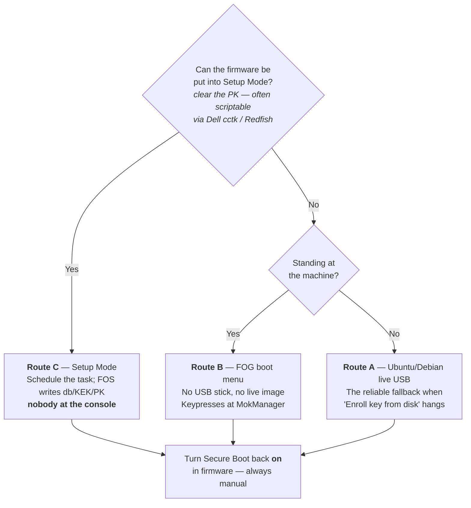

# Secure Boot: signing FOS with your own key

>[!warning] This is a hands-on procedure
>It requires **physically visiting each machine once**. If your site can
>leave Secure Boot disabled for imaging, that remains far less work. Read
>[Why FOG cannot do this for you](#why-fog-cannot-do-this-for-you) before
>deciding.
>
>The server side is automatic — the installer generates a Secure Boot CA and
>a signing key, signs the FOS kernels, and keeps them signed across
>upgrades, with nothing to configure. The per-machine visit does **not**
>require turning Secure Boot off. What you cannot avoid is the visit.

>[!info] The certificate you enroll and the key that signs are different certificates
>FOG's Secure Boot setup has two parts: a **Secure Boot CA**, which is what
>gets enrolled on each machine (published as `MOK.der`), and a **signing
>leaf** issued by that CA, which is what actually signs kernels day to day.
>That split means rotating the signing key — see [Rotating or removing a
>key](#rotating-or-removing-a-key) — normally doesn't require re-enrolling
>anything. For the full picture of how this fits alongside FOG's other
>certificates, see [[pki-zones|FOG's Certificate Zones]] and
>[[pki-glossary|the PKI glossary]]. If you're recovering from a much
>earlier build that predates this split, see
>[the old flat MOK](#the-old-flat-mok) below.
>
>Signing is on by default. Use `--no-secure-boot` to turn it off.

FOG does not ship signed FOS kernels, and cannot. If your estate mandates UEFI
Secure Boot and turning it off is not an option, this guide walks through
becoming your own signing authority: FOG generates a key, signs the FOS
kernel with it, and you tell each machine's firmware to trust the
certificate above it.

The result is entirely under your control — which is also the point. Nobody
else, FOG Project included, can produce something your machines will boot.

---

## Why FOG cannot do this for you

Secure Boot is a chain of signatures, and each link only trusts what it was
built to trust.

Your firmware ships with Microsoft's certificates in its allowed-signature
database (`db`). Practically everything bootable is signed either directly by
Microsoft or by a **shim** — a small loader that Microsoft signs once, and
which then carries the *distribution's own* certificate inside it. That is how
Ubuntu and Fedora work: Canonical and Red Hat each got one shim signed, and
from then on they sign their own kernels with their own keys, checked against
the certificate baked into their shim.

For FOG to do the same, the FOG Project would have to own a signing key with
the operational discipline that implies, and get a shim through Microsoft's
review process. Even then, a signature is only as meaningful as the key behind
it — a signing key that ships to everyone protects nobody.

**The iPXE project has already done exactly this.** Since iPXE 2.0, there is a
dedicated iPXE shim — published at
[ipxe/shim](https://github.com/ipxe/shim/releases), Microsoft-signed against
both the 2011 and 2023 certificates — which carries iPXE's own code-signing
certificate as its vendor certificate. Upstream then signs its released
binaries with that key — both the all-drivers `ipxe.efi` and the `snponly.efi`
variant FOG already prefers, for x86_64 and arm64 alike. So a **stock upstream
iPXE** boots under Secure Boot with nothing for you to sign.

The catch is specific to FOG, and it is worth being precise about, because it
is the whole reason this guide exists:

**FOG does not ship stock iPXE binaries.** FOG builds its own, with the boot
script compiled in (`EMBED=ipxescript`) and — on HTTPS installs using FOG's
own internal CA — the server's CA baked in (`TRUST=`). Those are by
definition custom binaries, they carry no signature, and iPXE's signed shim
will refuse them, exactly as it should. A shim that loaded any binary calling
itself iPXE would be worthless.

FOG could not fix this by signing its own builds either. The shim only trusts
iPXE's vendor certificate, so a FOG-signed binary would need every machine to
enroll FOG's key first — the same physical visit this guide already asks for,
while making one key compromise everyone's problem at once. There is no
mechanism, on any FOG release, for signing a custom-rebuilt iPXE binary with
FOG's own Secure Boot certificate so that shim would accept it.

The way out is to stop needing a custom binary. FOG's embedded boot script is
entirely generic, and iPXE 2.0 can fetch that script from the TFTP server
instead (`autoexec.ipxe`). That lets you run **upstream's signed `snponly.efi`**
and still get FOG's boot behaviour — which is the approach this guide takes.

The alternative the firmware already provides is **MOK** (Machine Owner Key):
a per-machine list of extra certificates that *you*, as the physical owner of
the machine, choose to trust. That is the route this guide takes.

>[!info] Why enrolment cannot be automated
>MOK enrolment requires a human at the physical console pressing keys. That
>is not an oversight — it is the security property. If a remote process
>could enroll a signing key, Secure Boot would be decorative. Budget for one
>visit per machine, the same way you would for a firmware password. FOG 1.6
>adds a way to skip this per-machine visit entirely by enrolling directly
>into firmware — see [Setup Mode](#setup-mode) below — but it still requires
>touching each machine's firmware settings once; there is no way to enroll
>trust into a machine that has never met you.

---

## What actually needs signing

Less than most people expect.

| Component | Signed? | Why |
| --- | --- | --- |
| iPXE (`snponly.efi`) | **No — use upstream's signed build** | Signed by the iPXE project; FOG's own builds are custom and unsigned |
| shim (`snponly-shimx64.efi`) | **No — Microsoft already signed it** | Published by the iPXE project |
| FOS kernel (`bzImage`, `bzImage32`) | **Yes — this is your job** | The firmware refuses to load an unsigned kernel |
| FOS init (`init.xz`, `init_32.xz`) | **No** | See below |
| Your images, snapins, scripts | **No** | They are never executed by firmware |

### The initrd is not verified — by anyone

This surprises people, so it is worth stating plainly: **the initramfs is not
covered by Secure Boot**, on any distribution. Ubuntu and Fedora do not sign
theirs either. They cannot — `dracut` and `initramfs-tools` build the initramfs
locally on each machine at install time and on every kernel update, so the
distribution never sees those bytes.

It is a well-known gap in the model, and the modern answer to it is the
Unified Kernel Image (kernel, initrd and command line stapled into a single
signed binary). FOG does not use UKIs today.

The practical consequence for you: **you only ever need to sign `bzImage` and
`bzImage32`.** Leave `init.xz` and `init_32.xz` alone.

### The chain you are building

```
UEFI firmware        (trusts Microsoft's certificate, via `db`)
  └─ snponly-shimx64.efi  ← Microsoft-signed, published by the iPXE project
      └─ snponly.efi      ← signed by iPXE; UPSTREAM's build, not FOG's
          └─ bzImage      ← YOU sign this; shim checks it against MOK
              └─ init.xz  ← not verified, nothing to do
```

Only the kernel is yours to sign. The two links above it are already signed by
people whose certificates the firmware and the shim respectively trust.

The first link is the one to understand. **MOK is shim's database, not the
firmware's** — the firmware has never heard of it. Shim installs itself as the
authority that later `LoadImage()` calls consult, and *that* is what accepts
your certificate.

The consequence is easy to get wrong: **MOK cannot help the first binary in the
chain.** When the firmware PXE-boots a file directly, it checks that file
against `db` only, because nothing has loaded shim yet to consult MOK. That is
why the shim — not iPXE — has to be your DHCP boot file. Point DHCP straight at
an iPXE binary and no amount of signing or enrolling will save you.

The iPXE shim decides what to load next **from its own filename**, by stripping
`-shim` out of it. Named `snponly-shimx64.efi`, it loads `snponly.efi` from the
directory it was itself loaded from; named `ipxe-shimx64.efi`, it loads
`ipxe.efi`. Whichever you pick, the second-stage file has to be sitting beside
it under exactly that name.

>[!warning] Use upstream's signed build, not FOG's
>FOG's own binaries in `/tftpboot` — including those in `autoexec/` — are
>locally built and unsigned, so the shim will reject them, even though one
>of them is also called `snponly.efi`. Download the signed build from the
>iPXE project. FOG's boot logic reaches it through `autoexec.ipxe` instead
>of being compiled in.

>[!tip] The alternative: enroll into `db` instead
>Many firmwares can be put into Custom or Setup mode, letting you add your
>own certificate to `db` directly — see [Setup Mode](#setup-mode) below.
>That removes shim from the picture — sign whatever you like and the
>firmware loads it. It is the only route if you need HTTPS netboot with
>FOG's own or your internal CA under Secure Boot at the same time; see
>[[pki-zones#https-and-netboot|HTTPS and netboot]].

---

## Before you start

>[!tip] Planning to migrate this server soon? Do that first
>If a server migration (moving FOG to new hardware, per
>[[migrating-fog-server|Migrating FOG Server]]) is already on your roadmap,
>do it **before** setting up Secure Boot here, not after. Migrating an
>already-enrolled Secure Boot setup is a viable, well-understood path — copy
>the `pki/secureboot/` directory forward, per
>[[migrating-fog-server#migrating-the-secure-boot-signing-key|that guide's
>Secure Boot section]] — but it is still one more thing to get right, and
>getting it wrong means every already-enrolled client needs re-enrolling a
>second time for no reason. Enrolling once, on the server you intend to keep,
>is strictly less work than enrolling now and potentially again later.

On the FOG server, nothing. `sbsigntool` (`sbsigntools` on RHEL/Rocky/Alma/
Fedora and Arch) is part of the installer's baseline package set, alongside
`openssl`. If your distribution ships neither name the installer says so and
carries on, leaving the kernels unsigned — read the installer output rather
than assuming.

On each client machine you intend to enrol, you need a way to run `mokutil` —
most simply, boot it once from any Linux live USB.

You do **not** need to download the signed shim or the signed `snponly.efi`.
Every install stages them at `/tftpboot/secureboot/`:

```
/tftpboot/secureboot/
├── snponly-shimx64.efi   Microsoft-signed shim (2011 + 2023), from ipxe/shim
├── snponly.efi           upstream's signed iPXE — firmware's own NIC driver
├── ipxe-shimx64.efi      the same shim again, under the name that loads ipxe.efi
├── ipxe.efi              upstream's signed iPXE — iPXE's own NIC drivers
├── mmx64.efi             MokManager, used during enrolment
├── autoexec.ipxe         FOG's boot script
├── MANIFEST              where each file came from, with checksums
└── arm64-efi/            the same set for arm64
```

Two complete chains, so you can switch between them with nothing but a DHCP
change. `snponly` is the default and the right first choice; `ipxe` is the
fallback for firmware whose own network stack does not work. [Which to
use](#3a-serve-the-signed-chain) is covered in step 3a.

>[!info] Version note
>The `ipxe.efi` pair arrived with **fog-ipxe v2.0.0-fog.3**. An install pinned
>to an earlier release stages only the `snponly` pair — check `MANIFEST`, which
>lists exactly what your install has.

Everything but `autoexec.ipxe` is upstream's, republished byte for byte through
the [fog-ipxe](https://github.com/FOGProject/fog-ipxe) release the installer
already downloads. Every file's SHA-256 and its signer are verified when that
release is built, so a test-signed or tampered binary fails the release rather
than reaching your server. `MANIFEST` records the source URL and checksum of
each file if you want to confirm that yourself.

Nothing is served from this directory unless you point DHCP at it, so its
presence changes nothing for your existing clients.

>[!info] If the directory is missing
>Two reasons it would not be there. **HTTPS-netboot installs using FOG's own
>CA skip it** — these are upstream's generic binaries, so they cannot carry
>your server's CA, and a signed binary cannot be rebuilt without voiding the
>signature. See [HTTPS and netboot](#the-chain-you-are-building) for the way
>round that, and note that a public CA on the vhost avoids the tradeoff
>entirely — see [[pki-zones#https-and-netboot|HTTPS and netboot]].
>Otherwise the download failed — it is deliberately not fatal — and the
>installer will have said so. Re-run it.

You can confirm you have a signed binary — a signed one has a non-empty
certificate table, an unsigned one does not:

```bash
sbverify --list /tftpboot/secureboot/snponly.efi
```

The signer should be **iPXE Secure Boot Intermediate G1A**. FOG's own
`/tftpboot/ipxe.efi` and `/tftpboot/autoexec/snponly.efi` have no signature at
all — if you see that, you are looking at the wrong file.

On arm64 the equivalents are `arm64-efi/snponly-shimaa64.efi` and
`arm64-efi/snponly.efi`.

>[!note] Why the shim is renamed `snponly-shimx64.efi`
>The shim decides what to load next by **stripping `-shim` out of its own
>filename** — `ipxe-shimx64.efi` looks for `ipxe.efi`, and
>`snponly-shimx64.efi` looks for `snponly.efi`. That is upstream's own
>mechanism, not a trick: `ipxeboot.tar.gz` ships `ipxe-shim.efi` and
>`snponly-shim.efi` as two symlinks to a single `shimx64.efi` for exactly this
>reason. Renaming does not disturb the signature, which covers the file's
>contents rather than its name.

>[!note] The shim comes from the ipxe/shim release, not from `ipxeboot.tar.gz`
>The tarball contains a `shimx64.efi` too, but it carries only the Microsoft
>UEFI CA **2011** signature. The standalone `ipxe-shimx64.efi` — the one FOG
>stages — carries **two**, 2011 and 2023, which matters on newer hardware that
>ships only the 2023 certificate.
>
>Both facts were confirmed by reading the PE certificate tables directly: the
>standalone shim has two `WIN_CERTIFICATE` entries, the bundled one has a
>single 2011 entry. The fog-ipxe release asserts **both** signatures are
>present, so a silent upstream regression to a 2011-only build fails the
>release rather than stranding anyone on 2023-only firmware.

>[!note] Verify your FOS kernel has an EFI stub
>Under Secure Boot the kernel is loaded by the firmware's own loader rather
>than by iPXE's Linux loader, which requires `CONFIG_EFI_STUB=y`. Stock FOS
>kernels are expected to have it; if boot fails immediately after signing
>with a format complaint rather than a signature complaint, this is the
>first thing to check.

---

## Step 1 — The signing key

**The installer already did this.** On first install it generates a Secure
Boot CA and a signing leaf under that CA, and signs the FOS kernels with the
leaf, so unless you want to supply your own key there is nothing to run here.

```
/opt/fog/pki/secureboot/
├── ca/
│   ├── .fogSBCA.key           0400 root:root — signs the leaf below
│   ├── .fogSBCA.pem
│   └── .fogSBCA.der           this is what MOK.der publishes — ENROL THIS
└── leaf/
    ├── sign.key                0600 root:root — what sbsign actually signs with
    └── sign.pem
```

The directory sits under `$fogprogramdir`, which is never inside the web root,
so none of it is reachable over HTTP. **The web server cannot read either
private key**: kernel downloads from the web UI are signed by a small
root-only helper (`/opt/fog/bin/fog-sign-kernel`) that takes no arguments,
rather than in the web server itself. Only the public certificate is
published, as `MOK.der` in the enrolment kit.

Back up the whole `pki/secureboot/` directory somewhere you would put a root
password. Anyone holding the CA key can mint a new signer your machines will
trust without re-enrolling; anyone holding the leaf key can sign a kernel,
full stop.

>[!warning] The CA is never regenerated, on purpose
>Re-running the installer reuses the existing CA. A fresh CA silently
>invalidates enrolment on **every machine that already trusted the old one**,
>and nothing surfaces that until a client fails to boot. `--recreate-keys` and
>`--recreate-CA` deliberately do not reach it. To rotate the CA on purpose,
>delete `pki/secureboot/`, re-run the installer, and re-enroll every client —
>see [Rotating or removing a key](#rotating-or-removing-a-key). Rotating just
>the *leaf* — the normal case — does not require any of this; see the same
>section.

### Bringing your own key

If you already have a signing key — a site CA, or one shared with other
tooling — pass it instead and the installer will never touch or overwrite it:

```bash
mkdir -p /root/fog-secureboot && cd /root/fog-secureboot

openssl req -new -x509 -newkey rsa:2048 \
  -keyout MOK.priv -outform DER -out MOK.der \
  -days 3650 -subj "/CN=FOG imaging - $(hostname -f)/" \
  -nodes

# The same certificate in PEM. Both formats are needed -- see the note below.
openssl x509 -inform DER -in MOK.der -outform PEM -out MOK.pem

chmod 600 MOK.priv
```

```bash
cd /path/to/fogproject/bin
./installfog.sh \
  --secure-boot-key  /root/fog-secureboot/MOK.priv \
  --secure-boot-cert /root/fog-secureboot/MOK.der
```

- `MOK.priv` — the private key. **Never leaves this machine.** Back it up
  somewhere you would put a root password, not somewhere you would put a
  config file.
- `MOK.der` — the public certificate, DER-encoded. This is what you distribute
  to clients and what `mokutil` enrols; it is not sensitive.
- `MOK.pem` — the same certificate, PEM-encoded. This is what `sbsign` and
  `sbverify` read.

>[!warning] Without a CA, this pair is flat — exactly like the certificate you enroll being the certificate that signs
>`--secure-boot-key`/`--secure-boot-cert` on their own hand the installer a
>leaf with no CA above it, and that certificate becomes **both** the signer
>and the thing you enrol — the flat model, same as before the CA/leaf split
>existed for FOG's own auto-generated key. Rotating this key later means
>re-enrolling every machine, same as [Rotating or removing a
>key](#rotating-or-removing-a-key) describes for the CA. FOG 1.6 adds
>`--secureboot-ca-cert` to bring your own **CA** instead, getting you the same
>rotatable-leaf benefit FOG's own default key already has — see
>[[pki-zones#bringing-your-own-ca|Bringing your own CA]]. Without it, get the
>same split by hand: see the tip below.

Both paths are recorded in `.fogsettings`, so later upgrades keep using them
without the flags being passed again. The two options are only meaningful
together — the installer refuses half a pair rather than leaving kernels
unsigned on a server whose admin believes they are signed.

>[!warning] `sbsign` and `sbverify` cannot read a DER certificate
>They load certificates with OpenSSL's `PEM_read_bio_X509`, which rejects DER
>outright:
>
>```
>$ sbsign --key MOK.priv --cert MOK.der --output out.efi in.efi
>Can't load certificate from file 'MOK.der'
>error:0480006C:PEM routines:get_name:no start line ... Expecting: CERTIFICATE
>```
>
>`mokutil` and MokManager want the opposite. Neither tool tells you which
>format it wanted, so keep both files and use `MOK.der` for enrolment and
>`MOK.pem` for signing. The installer's `--secure-boot-cert` accepts either and
>converts internally, so this only bites you when running `sbsign`/`sbverify`
>by hand.

The `-days 3650` gives ten years. Choose something you will actually remember
to renew — an expired MOK stops machines booting. FOG's own auto-generated CA
uses a longer lifetime, on the logic that a CA is meant to sit still for
years while the leaf underneath it does the rotating.

>[!tip] Use a descriptive CN
>It is shown in MokManager when someone enrols it, and again years later
>when someone is trying to work out what that key is for. `FOG imaging -
>fog.example.edu` beats `MOK`.

>[!tip] Getting the CA/leaf split by hand with your own CA
>Nothing above requires your key to be self-signed. If your organisation
>already runs an internal CA (AD Certificate Services or similar) and can
>issue a code-signing certificate, `--secure-boot-key`/`--secure-boot-cert`
>(or `--sign-key`/`--sign-cert` in `fos/build.sh`) accept that leaf
>certificate and its key exactly the same way — enroll that same leaf as the
>MOK and nothing else changes. Standard code-signing templates do not carry
>the Module-signing-only OID above, so this does not run into that trap.
>
>A CA can do more than substitute for the leaf, if you want it to. shim does
>not just exact-match the enrolled certificate — it validates the embedded
>PKCS#7 signature's certificate chain against whatever is enrolled
>(`sbsign --cert <leaf> --addcert <intermediate>` is what embeds that chain).
>That means enrolling your CA's root or intermediate **once**, then signing
>with any leaf issued under it afterward: reissue or rotate the leaf and no
>machine needs to be touched again — the same benefit FOG's own auto-generated
>key already gets automatically. Without `--secureboot-ca-cert` (FOG 1.6),
>doing this with your own CA means signing and publishing by hand: follow
>Step 3b with `--addcert` added to the `sbsign` call, and enroll the CA's
>certificate rather than a leaf.
>
>One thing this does **not** get you: a way to skip enrolment entirely by
>piggybacking on infrastructure your fleet might already have. There is no
>generic Intune/GPO mechanism to push an arbitrary org CA into UEFI `db` —
>what exists there is only Microsoft's own certificate rollover. If your CA
>is not already enrolled fleet-wide by some other means (vendor BIOS tooling,
>or manual Setup Mode), the one-time-per-machine visit still applies — it
>just becomes permanent once done.
>
>Nor does any of this extend to HTTPS. Kernel/shim trust and iPXE's TLS root
>store are two unrelated mechanisms — enrolling a CA here changes nothing
>about which HTTPS servers a Secure Boot client will fetch from. See
>[[pki-zones#https-and-netboot|HTTPS and netboot]].

>[!warning] Generate a fresh key — do not reuse the MOK you already have
>If this machine has ever built a DKMS module, it already has a MOK, and it is
>tempting to reuse it. It will not work.
>
>Since shim 15.4 (Ubuntu 21.04 and later), keys carrying the *Module-signing
>only* KeyUsage OID `1.3.6.1.4.1.2312.16.1.2` are deliberately **ignored** by
>both shim and GRUB when validating something to boot — they are only good for
>signing kernel modules. Ubuntu's and Debian's automatically generated DKMS
>MOK carries exactly that OID.
>
>The failure is a plain `Security Policy Violation` at boot with the key
>showing up quite happily in `mokutil --list-enrolled`, which is a
>memorably unhelpful combination. The `openssl req` command above produces a
>key without the OID, so just use it.
>
>The key FOG generates carries no such OID either, so this only applies if you
>are supplying your own.

### Turning signing off

`--no-secure-boot` skips key generation entirely and leaves the FOS kernels
unsigned. It is remembered in `.fogsettings`, so an upgrade will not hand back
a key and a `sudoers` rule you deliberately declined.

### The old flat MOK

If you're reading this because a machine somewhere already enrolled a
self-signed `MOK.key`/`MOK.pem` pair predating the CA/leaf split — the
proof-of-concept that Secure Boot signing could work at all — two things:

- Any server still on that layout gets moved onto the CA/leaf hierarchy
  automatically. The old `MOK.{key,pem}` is left on disk untouched, so
  anything already signed with it can still be re-signed, but new signing
  uses the new leaf.
- Every machine that enrolled the old flat MOK needs to enroll the new CA
  once more — there is no way around a fleet-wide re-enrollment when the
  enrolled certificate itself changes. A transitional path (reusing
  already-signed kernels while enrolling the new CA via a scheduled task)
  is intended for exactly this case, but is not built yet. If this affects
  you, back up your existing `pki/secureboot/`/`secureboot/` directories and
  [open an issue](https://github.com/FOGProject/fogproject/issues) or ask on
  the [FOG forums](https://forums.fogproject.org/) — this only ever affected
  very early testers, not any stable release.

### Setup Mode

>[!info] FOG 1.6
>Direct firmware enrollment (this section) is a FOG 1.6 addition. On earlier
>releases, use [MOK enrollment](#step-2-enroll-the-certificate-on-a-client)
>below instead.

Many firmwares support **Setup Mode** — a state that lets you write
certificates directly into UEFI's own trust database (`PK`, `KEK`, `db`),
bypassing shim and MokManager entirely. FOG can build the files that
enrollment needs (`PK.auth`, `KEK.auth`, `db.auth`) using `efitools`
(`cert-to-efi-sig-list`, `sign-efi-sig-list`, `efi-updatevar`). `db.auth`
embeds the **Secure Boot CA** — the intermediate, not the signing leaf —
alongside Microsoft's own certificates, which is what keeps leaf rotation
safe for Setup-Mode-enrolled clients too, the same as MOK enrollment.

>[!warning] `efitools` is unreliable on EL9 — check before you rely on it
>It's a declared dependency and installs normally on Debian/Ubuntu. On EL9:
>on a CentOS Stream 9 test box it's unavailable with EPEL *and* CRB enabled,
>and nothing else provides `sign-efi-sig-list`/`cert-to-efi-sig-list` — the
>upstream RPM tracker lists Fedora branches only, no EL9/EPEL rows at all.
>It is nonetheless present and working on at least one Rocky 9 FOG server,
>source not established. Only the three userspace tools are needed and they
>build from source in about a minute if your distribution doesn't package
>them:
>
>```bash
>dnf -y install gcc make openssl-devel git gnu-efi-devel
>git clone --depth 1 \
>    https://git.kernel.org/pub/scm/linux/kernel/git/jejb/efitools.git
>cd efitools
>make cert-to-efi-sig-list sign-efi-sig-list efi-updatevar
>install -m 0755 cert-to-efi-sig-list sign-efi-sig-list efi-updatevar /usr/bin/
>```
>
>`gnu-efi-devel` is required even for the userspace tools — they include
>`efi.h`. The EFI binaries (`KeyTool.efi` et al.) are not needed.

MOK enrolment via MokManager works exactly the same regardless of whether
Setup Mode is also used — the two are independent enrollment routes for the
same Secure Boot CA, not alternatives that conflict.

Confirmed on real UEFI hardware: machines boot FOG's leaf-signed kernels
while trusting only the intermediate, whether that intermediate was enrolled
as `MOK.der` through MokManager or written into `db` through this path. That
verification predates the name-constraints extension now carried on the
Secure Boot CA — re-confirm on hardware before relying on it, and use
`--no-sb-name-constraints` (see [[pki-zones#name-constraints|Name
constraints]]) if a fleet rejects the chain.

---

## Step 2 — enroll the certificate on a client

Repeat per machine. There are three routes, and the right one depends on what
you can get at: whether you can stand at the machine, and whether its firmware
can be put into Setup Mode.



**Routes A and B do not require you to turn Secure Boot off**, and you should
not: both work with it left on. Route C is different — it needs the platform in
Setup Mode, which is not the same thing as Secure Boot being switched off (see
that section).

The FOG web UI has a **FOG Configuration → Secure Boot** page. It shows your
certificate's fingerprint (SHA-256, and SHA-1 for MokManager's own "view key"
screen — see [[pki-glossary#fingerprint-aka-thumbprint|fingerprint]]), offers a
small **enrolment kit**, and links back to this guide for the full per-client
steps below:

| File | What it is |
| --- | --- |
| `MOK.der` | your public certificate — this is the thing being enrolled |
| `fog-enroll-mok.sh` | does the enrolment, checks the fingerprint first |
| `fog-enroll-mok.desktop` | double-click launcher for the above |

Leave that page open on another screen — you are going to compare the
fingerprint against it.

### Route A — a stock Ubuntu or Debian live USB

This is the reliable route. A stock live image already boots with Secure Boot
**on**, using the distribution's own signed shim, GRUB and kernel, so there is
nothing to sign and no firmware setting to change.

1. Write a normal Ubuntu or Debian live image to a USB stick, however you
   usually do it. **Do not remaster it** — the point is that stock media
   already solves the Secure Boot problem.
2. Copy all three kit files onto the stick, next to each other.
3. Boot the client from it, with Secure Boot still on.
4. Open the stick in the file manager and run `fog-enroll-mok.desktop`.

The script prints the certificate's fingerprint and asks you to confirm it
matches the web page before it does anything. Then it asks for a one-time
password, twice — that password only exists to prove, after the reboot, that
the person at the keyboard is the person who ran the script. It is not stored
and does not need to be strong. Use the same one across a batch of machines and
your life is easier.

Reboot. The machine stops in a blue **MOK Manager** screen instead of booting:

1. `Enroll MOK`
2. `View key 0` — check the CN is yours before continuing
3. `Continue`
4. `Yes`
5. Enter the password you just chose
6. `Reboot`

Confirm afterwards:

```bash
mokutil --list-enrolled | grep -A2 "FOG"
```

### Route B — from the FOG boot menu, no operating system and no USB stick

MokManager can read a certificate straight off a FAT filesystem, so a Linux
session is not required at all. The boot menu carries an **Enroll Secure Boot
Key** entry that takes you straight there — and the boot menu fetches
`MOK.der` into iPXE's memory before chaining to MokManager, the same way a
normal netboot already puts the FOS kernel and initrd there. MokManager's own
file browser walks that same in-memory image list, so the certificate shows up
in `Enroll key from disk` without you carrying anything to the machine.
**Confirmed on physical hardware.**

>[!info] The entry appears on its own
>It needs no configuration and shows for registered and unregistered hosts
>alike, because a machine that needs its MOK enrolled has usually never been
>registered. Like any menu entry it can be edited or removed under
>**FOG Configuration → PXE Boot Menu**.

>[!warning] Why the menu item exists, rather than "just PXE-boot the shim"
>**A plain PXE boot through the shim never shows MokManager.** Shim only hands
>control to MokManager when a *pending* MOK enrolment request already exists —
>normally staged by `mokutil --import`, which is what Route A does. With
>nothing staged, the shim boots straight through to `snponly.efi` and the blue
>MokManager screen never appears, however long you wait.
>
>The menu item chains directly to `secureboot/mmx64.efi`, deliberately
>bypassing that gate, which is what makes `Enroll key from disk` reachable
>with nothing pre-staged.
>
>Nor can you point DHCP straight at `mmx64.efi` to get the same effect. It is
>signed by iPXE, not Microsoft, so the firmware — which checks the first binary
>against `db` alone, as described [above](#the-chain-you-are-building) — will
>refuse to launch it. It boots here only because iPXE loads it *through shim's
>verification protocol*, and shim trusts iPXE's certificate.

You do **not** need Secure Boot currently enabled to do this, either — tested
on physical hardware with Secure Boot off, enrolled, then switched back on
afterward, with no difference in behaviour either way. MokManager's enrolment
does not depend on the firmware currently enforcing anything, only on shim
having loaded it. That means you can stage enrolment across a fleet before
ever flipping Secure Boot on: run this while it is still off, and every
machine already trusts your key by the time enforcement begins.
Or you can leave secure boot on for a new machine, enroll it then register it
and you're off without needing to touch secure boot settings.

1. PXE-boot the client as normal — Secure Boot on or off, it makes no
   difference to this step.
2. Choose **Enroll Secure Boot Key** — from the boot menu, or from a task
   scheduled against the host or a group from **Task Scheduling**, which
   chains into the exact same flow without you having to find the menu item
   on each machine (see the tip below). FOG fetches `MOK.der` into memory,
   then hands off to MokManager.
3. `Enroll key from disk`.
4. Pick `MOK.der` from the list — it is already there.
   >[!warning] If it is not listed
   >Not every firmware/MokManager combination is confirmed to expose a plain
   >`imgfetch`ed file the same way it exposes a kernel/initrd. Fall back to a
   >FAT-formatted USB stick with `MOK.der` on it (from the enrolment kit) —
   >it will appear in the same browser, the same way Route A's stick does.
5. `Continue` → `Yes`. Check the CN is yours, **and compare the fingerprint
   MokManager shows against the FOG Secure Boot page before confirming** —
   automatic delivery removes the "you personally carried this file"
   assurance Route A's USB stick still gives you, so this comparison matters
   more here, not less.
6. `Reboot`. No stick to remove.

>[!warning] MokManager times out on its own — twice
>Neither timer is something FOG controls or can change:
>
>- If you do not press a key within roughly **10 seconds** of the screen
>  appearing, MokManager gives up waiting and continues booting normally —
>  silently skipping enrolment. Be at the console before you select the
>  menu item or schedule the task, not after.
>- Once you are inside the tool, an **idle timeout of a couple of minutes**
>  reboots the machine if you stop responding partway through. Finish the
>  walkthrough once you start it; do not step away mid-enrolment.

>[!note] Why the fingerprint isn't checked automatically
>iPXE could in principle hash the file it just fetched and compare it
>against a value the same server also serves — but that value would travel
>over the exact same unauthenticated network path as the file itself, so
>anyone able to substitute one can substitute the other just as easily. The
>fingerprint on the FOG Secure Boot page is the actual check: you read it on
>a separate, already-trusted screen before confirming in MokManager. That
>manual comparison is the security boundary here, not something iPXE can do
>for you.

The client now trusts your key and will boot the signed FOS kernel on its
next PXE boot. Unlike Route A there is no one-time password step, because you
are already standing at the machine when the enrolment happens.

>[!tip] Push it as a task instead of hunting for the menu item
>"Enroll Secure Boot Key" is also a task type, schedulable from **Task
>Scheduling** against a single host or a whole group, the same way you would
>schedule a Deploy or a Capture. A host with this task pending skips the
>interactive boot menu entirely and chains straight into the flow above on
>its next PXE boot — useful for pushing enrolment across many machines
>without walking a tech through which menu item to pick on each one. The
>final `Enroll key from disk` → `Yes` step still has to happen at the
>console; nothing removes that.

>[!tip] Which route to reach for
>If the firmware can be put into Setup Mode, **Route C is the one that
>scales** — it is the only route that does not end with a human pressing keys
>on every machine; see
>[[secure-boot-setup-mode-enrollment|Setup Mode enrollment]]. Where it is not
>available, Route B has far fewer moving parts and, since the network-delivery
>change above, needs neither a live image nor a USB stick — try it first if
>you are standing at the machine anyway. Route A is the fallback: `Enroll key
>from disk` is reported to hang on some firmware, and a stock live USB
>sidesteps that entirely by using the distribution's own shim.

>[!note] arm64 clients
>The menu entry serves the matching MokManager automatically — `mmx64.efi` for
>x86-64 and `arm64-efi/mmaa64.efi` for arm64 — based on the architecture the
>client reported at boot. There is nothing to select.

>[!danger] If MokManager does not appear
>Confirm you picked **`Enroll Secure Boot Key`** and not an ordinary boot
>entry. Booting through the shim normally will not show MokManager: that
>needs a *pending* MOK request staged first, and this route does not stage
>one. Secure Boot being on or off is not the cause either way — this route
>chains to MokManager directly and has been confirmed working with it in
>both states. If the screen appeared and was gone by the time you looked,
>you likely missed MokManager's own ~10-second startup timeout — see the
>warning above — rather than anything being misconfigured.

### Route C — Setup Mode, with nobody at the console

Routes A and B both end at a human pressing keys, because MOK enrolment is
*designed* to require one. Route C sidesteps that by not using MOK at all: if
the platform is in **Setup Mode**, the running OS can write the real Secure Boot
databases directly, and FOS does it unattended.

Schedule the **Enroll Secure Boot Key** task exactly as in Route B. FOS decides
which route to take by itself — it reads the firmware state at boot, and only
takes this path if it finds Setup Mode. Anything else falls back to staging a
MOK request, so scheduling the task against a mixed fleet is safe.

What it writes, in this order and no other:

| Variable | Contents |
| --- | --- |
| `db` | Microsoft's five published CAs **plus** your `CN=FOG Project Secure Boot Signing` certificate |
| `KEK` | Microsoft's two KEK CAs plus this server's Key Exchange Key |
| `PK` | this server's Platform Key, alone |

The order is load-bearing. Writing `PK` is what takes the platform *out* of
Setup Mode, and every write after it must carry a signature the firmware
checks — so `PK` goes last. FOS also fetches all three blobs before writing any
of them, so a web server hiccup cannot leave a machine half-enrolled, and it
aborts on the first failure rather than pressing on to the write that closes the
door. A run that fails partway leaves the platform still in Setup Mode, still
booting anything, exactly as it was found.

Success is confirmed by `SetupMode` flipping 1 → 0 — the firmware accepting the
`PK`. Note that `SecureBoot` stays 0 until the next boot regardless, because the
firmware computes it during POST.

>[!warning] Microsoft's certificates are in that `db` on purpose
>It is tempting to read "your own trusted `db`" as "only your certificate".
>Removing Microsoft's CAs breaks Windows — and it breaks FOG, because the shim
>at the head of your own boot chain is Microsoft-signed. A `db` without them is
>a machine that no longer PXE boots.

>[!note] What still needs a human
>*Getting into* Setup Mode means clearing the `PK` at the firmware screen, and
>turning Secure Boot back **on** afterwards is a firmware toggle too. Neither is
>reachable from a running OS by design. So Route C trades "a visit with a live
>USB, or keypresses at MokManager" for "a firmware visit" — the win is that the
>firmware half is scriptable through vendor tooling (Dell `cctk`, Redfish) where
>Routes A and B never were, and that once done it is permanent.

>[!danger] The task cannot run on a machine already enforcing Secure Boot
>iPXE 2.0.0 verifies both the kernel *and* the initrd through shim. On a machine
>with Secure Boot enforcing and your certificate not yet trusted, both are
>refused — `Verification failed: Security Policy Violation` — so FOS never
>starts and no task of any kind runs. This is a property of the boot chain, not
>of the enrolment task. Secure Boot must be off, or the platform in Setup Mode,
>for the machine to get far enough to enroll.

#### Requirements

- **FOS release `20260804` or newer.** Earlier inits have no `fog.enrollsb`.
- **`efitools` on the server.** The installer installs it and builds the signed
  variable updates automatically. If it is missing the installer says so and
  skips building them — enrolment then falls back to the MOK routes rather than
  failing silently.
- **FOG 1.6.** The blobs are published at
  `<web-root>/service/secureboot/{db,KEK,PK}.auth` by the 1.6 installer only.
  FOS is shared between 1.5 and 1.6, so a 1.5 server ships an init that *has*
  `fog.enrollsb` — the MOK staging path still works there, but Route C cannot,
  because there are no `.auth` blobs to fetch.

The server's `PK`, `KEK` and signing keys are generated once and **never
regenerate** on later installs. The `.auth` blobs are rebuilt every install, but
from those same keys, so re-running the installer does not invalidate machines
you have already enrolled.

>[!note] Validation status
>Route C has been validated end to end in VirtualBox: Setup Mode → task
>completes unattended → firmware holds exactly the certificates in the table
>above → Secure Boot switched on → the same machine PXE boots FOG's signed chain
>and images normally. Per-model validation on *physical* firmware is still
>outstanding, and a mistake there is not reversible from the OS — it needs a
>firmware trip. Treat the first machine of any model as a test.

---

## Step 3 — Point Secure Boot clients at the shim, and sign the FOS kernels

### 3a — Serve the signed chain

Set the DHCP boot file for Secure Boot clients to
**`secureboot/snponly-shimx64.efi`**. Nothing in this step needs signing by you —
both binaries already carry signatures the firmware and shim trust.

>[!tip] This is the same driver model FOG already uses
>`snponly` binds only the firmware's own UEFI network protocol instead of
>replacing the NIC driver, which is exactly why FOG serves `snponly.efi` to
>every other client. So a Secure Boot machine now behaves like the rest of your
>estate rather than being a special case — the only difference is the shim in
>front and the signature on the kernel.

Because upstream's `snponly.efi` has no boot script compiled in, it fetches one
over TFTP, and **where it looks is not a single fixed path**. iPXE asks for the
bare name `autoexec.ipxe` and tries two locations in order:

1. relative to its *current working URI* — the TFTP directory the running
   `.efi` was itself downloaded from, i.e. `secureboot/autoexec.ipxe`
2. absolute at the TFTP root — `/autoexec.ipxe`

You can watch both attempts on the client console:

```
autoexec.ipxe...  Not found
/autoexec.ipxe... Not found
```

The installer satisfies both. It hard-links `autoexec.ipxe` into every
directory an EMBED-less binary can be booted from — the TFTP root,
`autoexec/`, `autoexec/i386-efi/`, `autoexec/arm64-efi/`, `secureboot/` and
`secureboot/arm64-efi/`. All six are one file, so editing any of them changes
all of them and there is no copy left quietly running the old script.

A hard link rather than a symlink because some TFTP daemons refuse to follow
symlinks, while a hard link is indistinguishable from a regular file to all of
them. A hard link rather than a copy so the paths cannot drift apart.

If a link has been broken — an older install, or the file was replaced by an
editor that writes-and-renames — re-running the installer restores it, or:

```bash
sudo ln -f /tftpboot/autoexec/autoexec.ipxe /tftpboot/secureboot/autoexec.ipxe
```

You can check they really are one file: every copy should report the same
inode and a link count of 6.

```bash
find /tftpboot -name autoexec.ipxe -printf '%i  links=%n  %p\n'
```

>[!tip] If nothing seems to happen
>Watch the TFTP server's log during a boot — it tells you exactly which
>filenames the client asked for and whether they were served, which beats
>guessing every time.

Your existing clients are unaffected — FOG's own unsigned `snponly.efi` stays
at the TFTP root, and non-Secure-Boot machines keep booting it. The signed copy
lives under `secureboot/` and is reached only by machines you point there.

>[!note] Both files are called `snponly.efi`, and that is fine
>`/tftpboot/snponly.efi` is FOG's own build — the boot script compiled in, no
>signature. `/tftpboot/secureboot/snponly.efi` is upstream's signed build,
>which reads its script from `autoexec.ipxe` instead. They are different
>binaries doing the same job by different means, which is why the signed one
>gets its own directory rather than replacing the other.

#### If the chain loads but the network never comes up

Shim runs, iPXE starts, and then there is no link or no DHCP. That points at
the firmware's own UEFI network stack, not at anything you signed. Set the DHCP
boot file to **`secureboot/ipxe-shimx64.efi`** instead — on arm64,
`secureboot/arm64-efi/ipxe-shimaa64.efi`.

That chain runs the all-drivers `ipxe.efi`, which replaces the firmware's NIC
driver with iPXE's own rather than binding the firmware's UEFI network
protocol. It recovers machines whose firmware SNP is broken or absent, and it
is the more invasive option — on hardware where the takeover fails, it hangs
instead. So try `snponly` first and move to this only on the symptom above.

Everything about the rest of this step is unchanged: both binaries are staged
for you, both are already signed, and `autoexec.ipxe` is hard-linked into
`secureboot/` for either one. **Nothing needs renaming server-side** — the shim
picks its second stage from its own filename, so the two chains sit side by
side in one directory and DHCP alone decides which runs.

### 3b — The FOS kernels

This is the part that is genuinely yours to sign, and **the installer has
already done it** — there is no step here unless you supplied your own key,
in which case [Step 1](#bringing-your-own-key) covers passing it.

Every install and upgrade re-signs the kernels, and it has to: the FOS
binaries are re-copied into place unsigned on every run, so the signature is
removed and immediately re-applied in the same pass. That is what stops an
upgrade silently leaving you with kernels your clients will not boot — which
is the single most common way this setup breaks.

Verify — and note the certificate must be the **PEM**, because `sbverify` will
not read DER:

```bash
sbverify --cert /opt/fog/pki/secureboot/leaf/sign.pem \
  /var/www/fog/service/ipxe/bzImage
# Signature verification OK
```

The full chain, including the intermediate:

```bash
$ sbverify --list /var/www/fog/service/ipxe/bzImage
 - subject: /CN=FOG Project Secure Boot Signing
   issuer:  /CN=FOG Secure Boot CA
 - subject: /CN=FOG Secure Boot CA
   issuer:  /CN=FOG Server CA
```

The signer shown should match the fingerprint on the **FOG Configuration →
Secure Boot** page; that page's fingerprint is the digest of the certificate
your clients enrol — the CA, not the leaf.

The installer keeps a `.unsigned` copy of each kernel beside the signed one,
because `sbsign` will not cleanly re-sign an already-signed image. Leave them
alone; they are refreshed on every download.

>[!note] The web Kernel Update page is covered too
>Downloading a kernel from **FOG Configuration → Kernel Update** signs it
>before it is sent to the TFTP server, so that route cannot leave you with an
>unsigned kernel either. It signs through a small root-only helper
>(`$fogprogramdir/bin/fog-sign-kernel`, `/opt/fog/bin/…` by default) rather
>than in the web server itself, so the
>web server never gets read access to your private key. If signing fails the
>update is refused outright rather than quietly installing a kernel your
>clients will not boot.
>
>Be aware of the limit of that protection: anyone who can already run code as
>your web server can ask the helper to sign a kernel of their choosing. What
>they cannot do is walk off with the key.

>[!warning] If `sbsigntool` could not be installed
>The installer adds `sbsigntool` (`sbsigntools` on RHEL/Arch) to its baseline
>package set, but if neither name exists in your distribution's repositories
>it skips the package, then warns and carries on **unsigned** rather than
>aborting the whole install. Read the installer output — an unsigned kernel
>only announces itself at a client, as a `Security Policy Violation`.

---

## Step 4 — Verify end to end

Take one enrolled machine and PXE boot it with Secure Boot **on**:

- iPXE loads and shows its banner — the shim accepted `snponly.efi`, so the
  upstream signed binaries are working.
- The FOG menu appears — `autoexec.ipxe` is being served and read.
- Selecting a task boots FOS rather than failing — your signature is accepted.

If it stops at the third step with a security violation, the kernel signature
is not being accepted. In order of likelihood:

| Symptom | Cause |
| --- | --- |
| `Security Policy Violation` | Certificate not enrolled on *this* machine, or the leaf was signed under a different CA than what's enrolled |
| `Security Policy Violation`, but the certificate *is* listed by `mokutil --list-enrolled` | The key carries the Module-signing only OID — see [Step 1](#step-1-the-signing-key) |
| Fails on every machine, including enrolled ones | Shim is not in the boot chain — see [the chain](#the-chain-you-are-building) |
| Worked yesterday, fails today | Something replaced the kernels without re-signing them. The installer always re-signs on install/upgrade — suspect anything that copies into `service/ipxe/` outside it — check with `sbverify` and re-run the installer |
| Every machine stops working after a change | Either the CA was regenerated, or you switched to a different admin-supplied flat key. Enrolment is per-CA (or per-flat-key), so all clients need re-enrolling — see [Rotating or removing a key](#rotating-or-removing-a-key) |
| Complains about format, not signature | Kernel lacks `CONFIG_EFI_STUB` |

---

## Signing your own FOS builds

If you build FOS yourself rather than using the released kernels, `build.sh`
can sign as part of the build, so the published `.sha256` covers the signed
image:

```bash
./build.sh -nka x64 \
  --sign-key  /root/fog-secureboot/MOK.priv \
  --sign-cert /root/fog-secureboot/MOK.pem
```

If you are using FOG's own auto-generated key, that is
`--sign-key /opt/fog/pki/secureboot/leaf/sign.key --sign-cert /opt/fog/pki/secureboot/leaf/sign.pem`.

`--sign-cert` must be the **PEM** here — `build.sh` hands it straight to
`sbsign`, which cannot read DER.

`FOS_SIGN_KEY` and `FOS_SIGN_CERT` work too, which is easier in CI. With
neither set the build is byte-for-byte what it always was.

---

## Rotating or removing a key

### Rotating FOG's own auto-generated leaf — the normal case

If you're using FOG's own auto-generated key (no `--secure-boot-key`/
`--secure-boot-cert` passed), the signing leaf rotates **without touching
any client**:

```bash
/opt/fog/pki/renewal-helper --zone secureboot
```

This re-issues the leaf from the Secure Boot CA and re-signs the kernels.
Nothing is re-enrolled in firmware, because what's enrolled is the CA, not
this leaf — see [[pki-zones#secure-boot|Secure Boot]]. This is the case to
reach for on a normal schedule; the two cases below are the disruptive ones.

### Switching to a key you supply

Nothing needs deleting for this one — an admin-supplied key/cert always
takes over immediately, whether or not FOG's own CA/leaf pair already exists:

```bash
cd /path/to/fogproject/bin
./installfog.sh \
  --secure-boot-key  /path/to/your/MOK.priv \
  --secure-boot-cert /path/to/your/MOK.der
```

That one run re-signs the FOS kernels with your key and republishes the
enrolment kit — `MOK.der` and the fingerprint on the **Secure Boot** page —
from your certificate, in the same pass. Remember this switches you to the
**flat model** (see [Bringing your own key](#bringing-your-own-key)) unless
you also pass FOG 1.6's `--secureboot-ca-cert`, so every already-enrolled
client needs re-enrolling — see the danger box below. The paths are recorded
in `.fogsettings`, so every later upgrade keeps using them without the flags
being passed again.

>[!warning] Keep the files where you pointed the installer
>The installer never copies your key or certificate in anywhere — it only
>remembers the paths you gave it. Moving or deleting those files afterward
>breaks signing on the next install or upgrade run, the same way losing any
>other private key would.

### Rotating FOG's own CA

If you want a fresh CA rather than just a fresh leaf under the existing one,
delete the directory first — the installer only generates a new CA when none
is present:

```bash
rm -rf /opt/fog/pki/secureboot
cd /path/to/fogproject/bin && ./installfog.sh
```

That produces a new CA and leaf and re-signs the kernels with the new leaf.

>[!danger] Changing the enrolled certificate stops every already-enrolled client booting at that moment
>This applies to switching to your own flat key, or rotating the CA itself —
>not to rotating just the auto-generated leaf, which is the whole point of
>having a CA above it. Either disruptive path invalidates every client's
>existing trust at once, and nothing surfaces that until a client fails to
>boot. Treat it as a deliberate, planned, estate-wide operation with every
>machine's new fingerprint re-enrolled in the same window, not a routine
>step or something to do mid-troubleshooting.

### Withdrawing a key from one machine

To remove trust for a certificate from a single machine, without touching the
server at all:

```bash
mokutil --delete MOK.der
```

then reboot and confirm in MokManager, exactly as for enrolment.

### If the private key is compromised

**There is no remote revocation.** If the compromised key is the auto-
generated leaf, rotate it per [above](#rotating-fogs-own-auto-generated-leaf-the-normal-case)
and nothing else needs to happen. If the compromised key is the CA itself
(or a flat admin-supplied key), every machine that enrolled it needs a
physical visit to remove it and enrol the replacement's fingerprint, exactly
like a planned rotation, just unplanned. That per-machine visit is the trade
you accept for not needing anyone else's permission to sign your own
kernels — treat the private key accordingly, and back it up somewhere you
would put a root password; see [Step 1](#step-1-the-signing-key).

---

## Verified

These steps have been run end to end with Secure Boot enforcing, through to a
completed deploy — **confirmed on physical hardware**:

```
firmware (Secure Boot on, Microsoft certificates in db)
  └─ secureboot/snponly-shimx64.efi
      └─ secureboot/snponly.efi        ← shim rewrote its own filename to find it
          └─ secureboot/autoexec.ipxe → default.ipxe → boot.php
              └─ bzImage (leaf-signed)  ← LoadImage() consulted MokList, chained to the CA, accepted it
                  └─ FOS → partclone → 42 GB deployed, Task Complete
```

Worth stating because a reader might reasonably fear the opposite: **no `shim`
command in the boot script and no `ShimRetainProtocol` handling were needed.**
Shim installs itself as the authority that later `LoadImage()` calls consult,
and that survives into iPXE on its own — so when iPXE loads the kernel, the
check goes against MokList rather than falling back to the firmware's `db`.
That assumption is what the whole MOK approach rests on, and it holds.

The signed binaries FOG stages are byte-for-byte the ones used in that run.

**Route B has since been run end to end as well**, on a client whose firmware
trusted nothing but the Microsoft certificates — no MOK enrolled at all, which
is the state a machine is in before it has ever met your FOG server. This run
also confirmed the network-delivery mechanism above, **on physical hardware**:

```
PXE boot → FOG menu → Enroll Secure Boot Key
  └─ imgfetch MOK.der over the network into iPXE's memory
      └─ secureboot/mmx64.efi          ← chained through shim, not the firmware
          └─ Enroll key from disk → MOK.der already listed → reboot
              └─ PXE boot again → bzImage now accepted → FOS
```

The detail worth knowing is that MokManager is loaded *through shim*, not by
the firmware. `mmx64.efi` carries iPXE's signature, not Microsoft's, so the
firmware would refuse to launch it directly — but shim's verification protocol
is what the load actually goes through, and shim trusts it. This is the same
mechanism that lets a MOK-signed kernel boot, so if one works the other does.

The same client also confirmed that enrolment does not require Secure Boot to
be currently enabled: enrolling with it off, then switching Secure Boot back
on afterward, produced no difference in behaviour from enrolling with it left
on throughout.

---

## Known limits

- **EFI only.** Secure Boot is a UEFI feature; BIOS/legacy PXE clients are
  unaffected and need none of this.
- **One visit per machine, always** — for MOK enrollment. There is no
  supported way to enroll a MOK without physical presence — that is the
  security property, not an oversight. The enrolment kit makes the visit
  short; it cannot remove it. [Setup Mode](#setup-mode) enrolls into the
  firmware's own `db` instead, still per-machine, but without the shim/
  MokManager detour — in practice only Dell exposes a genuinely scriptable
  path for that, via Custom Mode in Dell Command | Configure and iDRAC.
- **The initrd is unverified**, as it is everywhere else. If your threat model
  requires a verified initramfs, Secure Boot alone does not give you that on
  any distribution.
- Signing covers *booting*. It says nothing about whether the image FOS then
  writes to disk is trustworthy.
- **HTTPS netboot and Secure Boot are independent, and less constrained
  together than you'd expect.** A web certificate from a **public CA** (e.g.
  Let's Encrypt) on an FQDN gets you HTTPS netboot with no rebuild and no
  loss of the signed Secure Boot shim — see
  [[pki-zones#https-and-netboot|HTTPS and netboot]] for why. It's only
  FOG's own or your internal (non-publicly-trusted) CA that forces a choice
  between a `TRUST=`-rebuilt iPXE (HTTPS netboot, no signed shim) and the
  signed shim (Secure Boot, netboot stays HTTP) — unless you use
  [Setup Mode](#setup-mode) to skip shim's involvement entirely.
- **A Secure Boot USB stick does not work the same way.** The filename trick
  the shim uses to find its second stage — `automatic_next_path()` — is called
  only from shim's network and HTTP boot paths. There is no local-filesystem
  equivalent, so a shim booted from a USB stick or an ESP ignores the `-shim`
  rename entirely and falls back to its compiled-in default, `ipxe.efi`. If you
  build a Secure Boot USB from these instructions, name the second stage
  `ipxe.efi` or it will not be found.

>[!warning] Turning Secure Boot on can break existing Windows Hello for Business sign-in
>If a machine already has users signed in with Windows Hello for Business
>(PIN or biometric) from before Secure Boot was enabled, those sign-in
>methods typically stop working once it is turned on -- WHfB's local key
>container is sealed against the machine's boot security state, and enabling
>Secure Boot changes it. This is a Windows Hello/Entra ID consequence of
>changing Secure Boot state, not a FOG or MOK issue; it happens the same way
>no matter what enables Secure Boot.
>
>To fix it per affected user:
>
>1. In the Entra admin center: **Users → *(the user)* → Authentication
>   methods → remove Windows Hello for Business.**
>2. Log the user in with their password.
>3. As that user, run:
>   ```
>   certutil.exe -DeleteHelloContainer
>   ```
>4. If Group Policy enables/enforces Windows Hello for Business, also run:
>   ```
>   gpupdate /force
>   ```
>5. Restart the computer. The user signs in with their password and can then
>   re-create their PIN and biometric sign-in.

>[!note] Clearing the TPM does not touch enrolled keys
>Separately from the above: clearing a machine's TPM removes what is sealed
>*to* the TPM (BitLocker keys, the Windows Hello for Business container,
>etc.), but MOK enrolment is not TPM-backed at all — MokList lives in
>ordinary UEFI (NVRAM) variables that shim reads directly. Clearing the TPM
>neither enrols nor un-enrols a MOK, and does not interact with anything else
>in this guide.

## Still unverified

If you've tested Setup Mode against real firmware with the current name
constraints in place, or found a firmware where Route B's `Enroll key from
disk` behaves differently than described above, please confirm it — good or
bad — with a pull request against this page (an inline GitHub edit is fine)
or a post on the [FOG forums](https://forums.fogproject.org/).

## See also

- [[pki-zones|FOG's Certificate Zones]]
- [[pki-glossary|PKI & Secure Boot Glossary]]
- [[external-ca-lets-encrypt|External CA & Let's Encrypt certificates]]
- [BIOS and UEFI co-existence](bios-and-uefi-co-existence.md)
- [UEFI boot entries](uefi-boot-entries.md)
