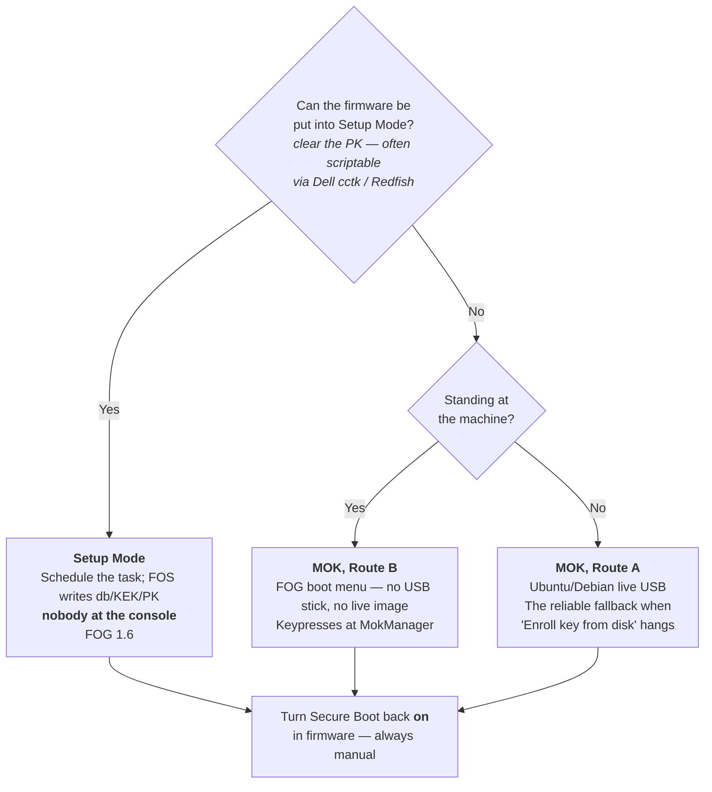

# Secure Boot: signing FOS with your own key

>[!warning] This is a hands-on procedure
>Enrolling a certificate requires **physically visiting each machine once**,
>unless your firmware supports Setup Mode (see below). If your site can
>leave Secure Boot disabled for imaging, that remains far less work. Read
>[Why FOG cannot do this for you](#why-fog-cannot-do-this-for-you) before
>deciding.
>
>The server side is automatic — the installer generates a Secure Boot CA and
>a signing key, signs the FOS kernels, and keeps them signed across
>upgrades, with nothing to configure. What you cannot avoid is enrolling the
>certificate on each client, one way or another.

>[!info] The certificate you enroll and the key that signs are different certificates
>FOG's Secure Boot setup has two parts: a **Secure Boot CA**, which is what
>gets enrolled on each machine (published as `MOK.der`), and a **signing
>leaf** issued by that CA, which is what actually signs kernels day to day.
>That split means rotating the signing key — see [Rotating or removing a
>key](#rotating-or-removing-a-key) — normally doesn't require re-enrolling
>anything. For the full picture of how this fits alongside FOG's other
>certificates, see [[pki-zones|FOG's Certificate Zones]] and
>[[pki-glossary|the PKI glossary]]. If you're recovering from a much
>earlier build that predates this split, see
>[the old flat MOK](#the-old-flat-mok) below.
>
>Signing is on by default. Use `--no-secure-boot` to turn it off.

FOG does not ship signed FOS kernels, and cannot. If your estate mandates UEFI
Secure Boot and turning it off is not an option, this guide explains why, and
routes you to the right page for what you need to do about it.

The result is entirely under your control — which is also the point. Nobody
else, FOG Project included, can produce something your machines will boot.

---

## Why FOG cannot do this for you

Secure Boot is a chain of signatures, and each link only trusts what it was
built to trust.

Your firmware ships with Microsoft's certificates in its allowed-signature
database (`db`). Practically everything bootable is signed either directly by
Microsoft or by a **shim** — a small loader that Microsoft signs once, and
which then carries the *distribution's own* certificate inside it. That is how
Ubuntu and Fedora work: Canonical and Red Hat each got one shim signed, and
from then on they sign their own kernels with their own keys, checked against
the certificate baked into their shim.

For FOG to do the same, the FOG Project would have to own a signing key with
the operational discipline that implies, and get a shim through Microsoft's
review process. Even then, a signature is only as meaningful as the key behind
it — a signing key that ships to everyone protects nobody.

**The iPXE project has already done exactly this.** Since iPXE 2.0, there is a
dedicated iPXE shim — published at
[ipxe/shim](https://github.com/ipxe/shim/releases), Microsoft-signed against
both the 2011 and 2023 certificates — which carries iPXE's own code-signing
certificate as its vendor certificate. Upstream then signs its released
binaries with that key — both the all-drivers `ipxe.efi` and the `snponly.efi`
variant FOG already prefers, for x86_64 and arm64 alike. So a **stock upstream
iPXE** boots under Secure Boot with nothing for you to sign.

The catch is specific to FOG, and it is worth being precise about, because it
is the whole reason this guide exists:

**FOG does not ship stock iPXE binaries.** FOG builds its own — the BIOS
targets with the boot script compiled in (`EMBED=ipxescript`), and, when you
ask for it with `--rebuild-ipxe-with-my-ca`, with your CA baked in (`TRUST=`).
Those are by definition custom binaries, so upstream's signed shim will not
accept them on the strength of iPXE's vendor certificate alone, exactly as it
should. A shim that loaded any binary calling itself iPXE would be worthless.

What FOG *does* do is sign them itself. Every `.efi` in FOG's TFTP tree is
signed with this server's own Secure Boot key, and shim will load one once that
key has been enrolled as a MOK on the machine — which is the physical visit
this guide is about. So the choice is not "signed shim or custom binary"; it is
whether you need a custom binary badly enough to enrol a key before the machine
can netboot. Most sites do not, which is why the section below matters.

>[!note] Only your own tree is signed
>`secureboot/` is left strictly alone — that is upstream's Microsoft-signed
>shim, its loaders and MokManager, and adding a second signature to them buys
>nothing. Binaries you build and copy into `/tftpboot` by hand are not signed
>either; re-run the installer so it signs them.

The way out is to stop needing a custom binary. FOG's embedded boot script is
entirely generic, and iPXE 2.0 can fetch that script from the TFTP server
instead (`autoexec.ipxe`). That lets you run **upstream's signed `snponly.efi`**
and still get FOG's boot behavior — which is the approach FOG takes.

The alternative the firmware already provides is **MOK** (Machine Owner Key):
a per-machine list of extra certificates that *you*, as the physical owner of
the machine, choose to trust. That is what
[[secure-boot-mok-enrollment|MOK enrollment]] uses.

>[!info] Why enrollment usually cannot be automated
>MOK enrollment requires a human at the physical console pressing keys. That
>is not an oversight — it is the security property. If a remote process
>could enroll a signing key, Secure Boot would be decorative. Budget for one
>visit per machine, the same way you would for a firmware password. FOG 1.6
>adds a way to skip this per-machine visit entirely by enrolling directly
>into firmware — see
>[[secure-boot-setup-mode-enrollment|Setup Mode enrollment]] — but it still
>requires touching each machine's firmware
>settings once; there is no way to enroll trust into a machine that has
>never met you.

>[!tip] The alternative: enroll into `db` instead
>Many firmwares can be put into Custom or Setup mode, letting you add your
>own certificate to `db` directly — see
>[[secure-boot-setup-mode-enrollment|Setup Mode enrollment]]. That removes
>shim from the picture — sign whatever you like and the firmware loads it.
>It is the only route if you need HTTPS netboot with FOG's own or your
>internal CA under Secure Boot at the same time; see
>[[pki-zones#https-and-netboot|HTTPS and netboot]].

---

## What actually needs signing

Less than most people expect.

| Component | Signed? | Why |
| --- | --- | --- |
| iPXE (`snponly.efi` / `ipxe.efi`) | **No — use upstream's signed build** | Signed by the iPXE project via its shim; FOG's own builds are custom and unsigned |
| shim (`snponly-shimx64.efi` / `ipxe-shimx64.efi`) | **No — Microsoft already signed it** | Published by the iPXE project |
| FOS kernel (`bzImage`, `bzImage32`) | **Yes — this is your job** | The firmware refuses to load an unsigned kernel |
| FOS init (`init.xz`, `init_32.xz`) | **No** | See below |
| Custom-built iPXE with your CA embedded (`TRUST=`) | **Optional — only if you bypass shim entirely** | Lets you sign your own rebuilt iPXE (e.g. for HTTPS netboot with an internal CA) with your own key; requires enrolling that CA straight into `db` via [[secure-boot-setup-mode-enrollment\|Setup Mode enrollment]], since shim only trusts iPXE's own certificate |
| Your images, snapins, scripts | **No** | They are never executed by firmware |

### The initrd is not verified — by anyone

This surprises people, so it is worth stating plainly: **the initramfs is not
covered by Secure Boot**, on any distribution. Ubuntu and Fedora do not sign
theirs either. They cannot — `dracut` and `initramfs-tools` build the initramfs
locally on each machine at install time and on every kernel update, so the
distribution never sees those bytes.

It is a well-known gap in the model, and the modern answer to it is the
Unified Kernel Image (kernel, initrd and command line stapled into a single
signed binary). FOG does not use UKIs today.

The practical consequence for you: **you only ever need to sign `bzImage` and
`bzImage32`.** Leave `init.xz` and `init_32.xz` alone.

### The chain you are building

```
UEFI firmware        (trusts Microsoft's certificate, via `db`)
  └─ snponly-shimx64.efi  ← Microsoft-signed, published by the iPXE project
      └─ snponly.efi      ← signed by iPXE; UPSTREAM's build, not FOG's
          └─ bzImage      ← YOU sign this; shim checks it against MOK
              └─ init.xz  ← not verified, nothing to do
```

Only the kernel is yours to sign. The two links above it are already signed by
people whose certificates the firmware and the shim respectively trust.

The first link is the one to understand. **MOK is shim's database, not the
firmware's** — the firmware has never heard of it. Shim installs itself as the
authority that later `LoadImage()` calls consult, and *that* is what accepts
your certificate.

The consequence is easy to get wrong: **MOK cannot help the first binary in the
chain.** When the firmware PXE-boots a file directly, it checks that file
against `db` only, because nothing has loaded shim yet to consult MOK. That is
why the shim — not iPXE — has to be your DHCP boot file. Point DHCP straight at
an iPXE binary and no amount of signing or enrolling will save you.

The iPXE shim decides what to load next **from its own filename**, by stripping
`-shim` out of it. Named `snponly-shimx64.efi`, it loads `snponly.efi` from the
directory it was itself loaded from; named `ipxe-shimx64.efi`, it loads
`ipxe.efi`. Whichever you pick, the second-stage file has to be sitting beside
it under exactly that name. Serving the signed chain and signing the kernels
is covered in
[[secure-boot-technical-details|Secure Boot technical details]].

---

## Choosing an enrollment route



- **[[secure-boot-setup-mode-enrollment|Setup Mode enrollment]]** (FOG 1.6) —
  the only route that doesn't end with a human pressing keys on every
  machine, if your firmware supports it.
- **[[secure-boot-mok-enrollment|MOK enrollment]]** — Routes A and B, both
  requiring a person at the console once per machine, working on any FOG
  release. Neither requires turning Secure Boot off.

---

## Before you start

>[!tip] Planning to migrate this server soon? Do that first
>If a server migration (moving FOG to new hardware, per
>[[migrating-fog-server|Migrating FOG Server]]) is already on your roadmap,
>do it **before** setting up Secure Boot here, not after. Migrating an
>already-enrolled Secure Boot setup is a viable, well-understood path — copy
>the `pki/secureboot/` directory forward, per
>[[migrating-fog-server#migrating-the-secure-boot-signing-material|that guide's Secure Boot section]]
>— but it is still one more thing to get right, and
>getting it wrong means every already-enrolled client needs re-enrolling a
>second time for no reason. Enrolling once, on the server you intend to keep,
>is strictly less work than enrolling now and potentially again later.

On the FOG server, nothing. `sbsigntool` (`sbsigntools` on RHEL/Rocky/Alma/
Fedora and Arch) is part of the installer's baseline package set, alongside
`openssl`. If your distribution ships neither name the installer says so and
carries on, leaving the kernels unsigned — read the installer output rather
than assuming.

On each client machine you intend to enroll via MOK, you need a way to run
`mokutil` — most simply, boot it once from any Linux live USB. Setup Mode
enrollment needs no client-side tooling at all.

You do **not** need to download the signed shim or the signed `snponly.efi`.
Every install stages them at `/tftpboot/secureboot/`:

```
/tftpboot/secureboot/
├── snponly-shimx64.efi   Microsoft-signed shim (2011 + 2023), from ipxe/shim
├── snponly.efi           upstream's signed iPXE — firmware's own NIC driver
├── ipxe-shimx64.efi      the same shim again, under the name that loads ipxe.efi
├── ipxe.efi              upstream's signed iPXE — iPXE's own NIC drivers
├── mmx64.efi             MokManager, used during enrolment
├── autoexec.ipxe         FOG's boot script
├── MANIFEST              where each file came from, with checksums
└── arm64-efi/            the same set for arm64
```

Two complete chains, so you can switch between them with nothing but a DHCP
change. `snponly` is the default and the right first choice; `ipxe` is the
fallback for firmware whose own network stack does not work — see
[[secure-boot-technical-details|Secure Boot technical details]] for which to
use and how to serve it.

>[!info] Version note
>The `ipxe.efi` pair arrived with **fog-ipxe v2.0.0-fog.3**. An install pinned
>to an earlier release stages only the `snponly` pair — check `MANIFEST`, which
>lists exactly what your install has.

Everything but `autoexec.ipxe` is upstream's, republished byte for byte through
the [fog-ipxe](https://github.com/FOGProject/fog-ipxe) release the installer
already downloads. Every file's SHA-256 and its signer are verified when that
release is built, so a test-signed or tampered binary fails the release rather
than reaching your server. `MANIFEST` records the source URL and checksum of
each file if you want to confirm that yourself.

Nothing is served from this directory unless you point DHCP at it, so its
presence changes nothing for your existing clients.

>[!info] If the directory is missing
>There is one reason now: the download failed. It is deliberately not fatal, so
>the install completed and said so in its output — re-run it.
>
>Earlier releases also skipped this directory on any HTTPS install, on the
>reasoning that Secure Boot and HTTPS could not coexist. They can, and FOG 1.6
>stages it in **every** install mode. See
>[[netboot-transport-and-pki|Netboot Transport and PKI]].

You can confirm you have a signed binary — a signed one has a non-empty
certificate table, an unsigned one does not:

```bash
sbverify --list /tftpboot/secureboot/snponly.efi
```

The signer should be **iPXE Secure Boot Intermediate G1A**. FOG's own builds
in the TFTP root — `/tftpboot/ipxe.efi`, `/tftpboot/snponly.efi` — are either
unsigned or signed by **FOG Project Secure Boot Signing**, this server's own
key. Either of those means you are looking at the wrong file.

On arm64 the equivalents are `arm64-efi/snponly-shimaa64.efi` and
`arm64-efi/snponly.efi`.

>[!note] Why the shim is renamed `snponly-shimx64.efi`
>The shim decides what to load next by **stripping `-shim` out of its own
>filename** — `ipxe-shimx64.efi` looks for `ipxe.efi`, and
>`snponly-shimx64.efi` looks for `snponly.efi`. That is upstream's own
>mechanism, not a trick: `ipxeboot.tar.gz` ships `ipxe-shim.efi` and
>`snponly-shim.efi` as two symlinks to a single `shimx64.efi` for exactly this
>reason. Renaming does not disturb the signature, which covers the file's
>contents rather than its name.

>[!note] The shim comes from the ipxe/shim release, not from `ipxeboot.tar.gz`
>The tarball contains a `shimx64.efi` too, but it carries only the Microsoft
>UEFI CA **2011** signature. The standalone `ipxe-shimx64.efi` — the one FOG
>stages — carries **two**, 2011 and 2023, which matters on newer hardware that
>ships only the 2023 certificate.
>
>Both facts were confirmed by reading the PE certificate tables directly: the
>standalone shim has two `WIN_CERTIFICATE` entries, the bundled one has a
>single 2011 entry. The fog-ipxe release asserts **both** signatures are
>present, so a silent upstream regression to a 2011-only build fails the
>release rather than stranding anyone on 2023-only firmware.

>[!note] Verify your FOS kernel has an EFI stub
>Under Secure Boot the kernel is loaded by the firmware's own loader rather
>than by iPXE's Linux loader, which requires `CONFIG_EFI_STUB=y`. Stock FOS
>kernels are expected to have it; if boot fails immediately after signing
>with a format complaint rather than a signature complaint, this is the
>first thing to check.

---

## The signing key

**The installer already did this.** On first install it generates a Secure
Boot CA and a signing leaf under that CA, and signs the FOS kernels with the
leaf, so unless you want to supply your own key there is nothing to run here.

```
/opt/fog/pki/secureboot/
├── ca/
│   ├── .fogSBCA.key           0400 root:root — signs the leaf below
│   ├── .fogSBCA.pem
│   └── .fogSBCA.der           this is what MOK.der publishes — ENROL THIS
└── leaf/
    ├── sign.key                0600 root:root — what sbsign actually signs with
    └── sign.pem
```

The directory sits under `$fogprogramdir`, which is never inside the web root,
so none of it is reachable over HTTP. **The web server cannot read either
private key**: kernel downloads from the web UI are signed by a small
root-only helper (`/opt/fog/bin/fog-sign-kernel`) that takes no arguments,
rather than in the web server itself. Only the public certificate is
published, as `MOK.der` in the enrollment kit.

Back up the whole `pki/secureboot/` directory somewhere you would put a root
password. Anyone holding the CA key can mint a new signer your machines will
trust without re-enrolling; anyone holding the leaf key can sign a kernel,
full stop.

>[!warning] The CA is never regenerated, on purpose
>Re-running the installer reuses the existing CA. A fresh CA silently
>invalidates enrollment on **every machine that already trusted the old one**,
>and nothing surfaces that until a client fails to boot. `--recreate-keys` and
>`--recreate-CA` deliberately do not reach it. To rotate the CA on purpose,
>delete `pki/secureboot/`, re-run the installer, and re-enroll every client —
>see [Rotating or removing a key](#rotating-or-removing-a-key). Rotating just
>the *leaf* — the normal case — does not require any of this; see the same
>section.

### Bringing your own key

Want to sign with a key you already control instead of FOG's auto-generated
one? See [[bringing-your-own-ca|Bringing your own CA]] — it covers generating
a leaf, the flat-vs-CA distinction, and getting the CA/leaf split by hand
without FOG 1.6's `--secureboot-ca-cert`.

### Turning signing off

`--no-secure-boot` skips key generation entirely and leaves the FOS kernels
unsigned. It is remembered in `.fogsettings`, so an upgrade will not hand back
a key and a `sudoers` rule you deliberately declined.

### The old flat MOK

If you're reading this because a machine somewhere already enrolled a
self-signed `MOK.key`/`MOK.pem` pair predating the CA/leaf split — the
proof-of-concept that Secure Boot signing could work at all — two things:

- Any server still on that layout gets moved onto the CA/leaf hierarchy
  automatically. The old `MOK.{key,pem}` is left on disk untouched, so
  anything already signed with it can still be re-signed, but new signing
  uses the new leaf.
- Every machine that enrolled the old flat MOK needs to enroll the new CA
  once more — there is no way around a fleet-wide re-enrollment when the
  enrolled certificate itself changes. A transitional path (reusing
  already-signed kernels while enrolling the new CA via a scheduled task)
  is intended for exactly this case, but is not built yet. If this affects
  you, back up your existing `pki/secureboot/`/`secureboot/` directories and
  [open an issue](https://github.com/FOGProject/fogproject/issues) or ask on
  the [FOG forums](https://forums.fogproject.org/) — this only ever affected
  very early testers, not any stable release.

---

## Rotating or removing a key

### Rotating FOG's own auto-generated leaf — the normal case

If you're using FOG's own auto-generated key (no `--secure-boot-key`/
`--secure-boot-cert` passed), the signing leaf rotates **without touching
any client**:

```bash
/opt/fog/pki/renewal-helper --zone secureboot
```

This re-issues the leaf from the Secure Boot CA and re-signs the kernels.
Nothing is re-enrolled in firmware, because what's enrolled is the CA, not
this leaf — see [[pki-zones#secure-boot|Secure Boot]]. This is the case to
reach for on a normal schedule; the two cases below are the disruptive ones.

### Switching to a key you supply

Nothing needs deleting for this one — an admin-supplied key/cert always
takes over immediately, whether or not FOG's own CA/leaf pair already exists:

```bash
cd /path/to/fogproject/bin
./installfog.sh \
  --secure-boot-key  /path/to/your/MOK.priv \
  --secure-boot-cert /path/to/your/MOK.der
```

That one run re-signs the FOS kernels with your key and republishes the
enrollment kit — `MOK.der` and the fingerprint on the **Secure Boot** page —
from your certificate, in the same pass. Remember this switches you to the
**flat model** (see [[bringing-your-own-ca|Bringing your own CA]]) unless
you also pass FOG 1.6's `--secureboot-ca-cert`, so every already-enrolled
client needs re-enrolling — see the danger box below. The paths are recorded
in `.fogsettings`, so every later upgrade keeps using them without the flags
being passed again.

>[!warning] Keep the files where you pointed the installer
>The installer never copies your key or certificate in anywhere — it only
>remembers the paths you gave it. Moving or deleting those files afterward
>breaks signing on the next install or upgrade run, the same way losing any
>other private key would.

### Rotating FOG's own CA

If you want a fresh CA rather than just a fresh leaf under the existing one,
delete the directory first — the installer only generates a new CA when none
is present:

```bash
rm -rf /opt/fog/pki/secureboot
cd /path/to/fogproject/bin && ./installfog.sh
```

That produces a new CA and leaf and re-signs the kernels with the new leaf.

>[!danger] Changing the enrolled certificate stops every already-enrolled client booting at that moment
>This applies to switching to your own flat key, or rotating the CA itself —
>not to rotating just the auto-generated leaf, which is the whole point of
>having a CA above it. Either disruptive path invalidates every client's
>existing trust at once, and nothing surfaces that until a client fails to
>boot. Treat it as a deliberate, planned, estate-wide operation with every
>machine's new fingerprint re-enrolled in the same window, not a routine
>step or something to do mid-troubleshooting.

To remove trust for a certificate from a single MOK-enrolled machine, see
[[secure-boot-mok-enrollment#withdrawing-a-key-from-one-machine|Withdrawing a key from one machine]].

### If the private key is compromised

**There is no remote revocation.** If the compromised key is the auto-
generated leaf, rotate it per [above](#rotating-fogs-own-auto-generated-leaf--the-normal-case)
and nothing else needs to happen. If the compromised key is the CA itself
(or a flat admin-supplied key), every machine that enrolled it needs a
physical visit to remove it and enroll the replacement's fingerprint, exactly
like a planned rotation, just unplanned. That per-machine visit is the trade
you accept for not needing anyone else's permission to sign your own
kernels — treat the private key accordingly, and back it up somewhere you
would put a root password; see [The signing key](#the-signing-key).

---

## Known limits

- **EFI only.** Secure Boot is a UEFI feature; BIOS/legacy PXE clients are
  unaffected and need none of this.
- **One visit per machine, always** — for MOK enrollment. There is no
  supported way to enroll a MOK without physical presence — that is the
  security property, not an oversight. The enrollment kit makes the visit
  short; it cannot remove it.
  [[secure-boot-setup-mode-enrollment|Setup Mode enrollment]] enrolls into the
  firmware's own `db` instead, still
  per-machine, but without the shim/MokManager detour — in practice only
  Dell exposes a genuinely scriptable path for that, via Custom Mode in Dell
  Command | Configure and iDRAC.
- **The initrd is unverified**, as it is everywhere else. If your threat model
  requires a verified initramfs, Secure Boot alone does not give you that on
  any distribution.
- Signing covers *booting*. It says nothing about whether the image FOS then
  writes to disk is trustworthy.
- **HTTPS netboot and Secure Boot are independent, and less constrained
  together than you'd expect.** A web certificate from a **public CA** (e.g.
  Let's Encrypt) on an FQDN gets you HTTPS netboot with no rebuild and no
  loss of the signed Secure Boot shim — see
  [[netboot-transport-and-pki|Netboot Transport and PKI]] for why. With FOG's
  own or your internal CA, a `TRUST=`-rebuilt iPXE is needed, and that binary
  is signed by this server rather than by iPXE — so it costs you a MOK
  enrolment *before* the machine can netboot, not the signed shim itself.
  [[secure-boot-setup-mode-enrollment|Setup Mode enrollment]] skips shim's
  involvement entirely if you would rather.
- **A Secure Boot USB stick does not work the same way.** The filename trick
  the shim uses to find its second stage — `automatic_next_path()` — is called
  only from shim's network and HTTP boot paths. There is no local-filesystem
  equivalent, so a shim booted from a USB stick or an ESP ignores the `-shim`
  rename entirely and falls back to its compiled-in default, `ipxe.efi`. If you
  build a Secure Boot USB from these instructions, name the second stage
  `ipxe.efi` or it will not be found. FOG's ready-made ESP archives sidestep
  this by shipping both loaders — see [[local-esp-boot|Local ESP Boot]].

>[!warning] Turning Secure Boot on can break existing Windows Hello for Business sign-in
>If a machine already has users signed in with Windows Hello for Business
>(PIN or biometric) from before Secure Boot was enabled, those sign-in
>methods typically stop working once it is turned on -- WHfB's local key
>container is sealed against the machine's boot security state, and enabling
>Secure Boot changes it. This is a Windows Hello/Entra ID consequence of
>changing Secure Boot state, not a FOG or MOK issue; it happens the same way
>no matter what enables Secure Boot.
>
>To fix it per affected user:
>
>1. In the Entra admin center: **Users → *(the user)* → Authentication
>   methods → remove Windows Hello for Business.**
>2. Log the user in with their password.
>3. As that user, run:
>   ```
>   certutil.exe -DeleteHelloContainer
>   ```
>4. If Group Policy enables/enforces Windows Hello for Business, also run:
>   ```
>   gpupdate /force
>   ```
>5. Restart the computer. The user signs in with their password and can then
>   re-create their PIN and biometric sign-in.

>[!note] Clearing the TPM does not touch enrolled keys
>Separately from the above: clearing a machine's TPM removes what is sealed
>*to* the TPM (BitLocker keys, the Windows Hello for Business container,
>etc.), but MOK enrollment is not TPM-backed at all — MokList lives in
>ordinary UEFI (NVRAM) variables that shim reads directly. Clearing the TPM
>neither enrolls nor un-enrolls a MOK, and does not interact with anything else
>in this guide.

## Still unverified

If you've found a firmware where Route B's `Enroll key from disk` behaves
differently than described in [[secure-boot-mok-enrollment|MOK enrollment]],
or tested [[secure-boot-setup-mode-enrollment|Setup Mode]]
against real firmware, please confirm it — good or bad — with a pull request
against the relevant page (an inline GitHub edit is fine) or a post on the
[FOG forums](https://forums.fogproject.org/).

## See also

- [[secure-boot-trust-stores|The two trust stores]] — `db` vs `MokList`, and which one your boot path consults
- [[secure-boot-mok-enrollment|MOK enrollment]] — Routes A and B
- [[secure-boot-setup-mode-enrollment|Setup Mode enrollment]] — Route C, FOG 1.6
- [[secure-boot-technical-details|Secure Boot technical details]] — serving the signed chain, signing kernels, signing your own FOS builds
- [[bringing-your-own-ca|Bringing your own CA]]
- [[pki-zones|FOG's Certificate Zones]]
- [[pki-glossary|PKI & Secure Boot Glossary]]
- [[external-ca-lets-encrypt|External CA & Let's Encrypt certificates]]
- [BIOS and UEFI co-existence](bios-and-uefi-co-existence.md)
- [UEFI boot entries](uefi-boot-entries.md)
