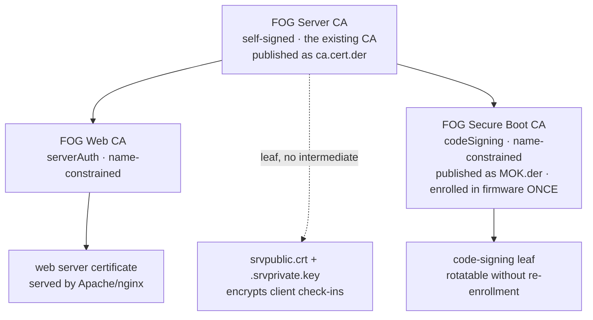

# FOG PKI infrastructure

FOG uses certificates for three unrelated jobs. This page describes how
they're kept separate, what that buys you, and how to replace any of them
with your own CA. For the Secure Boot signing workflow specifically (client
enrollment, rotating keys, Setup Mode), see
[[secure-boot-signing|Secure Boot: signing FOS with your own key]]. For
Let's Encrypt/ACME and fog-client's certificate pinning, see
[[external-ca-lets-encrypt|External CA & Let's Encrypt certificates]]. This
page is the reference the other two link back to.

>[!info] Availability
>The zone split described here applies to every server, generated
>automatically — there's no opt-in flag and no second layout to choose
>between. **Per-zone bring-your-own-CA, storage node certificate issuance,
>and Setup Mode firmware enrollment are FOG 1.6 additions**, flagged inline
>below as they come up.

## The three zones

| Zone | What it protects | Lifetime | Cost of changing it |
|---|---|---|---|
| **Web TLS** | The browser/API connection to the FOG web UI | Leaf: 5 years fixed (Web CA: 30 years) | None. Browsers just need the issuer trusted. |
| **Client Communication** | fog-client's encrypted check-in with the server | 10 years fixed | Medium. Every registered client must re-pin. |
| **Secure Boot** | The signature on the FOS kernels | CA (what's enrolled): 30 years · leaf: 5 years | High. Firmware re-enrollment on every machine. |

The root "FOG Server CA" itself is fixed at 30 years too, same as both
intermediates — only the two leaf types (web, Secure Boot) default shorter.

They have nothing in common except that FOG generates all three, and their
costs differ by orders of magnitude — which is exactly why they don't share
key material.

## Why they were separated

In the historic layout, one self-signed CA did the first two jobs, and one
self-signed leaf did the third. That produced two problems with the same
shape:

**`.srvprivate.key` was the web server's TLS key *and* the key that decrypts
every fog-client handshake.** `FOGBase::certDecrypt()` opens that exact path
on every `authorize()` call. So an ACME renewal, a purchased certificate
dropped in place, or `--recreate-keys` installed a perfectly valid
certificate and silently broke client authentication, with nothing in the
logs connecting the two.

**The enrolled Secure Boot key was the signing certificate itself.** Because
the thing in the firmware was a leaf that can issue nothing, rotating or
revoking the signing key meant a physical MokManager trip to every machine.

Both are the same mistake: one file serving as both a *trust anchor* and an
*operational key* — the thing you must never change, and the thing you want
to change routinely, were the same object. Separating them is also the fix
for a real advisory
([GHSA-94p8-jg9j-99v4](https://github.com/FOGProject/fogproject/security/advisories/GHSA-94p8-jg9j-99v4)):
an unconstrained root CA key let anyone who could read it mint trusted certs
for arbitrary domains, or sign arbitrary binaries Windows would run without
warning.

## The layout



The anchor is the CA your server already has — nothing above it is created,
so `ca.cert.der` doesn't change and no fog-client re-pins.

>[!tip] A useful consequence
>Because the certificate fog-client pins **is** the root, the Web CA sits
>beneath something every client already trusts. Trusting `ca.cert.der` once
>also validates the web certificate the Web CA later issues.

Under `$fogprogramdir/pki/` (default `/opt/fog/pki/`), one subfolder per
zone, each split into `ca/` (the zone's own CA material) and `leaf/` (what
that CA issues day to day):

| Path | What it is |
|---|---|
| `root/ca/.fogCA.{key,pem}` | The anchor. Key never regenerated, `0400 root:root`. |
| `root/leaf/.srvprivate.key` | Symlink → `$PKI_client_cert_dir/.srvprivate.key` |
| `root/leaf/.srvpublic.crt` | Symlink → `$PKI_client_cert_dir/.srvpublic.crt` |
| `web/ca/.fogWebCA.{key,pem}` | Signs the vhost's certificate |
| `web/ca/.fogWebCAchain.pem` | CA + web intermediate |
| `web/leaf/.webLeaf.{key,pem}` | What the web server actually serves |
| `secureboot/ca/.fogSBCA.{key,pem,der}` | Signs the code-signing leaf; `.der` is the same certificate `MOK.der` publishes |
| `secureboot/leaf/sign.{key,pem}` | What `sbsign` actually signs with |

`.srvprivate.key`/`.srvpublic.crt` stay exactly where they've always been —
`root/leaf/` only adds discoverability symlinks to them.

An install that already ran an earlier layout migrates its existing
key/cert material into this tree in place — nothing is re-issued, and old
paths keep resolving via symlink where anything might still reference them
directly.

## What an upgrade does and does not change

| | |
|---|---|
| `pki/root/ca/.fogCA.pem` | **unchanged**, byte for byte |
| `ca.cert.der` | **unchanged** — no client re-pins |
| `.srvprivate.key` | **unchanged** — client authentication is unaffected |
| the web certificate | **new**, issued by the Web CA, on its own keypair |
| the Secure Boot MOK | **new** — see [[secure-boot-signing\|the Secure Boot guide]], this one needs action |

The only endpoint-visible change is Secure Boot.

## Private key protection

The CA private key used to be readable by the web user — a remote code
execution in the PHP application could read the key the entire installation
trusts. `_hardenPkiPermissions` now locks each zone's CA key down after
generation:

| File | Mode | Why |
|---|---|---|
| `pki/root/ca/.fogCA.key` | `0400 root:root` | nothing on a running server needs it |
| `pki/secureboot/ca/.fogSBCA.key` | `0400 root:root` | same |
| `pki/web/ca/.fogWebCA.key` | `0600 root:root` | used only by root, through the sudo helper |
| `.srvprivate.key` | `0640 root:<apache>` | `certDecrypt()` must read this one |

>[!warning] This is pseudo-offline
>It protects the keys from a compromise of the web application, not from a
>compromise of the machine itself.

## Taking a key offline

```bash
/opt/fog/pki/fog-offline-ca-key /mnt/vault                  # the CA key
/opt/fog/pki/fog-offline-ca-key /mnt/vault --zone secureboot
```

The helper copies the key, verifies the copy still matches the certificate
that stays behind, and only then shreds the original — the key is what
leaves, never the certificate.

>[!warning] It's the certificate that must never move, not the key
>This warning is about a *different* file than the one you just offlined.
>Everything on the server chains to the CA's certificate, and the installer
>uses its presence — not the key's — to recognize that a CA already exists.
>Move or delete the *certificate* (root or intermediate alike) and the next
>run mints a brand new CA in its place, orphaning every intermediate and
>leaf beneath it and every client that already trusts what's enrolled.

Day to day nothing needs the key — only issuing a **new** intermediate, or a
new leaf beneath one whose own key is offline, does. The installer detects
an offlined key and says what to restore rather than failing inside
openssl.

## Leaf renewal

The web leaf and the Secure Boot signing leaf default to 5 years — short
enough that a compromised leaf key ages out on its own, long enough that
nothing renews them automatically. To rotate either one sooner:

```bash
/opt/fog/pki/renewal-helper --zone web
/opt/fog/pki/renewal-helper --zone secureboot
```

The web leaf re-issues from the online Web CA and reloads the web server.
The Secure Boot leaf re-issues from the Secure Boot CA and needs no
reload — nothing has to be re-enrolled in firmware, because it's the
intermediate that's enrolled, not the leaf. See
[[secure-boot-signing#rotating-or-removing-a-key|Rotating or removing a key]]
for the fleet-wide implications of that.

Either invocation refuses, and tells you the exact path to restore, if the
signing CA's private key isn't on this server. The web leaf invocation also
refuses on a leaf managed outside FOG — one whose canonical path resolves
outside this zone directory. Renew that one through your ACME client instead; see
[[external-ca-lets-encrypt|External CA & Let's Encrypt certificates]].

Nothing here runs on a timer — wire it into your own cron if you want
unattended renewal.

## Name constraints

Both intermediates carry `nameConstraints` and an `extendedKeyUsage`, so
neither can issue outside its zone or outside your network:

```
Web CA:          extendedKeyUsage = serverAuth
Secure Boot CA:  extendedKeyUsage = codeSigning
both:            permitted DNS: this server's hostname and domain
                 permitted IP:  all RFC1918 ranges, plus this server's own
```

Extend or narrow with:

```bash
./installfog.sh --internal-domain branch.example.local   # repeatable
./installfog.sh --internal-subnet 10.20.30.0/24          # repeatable; REPLACES
                                                          # the RFC1918 default
```

>[!warning] Constraints are fixed when the CA is issued, and a CA is never re-issued
>Renaming the server, or adding an `--extra-server-name` outside the
>permitted domains, produces a valid certificate that nothing accepts. The
>installer verifies the leaf against its issuer after signing and names the
>`rm -rf` that lets the CA be re-created with the new constraints.

**The Secure Boot CA carries no name constraints at all**, and since FOG 1.6
there is deliberately no setting or flag to add them. They don't constrain
anything that matters for code signing — a code-signing certificate carries no
names anyone resolves — and they sit in the one certificate UEFI and shim
actually parse, where a critical extension the firmware mishandles costs a
physical trip to every machine.

`--no-sb-name-constraints` used to make them opt-out, and was removed with the
setting behind it: an opt-out put the safe answer behind a flag nobody passes
until a fleet has already failed to boot. Existing servers keep whatever their
Secure Boot intermediate already carries, since an intermediate is never
re-minted. Constraints stay on the **Web** CA, where iPXE is a verifier FOG can
patch and firmware is not.

>[!note] A related trap, measured rather than assumed
>OpenSSL applies DNS constraints to the subject **CN** when a certificate
>carries no DNS SAN. A CN of `evil.example.com` under a `corp.local`
>constraint is rejected; the Secure Boot signing CN passes only because
>"FOG Project Secure Boot Signing" isn't hostname-shaped. Depending on that
>would mean a rename of that CN stops the fleet booting, so the signing leaf
>carries a permitted DNS SAN instead.

## Bringing your own CA

>[!info] FOG 1.6
>Per-zone bring-your-own-CA is a FOG 1.6 addition. On earlier releases, only
>bringing your own Secure Boot signing key/cert (a leaf, not a CA) is
>available.

Each zone is independently replaceable with a CA or key you already
run — the Web zone (`--web-ca-*`, or the legacy `--external-ca`) and the
Secure Boot zone (`--secureboot-ca-cert`, or a flat leaf via
`--secure-boot-key`/`--secure-boot-cert` on earlier releases) each have
their own flags and their own gotchas. **The Client Communication zone is
not replaceable this way, deliberately** — it's anchored at the certificate
every fog-client has already pinned, so replacing it means re-deploying
trust to every registered machine by some other means (GPO, client
reinstall); there's no built-in path for it. Full detail, commands, and
the flat-vs-CA distinction for Secure Boot: see
[[bringing-your-own-ca|Bringing your own CA]].

**If your CA carries `pathlen:0`** — an ordinary thing for an enterprise to
issue — it can't anchor an intermediate. The installer detects this, says
so, signs the web certificate directly from it instead, and leaves Secure
Boot on its self-signed key. Nothing is silently broken.

## Storage nodes

>[!info] FOG 1.6
>Storage node certificate issuance is a FOG 1.6 addition.

A storage node used to generate its own independent self-signed
`FOG Server CA`, so a fleet of five nodes had six unrelated CAs. Nodes now
ask the master for a certificate from the Web CA instead — authenticating
with the fogstorage database password they already hold, so nothing new
has to be distributed.

Two consequences worth knowing:

- **The node must be registered first.** A node the master doesn't know is
  refused, by design.
- **Any failure falls back to a self-signed certificate**, exactly as
  before, with an explanation — a node install must not break against a
  master that hasn't been updated yet.

## Certificate paths

>[!info] FOG 1.6
>Canonical-path symlink indirection is a FOG 1.6 addition.

FOG's own consumers — the vhost, `sbsign`, `certDecrypt()` — only ever
reference fixed canonical paths. Those paths may be symlinks, so the real
files can live wherever you keep certificates:

```bash
ln -sf /etc/pki/fog/server.key /opt/fog/pki/web/leaf/.webLeaf.key
ln -sf /etc/pki/fog/server.pem /opt/fog/pki/web/leaf/.webLeaf.pem
```

Relocating a certificate then never means editing the vhost — or
`.fogsettings`. The canonical path is what FOG recomputes and refers to every
run, so pointing the *path* somewhere else does nothing; make the path
**resolve** to your file instead. FOG reads the target, sees it is outside this
zone, and leaves it alone.

>[!note]
>SELinux labels follow the symlink **target**, so a certificate outside the
>expected directories may need `restorecon` or `semanage fcontext` on the
>real path. And a private key relocated into a world-readable directory
>silently defeats the separation the Secure Boot signing helper depends on.

## HTTPS and netboot

iPXE's netboot fetches (`boot.php`, the kernel, the initrd) are not tied to
FOG's own CA the way fog-client is:

| Web certificate issued by | Web UI / API / fog-client | iPXE netboot |
|---|---|---|
| Public CA (Let's Encrypt) | HTTPS, trusted natively | **HTTPS with no rebuild**, FQDN only |
| FOG's own PKI (this page) | HTTPS once `ca.cert.der` is trusted | HTTP by default; HTTPS with `embed-ca` |
| Your internal PKI | HTTPS once your root is trusted | HTTP by default; HTTPS with `embed-ca` |

The full decision, including what each install mode sets and what `embed-ca`
costs, is in [[netboot-transport-and-pki|Netboot Transport and PKI]].

Stock iPXE ships an unconditional public-CA fallback
(`ca.ipxe.org`) that cross-signs real-world public roots — Let's Encrypt
included — at connect time, independent of whether FOG rebuilt the binary
with its own CA baked in, and independent of Secure Boot enrollment status.
So a web certificate from a public CA on an FQDN gets you HTTPS netboot with
**no rebuild, and no loss of the signed Secure Boot shim.** That only fails
on a fully air-gapped network with no route to `ca.ipxe.org`.

Getting HTTPS netboot to work with FOG's own or your internal (non-publicly
trusted) CA instead means rebuilding iPXE with that CA baked in (`TRUST=`),
which is what `--install-mode embed-ca` does. That rebuilt binary is not
upstream's *Microsoft-signed* one — but it is not unsigned either. FOG signs
every EFI binary in its own TFTP tree with this server's Secure Boot signing
key, and upstream's signed shim will load it once that key has been enrolled
as a MOK on the machine. So the trade is not "lose Secure Boot"; it is **enrol
this server's key before the machine can netboot**, which reverses the usual
order in which a machine netboots first and enrols afterwards. See
[[secure-boot-mok-enrollment|Secure Boot MOK Enrollment]].

Enrolling your CA directly into UEFI firmware (`db`/`KEK`/`PK`, "Setup Mode" —
see [[secure-boot-setup-mode-enrollment|Secure Boot Setup Mode Enrollment]]) is
an alternative that bypasses shim entirely, not the only route.

Netboot stays on HTTP unless something asks otherwise, on fresh installs and
existing servers alike. It moves to HTTPS when the web certificate is declared
public (`PKI_web_cert_publicly_trusted`) or the rebuild is requested
(`BOOT_rebuild_ipxe_with_my_ca`).
A value FOG derived is re-derived on every run, so turning the trigger back off
returns netboot to HTTP. Override either way with `--netboot-proto http|https`,
which is remembered.

>[!note]
>Public Let's Encrypt for netboot works only on an FQDN in a domain you
>control — it doesn't need to be publicly reachable, DNS-01 is enough — and
>only on that exact FQDN, not a short hostname and not an IP. Set
>`FOG_WEB_HOST` to that FQDN or the generated boot URLs won't match the
>certificate.

>[!info] FOG 1.6
>The web/API-vs-netboot protocol split described above (`BOOT_url_proto`,
>`--netboot-proto`) is a FOG 1.6 addition, and its Nginx support is
>unverified — see [Still unverified](#still-unverified).

## Secure Boot

The Secure Boot zone follows the same shape as the web zone: the CA issues a
**FOG Secure Boot CA**, that intermediate is what gets enrolled in firmware
(`MOK.der`), and it issues a short-lived **code-signing leaf** that actually
signs the FOS kernels. `sbsign --addcert` embeds the intermediate in the
signature so shim can chain the leaf back to what was enrolled.

The point is rotation. Under the old flat model the enrolled certificate
*is* the signer, so replacing a signing key means a physical MokManager trip
to every machine. Enrolling the issuer instead means leaves can be rotated
or reissued while the fleet keeps booting.

Start at [[secure-boot-signing|Secure Boot: signing FOS with your own key]]
for the concepts and rotating/removing a key; enrollment itself is split
into [[secure-boot-mok-enrollment|MOK enrollment]] (any release) and
[[secure-boot-setup-mode-enrollment|Setup Mode enrollment]] (FOG 1.6,
unattended).

>[!warning] Servers that already enrolled a flat MOK
>A server that generated a self-signed MOK under an earlier build is moved
>onto the intermediate, and any machine that enrolled the old key must
>enroll once more. This only affects very early testers of the redesign —
>see
>[[secure-boot-signing#the-old-flat-mok|the note in the Secure Boot guide]].

## Still unverified

- **Nginx.** Vhost changes for this redesign (the managed-block splice, the
  `BOOT_url_proto` redirect exclusion) have been exercised on Apache only.
- **Secure Boot with name constraints, on hardware.**
- **Node certificate issuance against a real second machine.** The endpoint
  and the signing helper are each verified in isolation; the two halves
  haven't been run against each other across a network.

If you've tested one of these and can confirm it working (or not), please
open a pull request against this page — an inline edit on GitHub is enough —
or post on the [FOG forums](https://forums.fogproject.org/) so this page can
be updated with a confirmed result instead of a caveat.
