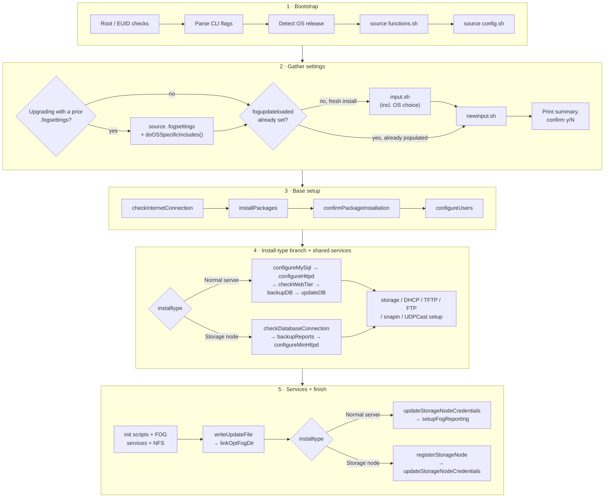
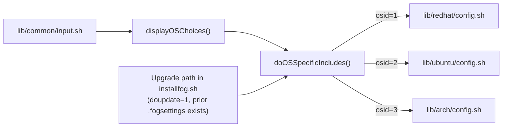

>[!warning] Traduction automatique
>Cette page a été traduite automatiquement et peut contenir des erreurs. En cas de doute, reportez-vous à [la version anglaise](https://docs.fogproject.org/en/latest/development/install-script-architecture).

# Architecture du script d'installation

L'installateur du serveur FOG est [`bin/installfog.sh`](https://github.com/FOGProject/fogproject/blob/dev-branch/bin/installfog.sh)
dans le dépôt principal `fogproject`, plus une poignée de fichiers qu'il
source depuis `lib/`. Cette page cartographie la façon dont ces pièces
s'assemblent, pour quiconque débogue une installation échouée, modifie le
comportement de l'installateur ou ajoute la prise en charge d'une nouvelle
distribution Linux. Elle ne répète volontairement **pas** ce qui est déjà
documenté pour les utilisateurs finaux :

- Pour exécuter l'installateur et savoir ce qu'il vous demande, voir
  [[install-fog-server|Installer le serveur FOG]].
- Pour chaque option CLI, voir
  [[command-line-options|Options de ligne de commande de l'installateur FOG]].
- Pour le fichier de paramètres persistant que l'installateur lit/écrit, voir
  [[install-fogsettings|Le fichier .fogsettings]].

## Où se trouve le code

| Fichier | Rôle |
|---|---|
| [`bin/installfog.sh`](https://github.com/FOGProject/fogproject/blob/dev-branch/bin/installfog.sh) | Point d'entrée. Vérifications root/OS, analyse de la CLI, orchestre tout le reste. |
| [`lib/common/functions.sh`](https://github.com/FOGProject/fogproject/blob/dev-branch/lib/common/functions.sh) | ~3 000 lignes — presque toutes les fonctions appelées par l'installateur vivent ici. |
| [`lib/common/config.sh`](https://github.com/FOGProject/fogproject/blob/dev-branch/lib/common/config.sh) | Valeurs par défaut de chemins/services indépendantes de l'OS, plus la détection systemd-vs-init.d. |
| [`lib/common/input.sh`](https://github.com/FOGProject/fogproject/blob/dev-branch/lib/common/input.sh) | Invites interactives pour une installation fraîche (interface, DHCP, HTTPS, type d'installation, choix de l'OS, …). |
| [`lib/common/newinput.sh`](https://github.com/FOGProject/fogproject/blob/dev-branch/lib/common/newinput.sh) | Un petit ensemble d'invites inconditionnelles (nom d'hôte du certificat, rapport d'utilisation) — voir [pourquoi il est séparé](#saisie-interactive--inputsh-vs-newinputsh). |
| [`lib/common/utils.sh`](https://github.com/FOGProject/fogproject/blob/dev-branch/lib/common/utils.sh) | Ne fait **pas** partie du flux d'installation principal — un script d'aide autonome « quelle version de FOG est installée » qui réutilise `displayBanner`/`dots` de `functions.sh`. |
| [`lib/redhat/config.sh`](https://github.com/FOGProject/fogproject/blob/dev-branch/lib/redhat/config.sh), [`lib/ubuntu/config.sh`](https://github.com/FOGProject/fogproject/blob/dev-branch/lib/ubuntu/config.sh), [`lib/arch/config.sh`](https://github.com/FOGProject/fogproject/blob/dev-branch/lib/arch/config.sh) | La couche d'abstraction par OS — voir [ci-dessous](#la-couche-dabstraction-par-os). |

## Flux d'installation général

Lisez ceci comme cinq rangées, de haut en bas — chaque rangée se lit
elle-même de gauche à droite :

Les deux branches `installtype` divergent pour une raison : un **serveur
normal** possède la base de données (`configureMySql`, `checkWebTier`,
`backupDB`, `updateDB` déploient/vérifient le schéma eux-mêmes), tandis
qu'un **nœud de stockage** dialogue avec un maître *existant*
(`checkDatabaseConnection` se contente de le sonder, `configureMinHttpd`
installe un `index.php` de substitution qui refuse de servir l'interface
web, et `registerStorageNode` annonce le nouveau nœud à ce maître). Les
deux chemins convergent vers la même configuration
stockage/DHCP/TFTP/FTP/snapin/services au milieu, et tous deux finissent
par appeler `updateStorageNodeCredentials` pour maintenir la
synchronisation des identifiants propres au nœud.

## La couche d'abstraction par OS

`functions.sh` et `installfog.sh` sont écrits de façon indépendante de
l'OS — partout où ils ont besoin d'un nom de paquet, d'un nom de service ou
d'un chemin de configuration, ils lisent une variable au lieu d'en coder un
en dur. Ces variables sont fournies par exactement un des trois fichiers,
sélectionné par `doOSSpecificIncludes()` (définie dans `functions.sh`)
selon `$osid` :

`doOSSpecificIncludes()` s'exécute depuis **deux** endroits, pas un seul :
une fois depuis l'intérieur de `displayOSChoices()` pendant le flux
interactif normal (`input.sh` → invite OS → ce dispatch), et une fois
directement depuis `installfog.sh` juste après le sourçage d'un
`.fogsettings` antérieur sur le chemin de mise à niveau — parce que ce
raccourci de mise à niveau peut sauter `input.sh` entièrement (voir
[ci-dessous](#saisie-interactive--inputsh-vs-newinputsh)), ce qui
signifierait sinon que les variables par OS ne seraient jamais
(re)chargées pour cette exécution. Arch fait aussi l'objet d'un cas
particulier ici : `doOSSpecificIncludes()` force `systemctl="yes"` pour
`osid=3`, quel que soit le résultat de la détection systemd de
`lib/common/config.sh`.

### Le contrat que chaque fichier OS implémente

Les trois fichiers suivent le même idiome — `[[ -z $var ]] && var="default"` —
de sorte qu'une valeur déjà définie (par une option CLI, ou par un
`.fogsettings` antérieur lors d'une mise à niveau) est toujours laissée
intacte plutôt qu'écrasée. Les variables que chacun d'eux définit :

`packageQuery`, `packages`, `packageinstaller`, `packagelist`,
`packageupdater`, `packmanUpdate`, `langPackages`, `dhcpname`,
`webdirdest`/`docroot`, `webredirect`, `apacheuser`, `apachelogdir`,
`apacheerrlog`, `apacheacclog`, `etcconf`, `storageLocation`,
`storageLocationCapture`, `dhcpconfig`, `dhcpconfigother`, `tftpdirdst`,
`ftpconfig`, `snapindir`, `dhcpd`, `iscservice`, `keapackage`, `keaservice`.

Quelques variables ne sont **pas** universelles — une implémentation
ajoutant un quatrième OS devrait les traiter comme des extras optionnels
dont les autres fichiers se trouvent avoir besoin, pas comme des membres
obligatoires de l'interface : `repoenable` (RedHat uniquement), `phpfpm`
(RedHat uniquement — le php-fpm de Debian est géré par le seul nommage des
paquets), `nfsexportsopts` (branche Mageia de RedHat uniquement),
`tftpconfigupstartdefaults` (Ubuntu uniquement), et
`tftpconfig`/`ftpxinetd`/`httpdconf` (Arch uniquement, parce qu'Arch est le
seul OS ici qui supervise encore tftp/ftp via `xinetd` au lieu d'un démon
autonome).

### Ce qui diffère réellement entre les trois

| Aspect | Famille RedHat (`osid=1`) | Famille Ubuntu/Debian (`osid=2`) | Arch (`osid=3`) |
|---|---|---|---|
| Gestionnaire de paquets | `dnf` ou `yum`, autodétecté ; **échec dur si aucun des deux n'existe** | `apt-get`/`dpkg`, supposé inconditionnellement | `pacman`, supposé inconditionnellement |
| Nommage du moteur de BD | Noms `mysql`/`mariadb` codés en dur selon la branche de distribution | **Sonde à l'exécution** si `mysql-server` est déjà installé pour choisir les noms de paquets MySQL ou MariaDB | Noms `mariadb` codés en dur |
| Nom du service DHCP | `dhcpd` / `dhcp-server` (RHEL 8+) vs `dhcp` (RHEL 7-) | `isc-dhcp-server` (même nom pour le paquet et le service) | `dhcpd4` |
| Racine web par défaut | `/var/www/html/` | `/var/www/html/`, avec repli sur `/var/www/` si celui-ci n'existe pas | `/srv/http/` |
| Utilisateur d'exécution d'Apache | `apache` | `www-data` | `http` |
| Racine TFTP | `/tftpboot` (Mageia : `/var/lib/tftpboot`) | `/tftpboot` | `/srv/tftp` |
| Supervision des services | systemd ou `chkconfig`/`init.d` | systemd ou `sysv-rc-conf`/`insserv` | systemd (forcé) **+** `xinetd` pour tftp/ftp |
| Branchement interne par OS | Le plus riche — un sous-cas Mageia, plus des renommages de paquets conditionnés par `$OSVersion` | Une branche couvrant ubuntu/debian/mint uniformément (ne distingue pas du tout Debian d'Ubuntu) | Aucun — Arch est traité comme une cible unique et plate |

La prise en charge de Kea DHCP (une alternative à ISC-DHCP) est
nominalement disponible sur les trois — chacun définit
`keapackage`/`keaservice` — mais la disponibilité est en réalité décidée au
moment de l'installation par `resolveDHCPEngine()`, qui sonde si le paquet
nommé s'installe, et non par quoi que ce soit dans les fichiers par OS
eux-mêmes.

## Saisie interactive : `input.sh` vs `newinput.sh`

Les deux fichiers utilisent le même idiome : une boucle
`while [[ -z $var ]]; do … done` par question, entièrement sautée si la
variable est déjà définie (par une option CLI ou `.fogsettings`) et qui
sinon affiche une invite avec une valeur par défaut calculée acceptable
d'un simple `<Entrée>` (sauf si `-d`/`--no-defaults` est passé, ou si
`-y`/`--autoaccept` saute complètement l'invite).

`input.sh` constitue l'essentiel du flux interactif : interface réseau,
routeur, DNS, plage DHCP, langue d'installation, type d'installation,
identifiants de BD du nœud de stockage, HTTPS. Mais il n'est sourcé que
lorsque `[[ ! $doupdate -eq 1 || ! $fogupdateloaded -eq 1 ]]` — c'est-à-dire
qu'il est **entièrement sauté lors d'une mise à niveau** où le
`.fogsettings` chargé a déjà `fogupdateloaded=1`.

`newinput.sh` n'a pas une telle garde — `installfog.sh` le source toujours.
Il existe précisément pour qu'une invite introduite *après* la dernière
écriture du `.fogsettings` de quelqu'un soit quand même posée lors de sa
prochaine mise à niveau, même si l'essentiel d'`input.sh` est contourné
pour lui. Il pose actuellement exactement deux questions : le nom d'hôte
utilisé pour le CN du certificat TLS généré (pas le nom d'hôte du système),
et l'acceptation ou non du rapport d'utilisation anonyme (nom de l'OS,
version de l'OS, version de FOG uniquement). Toute nouvelle invite qui doit
atteindre les installations existantes lors d'une mise à niveau doit être
ajoutée ici, pas dans `input.sh`.

## Référence des fonctions par domaine

Presque tout ce qui suit vit dans `lib/common/functions.sh` ; une fonction
est dite « interne » si rien dans `installfog.sh` ne l'appelle
directement — seulement d'autres fonctions de la bibliothèque.

### Installation de paquets et dépôts

| Fonction | Rôle |
|---|---|
| `installPackages()` | Construit la liste finale `$packages` selon l'OS/la version (nommage MySQL-vs-MariaDB, paquets de langue, configuration des dépôts EPEL/Remi ou PPA), appelle `resolveDHCPEngine`, installe le tout. |
| `confirmPackageInstallation()` | Re-interroge chaque paquet de `$packages` pour confirmer qu'il a réellement été installé. |
| `addOndrejRepo()` | *Interne.* Configuration du PPA PHP/Apache réservée à Debian/Ubuntu, appelée depuis `installPackages`. |
| `resolveDHCPEngine()` | *Interne.* Choisit ISC-DHCP ou Kea pour le service DHCP hébergé par FOG — voir [DHCP](#dhcp-isc-vs-kea) ci-dessous. |

### MySQL/MariaDB et déploiement du schéma

| Fonction | Rôle |
|---|---|
| `configureMySql()` | La plus grosse fonction du fichier. Résout la bonne unité systemd de BD, détecte et sécurise un compte root sans mot de passe, crée/renouvelle l'utilisateur `fogstorage`, et (sauf en mode BD externe) effectue le premier `mysql_install_db` sur Arch. |
| `checkDatabaseConnection()` | Chemin nœud de stockage : sonde la BD du maître avec les identifiants configurés. |
| `backupDB()` | Télécharge une sauvegarde `.sql` via la couche web avant une mise à niveau ; ne fait rien en mode BD externe. |
| `updateDB()` | Orchestre le déploiement du schéma — envoie en POST la requête de mise à jour du schéma avec un jeton d'installation, ou affiche les instructions de connexion/jeton pour une mise à jour manuelle via le navigateur, puis vérifie qu'elle a bien eu lieu. |
| `schemaVersionInDB()`, `fogUserCount()` | *Internes*, toutes deux appelées uniquement depuis `updateDB`. Renvoient un nombre ou **rien** — les appelants doivent traiter la valeur vide comme « inconnu », jamais comme zéro (voir [pièges](#décisions-de-conception-à-connaître-avant-de-toucher-ce-fichier)). |
| `verifySchemaDeploy()` | *Interne.* Confirme que la version du schéma déployée correspond réellement à ce que le code attend. |

### Apache/httpd et la couche web

| Fonction | Rôle |
|---|---|
| `configureHttpd()` | Arrête httpd/php-fpm, déploie les fichiers web, génère le jeton d'amorçage du schéma propre à l'installation, écrit `config.class.php`, et (Arch uniquement) réécrit `httpd.conf`/`php.ini` puisqu'Arch livre la plupart des modules désactivés par défaut. |
| `configureMinHttpd()` | Variante nœud de stockage — appelle `configureHttpd()` puis remplace `management/index.php` par un fichier de substitution qui refuse de servir l'interface. |
| `createSSLCA()` | *Interne.* Crée/réutilise la CA auto-signée et le certificat serveur, écrit le vhost Apache, ajuste la configuration du pool de php-fpm. |
| `downloadfiles()` | *Interne.* Télécharge les binaires kernel/init/iPXE/client depuis les GitHub Releases avec vérification SHA-256 et nouvelles tentatives. |
| `checkWebTier()` | Sonde l'interface web pour obtenir une véritable réponse non vide avant de faire confiance à quoi que ce soit d'autre qui lui parle — voir [pièges](#décisions-de-conception-à-connaître-avant-de-toucher-ce-fichier). |

### DHCP (ISC vs Kea)

| Fonction | Rôle |
|---|---|
| `configureDHCP()` | Point d'entrée de premier niveau. Si FOG n'héberge pas le DHCP, dépose simplement une configuration Kea de référence (`writeKeaSample`) pour les administrateurs exécutant le DHCP ailleurs. Sinon, calcule le sous-réseau/la plage et écrit soit un `dhcpd.conf` ISC (avec un bloc `class` par architecture de démarrage), soit délègue à Kea. |
| `configureKeaDHCP()` | *Interne.* Écrit la configuration Kea active en deux niveaux — les classes d'architecture de base doivent passer `kea-dhcp4 -t`, mais l'ajout de la classe Apple BSDP est fait au mieux et silencieusement abandonné si Kea le rejette. |
| `writeKeaSample()`, `_writeKeaConfig()`, `_keaBaseClasses()`, `_keaAppleClass()` | *Internes.* Aides partagées pour que la configuration Kea active et l'exemple prêt à copier ne puissent pas diverger — reflétant délibérément les blocs `class` ISC de `configureDHCP()`. |

### TFTP/PXE, NFS, FTP, UDPCast

| Fonction | Rôle |
|---|---|
| `configureTFTPandPXE()` | Reconstruit iPXE (en faisant confiance à la CA du site si HTTPS est activé), déploie l'arborescence TFTP et configure le service TFTP — `tftpd-hpa` sur la famille Debian, ou une paire `fog-tftp.service`/`.socket` écrite à la main ailleurs. |
| `configureDefaultiPXEfile()` | *Interne.* Écrit le script de démarrage iPXE qui enchaîne vers `service/ipxe/boot.php`. |
| `configureNFS()` | Réécrit `/etc/exports` (sauf `-E`/`--no-exportbuild`) en le mappant à l'utilisateur FOG, et avertit explicitement si un export existant a encore `no_root_squash`. |
| `configureFTP()` | Écrit `vsftpd.conf`, en ajoutant `seccomp_sandbox=NO` sur vsftpd ≥3.2. |
| `configureUDPCast()` | Extrait les sources UDPCast embarquées et les compile/installe, avec un rafraîchissement de `config.guess`/`config.sub` spécifique aux CPU Broadcom. |

### Services et scripts d'init

| Fonction | Rôle |
|---|---|
| `installFOGServices()` | Copie en place les binaires des services d'arrière-plan de FOG. |
| `installInitScript()` | Déploie les unités systemd / scripts init.d, puis appelle `enableInitScript`. |
| `enableInitScript()`, `startInitScript()`, `stopInitScript()` | *Internes.* Activent/démarrent/arrêtent chaque service de `$serviceList`, en branchant sur `$systemctl` et (pour le repli non-systemd) `$osid`. |
| `configureFOGService()` | Écrit le paramètre webroot du `config.php` des services. |

### Utilisateurs, SELinux, pare-feu

| Fonction | Rôle |
|---|---|
| `configureUsers()` | Crée le compte système `fogproject`, installe un script d'avertissement à la connexion pour que personne ne le confonde avec un compte interactif, et définit/valide son mot de passe. |
| `checkPasswordChars()`, `generatePassword()` | *Internes*, appelées depuis `configureUsers`/`configureMySql`. Imposent/génèrent des mots de passe que l'outillage de l'installateur peut manipuler sans risque. |
| `checkSELinux()` | Propose de passer SELinux en mode permissif (par défaut : **oui**). |
| `checkFirewall()` | Détecte un jeu de règles iptables non standard ou un firewalld en cours d'exécution et propose de le désactiver (par défaut : **non**, contrairement à SELinux). |

### Aides réseau/calcul d'IP

*Toutes internes*, utilisées lors du calcul des plages DHCP et de la
validation de la configuration d'interface : `validip()`, `getCidr()`,
`mask2cidr()`, `cidr2mask()`, `mask2network()`, `interface2broadcast()`,
`subtract1fromAddress()`, `addToAddress()`, `getAllNetworkInterfaces()`
(appelée depuis `input.sh`, pas depuis `functions.sh` lui-même).

### Nœud de stockage, paramètres et divers

| Fonction | Rôle |
|---|---|
| `registerStorageNode()`, `updateStorageNodeCredentials()` | Enregistrent un nouveau nœud de stockage auprès d'un maître existant, et maintiennent ses identifiants synchronisés à chaque exécution. |
| `writeUpdateFile()` | Écrit `/opt/fog/.fogsettings` — voir [[install-fogsettings\|Le fichier .fogsettings]] pour le format lui-même. Maintient une liste canonique unique des clés gérées pour que les chemins d'écriture fraîche et de fusion lors d'une mise à niveau sur place ne puissent pas diverger. |
| `configureStorage()`, `configureSnapins()`, `linkOptFogDir()` | Créent/permissionnent les emplacements de stockage d'images, de snapins et le lien symbolique `/opt/fog`. |
| `checkInternetConnection()` | Sonde de joignabilité DNS/HTTP/HTTPS contre un petit ensemble d'hôtes bien connus, avec des indices de dépannage propres à la distribution en cas d'échec. |
| `setupFogReporting()` | Installe la tâche cron à horaire aléatoire derrière l'option de rapport d'utilisation anonyme de `newinput.sh`. |
| `dots()`, `errorStat()` | L'interface de progression `" * Doing thing........."` et le gestionnaire centralisé de réussite/échec que presque toutes les autres fonctions appellent. |
| `diffconfig()`, `linkIfAbsent()` | Aides d'écriture sûre de fichiers de configuration — voir [pièges](#décisions-de-conception-à-connaître-avant-de-toucher-ce-fichier). |

## Décisions de conception à connaître avant de toucher ce fichier

`functions.sh` porte des commentaires en ligne inhabituellement détaillés
expliquant *pourquoi* quelque chose est fait d'une certaine manière,
généralement parce que cela n'était pas fait ainsi auparavant et que cela a
causé un problème réel et signalé. Voici ceux qui valent la peine d'être
lus avant de modifier le code environnant :

- **`linkIfAbsent()` (et non `ln -sf`).** Un simple `ln -s` journalisait
  autrefois une erreur inquiétante « File exists » à chaque réinstallation,
  parce que le lien de l'exécution précédente était toujours là — sans
  gravité, mais cela ressemblait à une mise à niveau échouée et a envoyé au
  moins un utilisateur à la poursuite d'un bogue fantôme ([sujet 18204 des
  forums](https://forums.fogproject.org/topic/18204)). `ln -sf` n'est pas
  utilisé non plus, parce que certaines distributions livrent elles-mêmes
  ces chemins (Fedora fournit son propre `mysql.service`), et écraser un
  fichier empaqueté est pire que sauter un lien qui n'était pas nécessaire.
  Il remplace toutefois un lien *cassé* — un lien que FOG a créé lui-même
  dans une version antérieure, inutile pour systemd et pouvant masquer une
  unité fonctionnelle.
- **`checkWebTier()` attrape un 500 de zéro octet.** Une erreur fatale PHP
  dans la chaîne de démarrage de FOG renvoie un HTTP 500 vide, que toutes
  les autres vérifications de l'installateur traitaient autrefois comme un
  succès — c'est ainsi qu'une installation pouvait afficher
  « Setup complete » au-dessus d'un site complètement mort. Cette sonde
  vérifie que des octets sont réellement revenus, pas seulement le code de
  sortie.
- **`schemaVersionInDB()` / `fogUserCount()` — vide signifie « inconnu »,
  jamais « zéro ».** Deviner « installation fraîche » pour une installation
  établie afficherait un jeton d'installation actif là où un attaquant
  pourrait le voir ; deviner « établie » pour une installation réellement
  fraîche la laisserait bloquée sans moyen de s'amorcer. Chaque appelant
  doit traiter « je n'ai pas pu déterminer » comme un cas à part entière.
- **`updateDB()` choisit par défaut la mise à jour automatique du schéma.**
  Elle ne définissait autrefois `dbupdate` qu'à partir de l'option `-y`, si
  bien que chaque installation interactive retombait sur un chemin
  « appuyez sur Entrée quand vous l'aurez mise à jour dans le navigateur »
  qui ne vérifiait rien et affichait le jeton d'installation dans le
  terminal. L'automatique est désormais le défaut ; le refuser est un choix
  délibéré.
- **L'aliasing de l'unité `mariadb.service` existe pour une raison
  subtile.** `lib/common/config.sh` crée des liens symboliques de
  `mariadb.service` vers les noms `mysql.service`/`mysqld.service` pour que
  la recherche d'unité de `configureMySql()` la trouve quel que soit le nom
  utilisé par la distribution — mais la recherche elle-même doit préférer
  une unité réelle à un alias, parce que lors d'une installation fraîche
  (avant que la BD n'ait jamais démarré) `systemctl list-unit-files`
  renvoie les liens d'alias *à côté* de l'unité réelle, et `grep -o` ne
  classe pas les correspondances par préférence.
- **Pas de `a2enmod php` sur Debian.** Debian/Ubuntu nomment ce module
  `php7.4`/`php8.3`/etc., jamais simplement `php`, donc cet appel ne
  faisait qu'échouer — et l'activer serait de toute façon une erreur,
  puisque FOG sert PHP via FPM à travers `proxy_fcgi`, et que `mod_php`
  impose le `mpm_prefork` incompatible.
- **Les configurations DHCP ISC et Kea sont générées à partir d'aides
  partagées** (`_keaBaseClasses()`, `_keaAppleClass()`) précisément pour
  que la configuration Kea active et son équivalent ISC dans
  `configureDHCP()` ne puissent pas diverger — la correspondance entre
  architecture et fichier de démarrage doit rester identique entre les
  deux.
- **`configureNFS()` avertit explicitement au sujet de `no_root_squash`.**
  Les captures arrivent en tant que root ; si l'export l'autorise encore,
  le déplacement de l'image terminée hors du répertoire de capture échoue
  avec un `550 Rename failed` facile à confondre avec autre chose.
- **Le mode base de données externe/non privilégiée court-circuite
  plusieurs fonctions.** `backupDB()`, l'étape d'attribution des droits
  `fogstorage` d'`updateDB()`, et le chemin d'authentification locale de
  `checkDatabaseConnection()` sautent tous explicitement le travail quand
  `$snmysqlexternal == 1`, plutôt que d'essayer de faire dégrader
  gracieusement des opérations nécessitant root.

## Déboguer l'installateur

- Chaque exécution écrit `error_logs/foginstall.log` (la sortie complète
  passée par tee) et `error_logs/fog_error_<version>.log` (erreurs au
  niveau des commandes uniquement) sous le répertoire depuis lequel vous
  avez lancé l'installateur — normalement `bin/` dans le dépôt cloné.
- `-X`/`--exitFail` rend la plupart des échecs non fatals, pour voir
  jusqu'où une étape cassée est réellement allée au lieu de s'arrêter au
  premier échec d'`errorStat`. `configureDHCP()` en particulier traite déjà
  par défaut un échec de configuration Kea/ISC comme non fatal,
  précisément pour que la configuration TFTP/PXE s'exécute quand même
  ensuite.
- `-d`/`--no-defaults` force chaque invite à recevoir une réponse explicite
  au lieu d'accepter une valeur par défaut devinée — utile quand vous
  soupçonnez l'autodétection (interface, routeur, DNS, nom d'hôte) d'avoir
  choisi la mauvaise valeur.
- Relancer l'installateur contre un `/opt/fog/.fogsettings` existant est le
  chemin de mise à jour normal — la plupart des fonctions sont écrites pour
  être relançables sans risque (`linkIfAbsent`, `diffconfig`,
  réinstallation des paquets, comportement de fusion sans écrasement de
  `writeUpdateFile`), ce qui fait de « relancez simplement l'installateur »
  une première étape de dépannage raisonnable.
- Voir la référence complète des options dans
  [[command-line-options|Options de ligne de commande de l'installateur FOG]].

## Candidats au nettoyage

Quelques fonctions de `functions.sh` n'ont aucun appelant repérable dans
les sources shell actuelles : `join()`, `vercomp()`, `restoreReports()` et
`subtractFromAddress()` (supplantée par `subtract1fromAddress()` pour le
seul vrai calcul de plage DHCP qui en a besoin — et contrairement à sa
jumelle, elle contient encore des `echo` de débogage résiduels dans ses
branches de débordement). Le seul site d'appel de `clearScreen()` dans
`installfog.sh` est commenté. Rien de tout cela n'est confirmé mort —
elles peuvent être utilisées depuis un chemin extérieur aux sources
`.sh` — mais elles méritent un second regard pour quiconque travaille sur
l'angle de réduction des dépendances de cet installateur.

## Pages liées

- [[install-fog-server|Installer le serveur FOG]] — le guide d'installation
  destiné aux utilisateurs derrière lequel se trouvent les rouages décrits
  ici.
- [[command-line-options|Options de ligne de commande de l'installateur FOG]] —
  chaque option CLI.
- [[install-fogsettings|Le fichier .fogsettings]] — le format que
  `writeUpdateFile()` produit et que chaque exécution ultérieure relit.
