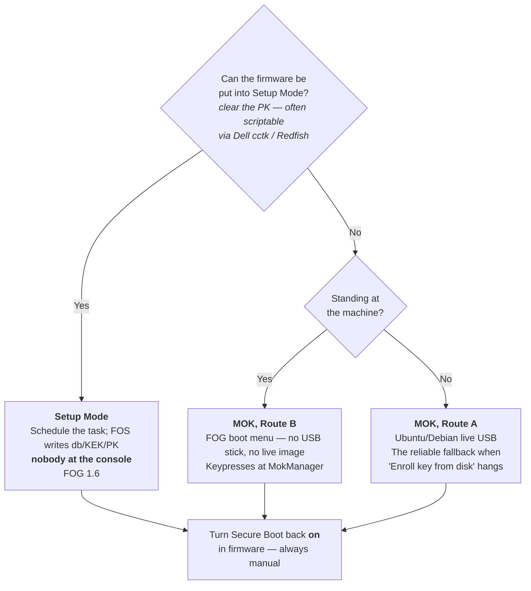

>[!warning] Traduction automatique
>Cette page a été traduite automatiquement et peut contenir des erreurs. En cas de doute, reportez-vous à [la version anglaise](https://docs.fogproject.org/en/latest/kb/how-tos/secure-boot-signing).

# Secure Boot : signer FOS avec votre propre clé

>[!warning] Il s'agit d'une procédure manuelle
>Enrôler un certificat exige de **se rendre physiquement une fois auprès de
>chaque machine**, sauf si votre micrologiciel prend en charge le Setup Mode
>(voir plus bas). Si votre site peut laisser le Secure Boot désactivé pour
>l'imagerie, cela reste bien moins de travail. Lisez
>[Pourquoi FOG ne peut pas le faire à votre place](#pourquoi-fog-ne-peut-pas-le-faire-à-votre-place)
>avant de décider.
>
>Le côté serveur est automatique — l'installeur génère une autorité de
>certification Secure Boot et une clé de signature, signe les noyaux FOS et les
>maintient signés au fil des mises à niveau, sans rien à configurer. Ce que vous
>ne pouvez pas éviter, c'est l'enrôlement du certificat sur chaque client, d'une
>façon ou d'une autre.

>[!info] Le certificat que vous enrôlez et la clé qui signe sont deux certificats différents
>La configuration Secure Boot de FOG comporte deux parties : une **autorité de
>certification Secure Boot**, qui est ce qui est enrôlé sur chaque machine
>(publiée sous le nom `MOK.der`), et une **feuille de signature** émise par cette
>autorité, qui est ce qui signe réellement les noyaux au quotidien. Grâce à cette
>séparation, renouveler la clé de signature — voir
>[Renouveler ou retirer une clé](#renouveler-ou-retirer-une-clé) — n'exige
>normalement de rien réenrôler. Pour la vue d'ensemble de la façon dont cela
>s'articule avec les autres certificats de FOG, voir
>[[pki-zones|Les zones de certificats de FOG]] et
>[[pki-glossary|le glossaire PKI]]. Si vous devez récupérer une installation
>bien antérieure à cette séparation, voir
>[l'ancien MOK plat](#lancien-mok-plat) ci-dessous.
>
>La signature est active par défaut. Utilisez `--no-secure-boot` pour la
>désactiver.

FOG ne livre pas de noyaux FOS signés, et ne le peut pas. Si votre parc impose
l'UEFI Secure Boot et que le désactiver n'est pas envisageable, ce guide explique
pourquoi et vous oriente vers la page adaptée à ce que vous devez faire.

Le résultat est entièrement sous votre contrôle — et c'est aussi tout l'intérêt.
Personne d'autre, projet FOG compris, ne peut produire quelque chose que vos
machines démarreront.

---

## Pourquoi FOG ne peut pas le faire à votre place

Le Secure Boot est une chaîne de signatures, et chaque maillon ne fait confiance
qu'à ce pour quoi il a été conçu.

Votre micrologiciel est livré avec les certificats de Microsoft dans sa base de
signatures autorisées (`db`). Pratiquement tout ce qui est amorçable est signé
soit directement par Microsoft, soit par un **shim** — un petit chargeur que
Microsoft signe une fois, et qui embarque ensuite le certificat *propre à la
distribution*. C'est ainsi que fonctionnent Ubuntu et Fedora : Canonical et Red
Hat ont chacun fait signer un shim, et signent depuis lors leurs propres noyaux
avec leurs propres clés, vérifiées au regard du certificat intégré à leur shim.

Pour que FOG fasse de même, le projet FOG devrait posséder une clé de signature
avec la discipline opérationnelle que cela implique, et faire passer un shim par
le processus de revue de Microsoft. Et même alors, une signature ne vaut que ce
que vaut la clé derrière elle — une clé de signature livrée à tout le monde ne
protège personne.

**Le projet iPXE a déjà fait exactement cela.** Depuis iPXE 2.0, il existe un
shim iPXE dédié — publié sur
[ipxe/shim](https://github.com/ipxe/shim/releases), signé par Microsoft avec les
certificats de 2011 et de 2023 — qui embarque le certificat de signature de code
d'iPXE comme certificat fournisseur. L'amont signe ensuite ses binaires publiés
avec cette clé — aussi bien le `ipxe.efi` contenant tous les pilotes que la
variante `snponly.efi` que FOG privilégie déjà, pour x86_64 comme pour arm64. Un
**iPXE amont standard** démarre donc sous Secure Boot sans que vous ayez rien à
signer.

Le problème est propre à FOG, et il vaut la peine d'être précis, car c'est toute
la raison d'être de ce guide :

**FOG ne livre pas de binaires iPXE standard.** FOG compile les siens, avec le
script de démarrage embarqué (`EMBED=ipxescript`) et — sur les installations
HTTPS utilisant l'autorité de certification interne de FOG — l'autorité du
serveur intégrée (`TRUST=`). Ce sont par définition des binaires personnalisés,
ils ne portent aucune signature, et le shim signé d'iPXE les refusera, comme il
se doit. Un shim qui chargerait n'importe quel binaire se prétendant iPXE ne
vaudrait rien.

FOG ne pourrait pas non plus résoudre cela en signant ses propres compilations.
Le shim ne fait confiance qu'au certificat fournisseur d'iPXE : un binaire signé
par FOG exigerait donc que chaque machine enrôle d'abord la clé de FOG — la même
visite physique que ce guide demande déjà, tout en faisant d'une seule
compromission de clé le problème de tout le monde à la fois. Il n'existe, sur
aucune version de FOG, de mécanisme permettant de signer un binaire iPXE
recompilé sur mesure avec le certificat Secure Boot de FOG de sorte que le shim
l'accepte.

La solution consiste à ne plus avoir besoin d'un binaire personnalisé. Le script
de démarrage embarqué de FOG est entièrement générique, et iPXE 2.0 sait à la
place récupérer ce script depuis le serveur TFTP (`autoexec.ipxe`). Cela permet
d'exécuter le **`snponly.efi` signé d'amont** tout en conservant le comportement
de démarrage de FOG — c'est l'approche retenue par FOG.

L'alternative que le micrologiciel offre déjà est le **MOK** (Machine Owner
Key) : une liste, propre à chaque machine, de certificats supplémentaires que
*vous*, en tant que propriétaire physique de la machine, choisissez d'approuver.
C'est ce qu'utilise [[secure-boot-mok-enrollment|l'enrôlement MOK]].

>[!info] Pourquoi l'enrôlement ne peut généralement pas être automatisé
>L'enrôlement MOK exige un humain devant la console physique appuyant sur des
>touches. Ce n'est pas un oubli — c'est la propriété de sécurité. Si un processus
>distant pouvait enrôler une clé de signature, le Secure Boot serait décoratif.
>Prévoyez une visite par machine, comme vous le feriez pour un mot de passe de
>micrologiciel. FOG 1.6 ajoute un moyen d'éviter complètement cette visite par
>machine en enrôlant directement dans le micrologiciel — voir
>[[secure-boot-setup-mode-enrollment|l'enrôlement en Setup Mode]] — mais cela
>exige tout de même de toucher une fois aux réglages du micrologiciel de chaque
>machine ; il n'existe aucun moyen d'enrôler de la confiance dans une machine qui
>ne vous a jamais rencontré.

>[!tip] L'alternative : enrôler directement dans `db`
>De nombreux micrologiciels peuvent être placés en mode Custom ou Setup, ce qui
>permet d'ajouter votre propre certificat directement à `db` — voir
>[[secure-boot-setup-mode-enrollment|l'enrôlement en Setup Mode]]. Cela retire le
>shim de l'équation : signez ce que vous voulez et le micrologiciel le charge.
>C'est la seule voie si vous avez besoin, en même temps, du démarrage réseau
>HTTPS avec l'autorité de FOG ou votre autorité interne sous Secure Boot ; voir
>[[pki-zones#https-and-netboot|HTTPS et démarrage réseau]].

---

## Ce qui doit réellement être signé

Moins de choses que la plupart des gens ne l'imaginent.

| Composant | Signé ? | Pourquoi |
| --- | --- | --- |
| iPXE (`snponly.efi` / `ipxe.efi`) | **Non — utilisez la compilation signée d'amont** | Signé par le projet iPXE via son shim ; les compilations propres à FOG sont personnalisées et non signées |
| shim (`snponly-shimx64.efi` / `ipxe-shimx64.efi`) | **Non — Microsoft l'a déjà signé** | Publié par le projet iPXE |
| Noyau FOS (`bzImage`, `bzImage32`) | **Oui — c'est votre travail** | Le micrologiciel refuse de charger un noyau non signé |
| Init de FOS (`init.xz`, `init_32.xz`) | **Non** | Voir ci-dessous |
| iPXE recompilé sur mesure avec votre autorité intégrée (`TRUST=`) | **Facultatif — uniquement si vous contournez entièrement le shim** | Vous permet de signer avec votre propre clé votre propre iPXE recompilé (par exemple pour du démarrage réseau HTTPS avec une autorité interne) ; exige d'enrôler cette autorité directement dans `db` via [[secure-boot-setup-mode-enrollment\|l'enrôlement en Setup Mode]], puisque le shim ne fait confiance qu'au certificat d'iPXE |
| Vos images, snapins et scripts | **Non** | Ils ne sont jamais exécutés par le micrologiciel |

### L'initrd n'est vérifié — par personne

Cela surprend, il vaut donc la peine de le dire clairement : **l'initramfs n'est
pas couvert par le Secure Boot**, sur aucune distribution. Ubuntu et Fedora ne
signent pas le leur non plus. Ils ne le peuvent pas — `dracut` et
`initramfs-tools` construisent l'initramfs localement sur chaque machine, à
l'installation et à chaque mise à jour du noyau : la distribution ne voit donc
jamais ces octets.

C'est une lacune bien connue du modèle, et la réponse moderne est l'image noyau
unifiée (UKI : noyau, initrd et ligne de commande agrafés en un unique binaire
signé). FOG n'utilise pas d'UKI aujourd'hui.

La conséquence pratique pour vous : **vous n'avez jamais qu'à signer `bzImage` et
`bzImage32`.** Laissez `init.xz` et `init_32.xz` tranquilles.

### La chaîne que vous construisez

```
UEFI firmware        (trusts Microsoft's certificate, via `db`)
  └─ snponly-shimx64.efi  ← Microsoft-signed, published by the iPXE project
      └─ snponly.efi      ← signed by iPXE; UPSTREAM's build, not FOG's
          └─ bzImage      ← YOU sign this; shim checks it against MOK
              └─ init.xz  ← not verified, nothing to do
```

Seul le noyau vous revient à signer. Les deux maillons au-dessus sont déjà signés
par des acteurs dont le micrologiciel et le shim, respectivement, approuvent les
certificats.

Le premier maillon est celui qu'il faut comprendre. **MOK est la base du shim,
pas celle du micrologiciel** — le micrologiciel n'en a jamais entendu parler. Le
shim s'installe lui-même comme l'autorité que consultent les appels ultérieurs à
`LoadImage()`, et *c'est elle* qui accepte votre certificat.

La conséquence est facile à se représenter de travers : **le MOK ne peut rien
pour le premier binaire de la chaîne.** Lorsque le micrologiciel démarre
directement un fichier en PXE, il le contrôle au regard de `db` uniquement, car
rien n'a encore chargé le shim qui permettrait de consulter le MOK. C'est
pourquoi c'est le shim — et non iPXE — qui doit être votre fichier de démarrage
DHCP. Pointez le DHCP directement sur un binaire iPXE et aucune signature ni
aucun enrôlement ne vous sauveront.

Le shim d'iPXE décide de ce qu'il charge ensuite **d'après son propre nom de
fichier**, en en retirant `-shim`. Nommé `snponly-shimx64.efi`, il charge
`snponly.efi` depuis le répertoire d'où il a lui-même été chargé ; nommé
`ipxe-shimx64.efi`, il charge `ipxe.efi`. Quel que soit votre choix, le fichier
de second étage doit se trouver à côté de lui sous exactement ce nom. Servir la
chaîne signée et signer les noyaux sont traités dans
[[secure-boot-technical-details|Secure Boot : détails techniques]].

---

## Choisir une voie d'enrôlement



- **[[secure-boot-setup-mode-enrollment|Enrôlement en Setup Mode]]** (FOG 1.6) —
  la seule voie qui ne se termine pas par un humain appuyant sur des touches
  devant chaque machine, si votre micrologiciel la prend en charge.
- **[[secure-boot-mok-enrollment|Enrôlement MOK]]** — les voies A et B, qui
  exigent toutes deux une personne devant la console une fois par machine, et
  fonctionnent sur toutes les versions de FOG. Aucune n'impose de désactiver le
  Secure Boot.

---

## Avant de commencer

>[!tip] Vous prévoyez de migrer ce serveur bientôt ? Faites-le d'abord
>Si une migration de serveur (déplacer FOG vers un nouveau matériel, selon
>[[migrating-fog-server|Migrer le serveur FOG]]) figure déjà à votre feuille de
>route, faites-la **avant** de mettre en place le Secure Boot ici, et non après.
>Migrer une installation Secure Boot déjà enrôlée est une voie praticable et bien
>comprise — recopiez le répertoire `pki/secureboot/`, selon
>[[migrating-fog-server#migrating-the-secure-boot-signing-material|la section Secure Boot de ce guide]]
>— mais c'est une chose de plus à réussir, et la rater signifie que chaque client
>déjà enrôlé devra être réenrôlé une seconde fois pour rien. Enrôler une fois,
>sur le serveur que vous comptez conserver, représente strictement moins de
>travail qu'enrôler maintenant puis peut-être de nouveau plus tard.

Sur le serveur FOG, rien. `sbsigntool` (`sbsigntools` sur
RHEL/Rocky/Alma/Fedora et Arch) fait partie du jeu de paquets de base de
l'installeur, aux côtés d'`openssl`. Si votre distribution ne fournit ni l'un ni
l'autre de ces noms, l'installeur le signale et poursuit, laissant les noyaux non
signés — lisez la sortie de l'installeur plutôt que de le supposer.

Sur chaque machine cliente que vous comptez enrôler par MOK, il vous faut un
moyen d'exécuter `mokutil` — au plus simple, démarrez-la une fois depuis
n'importe quelle clé USB live Linux. L'enrôlement en Setup Mode ne nécessite
aucun outillage côté client.

Vous n'avez **pas** besoin de télécharger le shim signé ni le `snponly.efi`
signé. Chaque installation les met en place dans `/tftpboot/secureboot/` :

```
/tftpboot/secureboot/
├── snponly-shimx64.efi   Microsoft-signed shim (2011 + 2023), from ipxe/shim
├── snponly.efi           upstream's signed iPXE — firmware's own NIC driver
├── ipxe-shimx64.efi      the same shim again, under the name that loads ipxe.efi
├── ipxe.efi              upstream's signed iPXE — iPXE's own NIC drivers
├── mmx64.efi             MokManager, used during enrolment
├── autoexec.ipxe         FOG's boot script
├── MANIFEST              where each file came from, with checksums
└── arm64-efi/            the same set for arm64
```

Deux chaînes complètes, ce qui vous permet de passer de l'une à l'autre avec un
simple changement DHCP. `snponly` est le choix par défaut et le bon premier
choix ; `ipxe` est le repli pour les micrologiciels dont la pile réseau ne
fonctionne pas — voir
[[secure-boot-technical-details|Secure Boot : détails techniques]] pour savoir
lequel utiliser et comment le servir.

>[!info] Note de version
>La paire `ipxe.efi` est arrivée avec **fog-ipxe v2.0.0-fog.3**. Une installation
>figée sur une version antérieure ne met en place que la paire `snponly` —
>vérifiez `MANIFEST`, qui liste exactement ce dont dispose votre installation.

Tout sauf `autoexec.ipxe` provient de l'amont, republié octet pour octet via la
version [fog-ipxe](https://github.com/FOGProject/fog-ipxe) que l'installeur
télécharge déjà. Le SHA-256 et le signataire de chaque fichier sont vérifiés lors
de la construction de cette version, de sorte qu'un binaire signé pour test ou
altéré fait échouer la publication plutôt que d'atteindre votre serveur.
`MANIFEST` consigne l'URL source et la somme de contrôle de chaque fichier si
vous souhaitez le vérifier vous-même.

Rien n'est servi depuis ce répertoire tant que vous n'y pointez pas le DHCP : sa
présence ne change donc rien pour vos clients existants.

>[!info] Si le répertoire est absent
>Deux raisons possibles. **Les installations en démarrage réseau HTTPS utilisant
>l'autorité de certification propre à FOG le sautent** — ce sont des binaires
>génériques d'amont, ils ne peuvent donc pas embarquer l'autorité de votre
>serveur, et un binaire signé ne peut pas être recompilé sans invalider la
>signature. Voir [[pki-zones#https-and-netboot|HTTPS et démarrage réseau]] pour
>le contournement, et notez qu'une autorité publique sur le vhost évite
>entièrement ce compromis. Sinon, le téléchargement a échoué — ce n'est
>délibérément pas fatal — et l'installeur l'aura signalé. Relancez-le.

Vous pouvez vérifier que vous disposez bien d'un binaire signé — un binaire signé
possède une table de certificats non vide, un binaire non signé n'en a pas :

```bash
sbverify --list /tftpboot/secureboot/snponly.efi
```

Le signataire doit être **iPXE Secure Boot Intermediate G1A**. Les
`/tftpboot/ipxe.efi` et `/tftpboot/autoexec/snponly.efi` propres à FOG n'ont
aucune signature — si vous voyez cela, vous regardez le mauvais fichier.

Sur arm64, les équivalents sont `arm64-efi/snponly-shimaa64.efi` et
`arm64-efi/snponly.efi`.

>[!note] Pourquoi le shim est renommé `snponly-shimx64.efi`
>Le shim décide de ce qu'il charge ensuite en **retirant `-shim` de son propre
>nom de fichier** — `ipxe-shimx64.efi` cherche `ipxe.efi`, et
>`snponly-shimx64.efi` cherche `snponly.efi`. C'est le mécanisme même de l'amont,
>pas une astuce : `ipxeboot.tar.gz` livre `ipxe-shim.efi` et `snponly-shim.efi`
>sous forme de deux liens symboliques vers un unique `shimx64.efi`, précisément
>pour cette raison. Le renommage ne perturbe pas la signature, qui couvre le
>contenu du fichier et non son nom.

>[!note] Le shim provient de la publication ipxe/shim, pas d'`ipxeboot.tar.gz`
>L'archive contient elle aussi un `shimx64.efi`, mais il ne porte que la
>signature de l'autorité UEFI Microsoft **2011**. Le `ipxe-shimx64.efi`
>autonome — celui que FOG met en place — en porte **deux**, 2011 et 2023, ce qui
>compte sur le matériel récent livré uniquement avec le certificat de 2023.
>
>Ces deux faits ont été confirmés par lecture directe des tables de certificats
>PE : le shim autonome comporte deux entrées `WIN_CERTIFICATE`, celui de
>l'archive n'en a qu'une, de 2011. La publication fog-ipxe vérifie que **les
>deux** signatures sont présentes, de sorte qu'une régression silencieuse de
>l'amont vers une compilation limitée à 2011 fait échouer la publication plutôt
>que de laisser quiconque en plan sur un micrologiciel exclusivement 2023.

>[!note] Vérifiez que votre noyau FOS possède un stub EFI
>Sous Secure Boot, le noyau est chargé par le chargeur du micrologiciel lui-même
>plutôt que par le chargeur Linux d'iPXE, ce qui exige `CONFIG_EFI_STUB=y`. Les
>noyaux FOS standard sont censés en disposer ; si le démarrage échoue
>immédiatement après la signature avec une plainte de format plutôt que de
>signature, c'est la première chose à vérifier.

---

## La clé de signature

**L'installeur l'a déjà fait.** À la première installation, il génère une
autorité de certification Secure Boot et une feuille de signature sous cette
autorité, et signe les noyaux FOS avec la feuille : à moins de vouloir fournir
votre propre clé, il n'y a donc rien à exécuter ici.

```
/opt/fog/pki/secureboot/
├── ca/
│   ├── .fogSBCA.key           0400 root:root — signs the leaf below
│   ├── .fogSBCA.pem
│   └── .fogSBCA.der           this is what MOK.der publishes — ENROL THIS
└── leaf/
    ├── sign.key                0600 root:root — what sbsign actually signs with
    └── sign.pem
```

Le répertoire se trouve sous `$fogprogramdir`, qui n'est jamais à l'intérieur de
la racine web : rien de tout cela n'est donc accessible par HTTP. **Le serveur
web ne peut lire aucune des deux clés privées** : les téléchargements de noyau
depuis l'interface web sont signés par un petit assistant réservé à root
(`/opt/fog/bin/fog-sign-kernel`) qui n'accepte aucun argument, plutôt que par le
serveur web lui-même. Seul le certificat public est publié, sous le nom
`MOK.der`, dans le kit d'enrôlement.

Sauvegardez l'intégralité du répertoire `pki/secureboot/` là où vous mettriez un
mot de passe root. Quiconque détient la clé de l'autorité peut forger un nouveau
signataire auquel vos machines feront confiance sans réenrôlement ; quiconque
détient la clé de la feuille peut signer un noyau, tout simplement.

>[!warning] L'autorité de certification n'est jamais régénérée, à dessein
>Relancer l'installeur réutilise l'autorité existante. Une nouvelle autorité
>invalide silencieusement l'enrôlement sur **toutes les machines qui approuvaient
>déjà l'ancienne**, et rien ne le révèle avant qu'un client ne refuse de
>démarrer. `--recreate-keys` et `--recreate-CA` ne l'atteignent délibérément pas.
>Pour renouveler l'autorité volontairement, supprimez `pki/secureboot/`,
>relancez l'installeur et réenrôlez chaque client — voir
>[Renouveler ou retirer une clé](#renouveler-ou-retirer-une-clé). Renouveler
>seulement la *feuille* — le cas normal — n'exige rien de tout cela ; voir la
>même section.

### Apporter votre propre clé

Vous souhaitez signer avec une clé que vous contrôlez déjà, plutôt qu'avec celle
générée automatiquement par FOG ? Voir
[[bringing-your-own-ca|Apporter votre propre autorité de certification]] — cette
page traite de la génération d'une feuille, de la distinction entre modèle plat
et modèle avec autorité, et de la façon d'obtenir la séparation autorité/feuille
à la main, sans le `--secureboot-ca-cert` de FOG 1.6.

### Désactiver la signature

`--no-secure-boot` saute entièrement la génération de clés et laisse les noyaux
FOS non signés. Ce choix est mémorisé dans `.fogsettings`, de sorte qu'une mise à
niveau ne vous redonnera pas une clé et une règle `sudoers` que vous aviez
délibérément refusées.

### L'ancien MOK plat

Si vous lisez ceci parce qu'une machine quelque part a déjà enrôlé une paire
`MOK.key`/`MOK.pem` auto-signée antérieure à la séparation autorité/feuille — la
démonstration que la signature Secure Boot pouvait fonctionner — deux choses :

- Tout serveur encore sur cette disposition est basculé automatiquement vers la
  hiérarchie autorité/feuille. Les anciens `MOK.{key,pem}` sont laissés intacts
  sur le disque, de sorte que tout ce qui a déjà été signé avec eux peut encore
  être resigné, mais les nouvelles signatures utilisent la nouvelle feuille.
- Chaque machine ayant enrôlé l'ancien MOK plat doit enrôler la nouvelle autorité
  une fois de plus — il n'existe aucun moyen d'éviter un réenrôlement de tout le
  parc lorsque le certificat enrôlé lui-même change. Une voie de transition
  (réutiliser les noyaux déjà signés tout en enrôlant la nouvelle autorité via
  une tâche planifiée) est prévue exactement pour ce cas, mais n'est pas encore
  développée. Si cela vous concerne, sauvegardez vos répertoires
  `pki/secureboot/`/`secureboot/` existants et
  [ouvrez un ticket](https://github.com/FOGProject/fogproject/issues) ou posez la
  question sur les [forums FOG](https://forums.fogproject.org/) — cela n'a
  jamais concerné que de très premiers testeurs, et aucune version stable.

---

## Renouveler ou retirer une clé

### Renouveler la feuille auto-générée de FOG — le cas normal

Si vous utilisez la clé auto-générée de FOG (sans avoir passé
`--secure-boot-key`/`--secure-boot-cert`), la feuille de signature se renouvelle
**sans toucher au moindre client** :

```bash
/opt/fog/pki/renewal-helper --zone secureboot
```

Cela réémet la feuille depuis l'autorité de certification Secure Boot et resigne
les noyaux. Rien n'est réenrôlé dans le micrologiciel, car ce qui est enrôlé est
l'autorité et non cette feuille — voir [[pki-zones#secure-boot|Secure Boot]].
C'est le cas de figure à privilégier pour un renouvellement régulier ; les deux
cas ci-dessous sont les cas perturbateurs.

### Passer à une clé que vous fournissez

Rien n'a besoin d'être supprimé dans ce cas — une clé et un certificat fournis
par l'administrateur prennent immédiatement le relais, que la paire
autorité/feuille propre à FOG existe déjà ou non :

```bash
cd /path/to/fogproject/bin
./installfog.sh \
  --secure-boot-key  /path/to/your/MOK.priv \
  --secure-boot-cert /path/to/your/MOK.der
```

Cette seule exécution resigne les noyaux FOS avec votre clé et republie le kit
d'enrôlement — `MOK.der` et l'empreinte sur la page **Secure Boot** — à partir de
votre certificat, dans la même passe. N'oubliez pas que cela vous fait passer au
**modèle plat** (voir
[[bringing-your-own-ca|Apporter votre propre autorité de certification]]) à moins
de passer également le `--secureboot-ca-cert` de FOG 1.6 : chaque client déjà
enrôlé doit donc être réenrôlé — voir l'encadré de danger ci-dessous. Les chemins
sont consignés dans `.fogsettings`, de sorte que chaque mise à niveau ultérieure
continue de les utiliser sans qu'il faille repasser les options.

>[!warning] Laissez les fichiers là où vous avez pointé l'installeur
>L'installeur ne recopie jamais votre clé ni votre certificat où que ce soit — il
>se contente de mémoriser les chemins que vous lui avez donnés. Déplacer ou
>supprimer ces fichiers ensuite casse la signature à la prochaine installation ou
>mise à niveau, comme le ferait la perte de n'importe quelle autre clé privée.

### Renouveler l'autorité de certification propre à FOG

Si vous voulez une nouvelle autorité plutôt qu'une simple nouvelle feuille sous
l'autorité existante, supprimez d'abord le répertoire — l'installeur ne génère
une nouvelle autorité que lorsqu'aucune n'est présente :

```bash
rm -rf /opt/fog/pki/secureboot
cd /path/to/fogproject/bin && ./installfog.sh
```

Cela produit une nouvelle autorité et une nouvelle feuille, et resigne les noyaux
avec la nouvelle feuille.

>[!danger] Changer le certificat enrôlé empêche instantanément tout client déjà enrôlé de démarrer
>Cela vaut pour le passage à votre propre clé plate, ou pour le renouvellement de
>l'autorité elle-même — mais pas pour le simple renouvellement de la feuille
>auto-générée, qui est justement l'intérêt d'avoir une autorité au-dessus d'elle.
>L'une comme l'autre de ces voies perturbatrices invalide d'un coup la confiance
>existante de chaque client, et rien ne le révèle avant qu'un client ne refuse de
>démarrer. Traitez cela comme une opération délibérée, planifiée, à l'échelle de
>tout le parc, avec la nouvelle empreinte réenrôlée sur chaque machine dans la
>même fenêtre — et non comme une étape de routine ou quelque chose à faire en
>plein dépannage.

Pour retirer la confiance accordée à un certificat sur une seule machine enrôlée
par MOK, voir
[[secure-boot-mok-enrollment#Retirer une clé d'une machine|Retirer une clé d'une machine]].

### Si la clé privée est compromise

**Il n'existe aucune révocation à distance.** Si la clé compromise est la feuille
auto-générée, renouvelez-la selon
[ce qui précède](#rotating-fogs-own-auto-generated-leaf--the-normal-case) et rien
d'autre n'est nécessaire. Si la clé compromise est l'autorité elle-même (ou une
clé plate fournie par l'administrateur), chaque machine l'ayant enrôlée nécessite
une visite physique pour la retirer et enrôler l'empreinte de remplacement,
exactement comme pour un renouvellement planifié, mais sans l'avoir prévu. Cette
visite par machine est la contrepartie que vous acceptez pour ne dépendre de la
permission de personne d'autre afin de signer vos propres noyaux — traitez la clé
privée en conséquence, et sauvegardez-la là où vous mettriez un mot de passe
root ; voir [La clé de signature](#la-clé-de-signature).

---

## Limites connues

- **EFI uniquement.** Le Secure Boot est une fonctionnalité UEFI ; les clients
  PXE en BIOS/legacy ne sont pas concernés et n'ont besoin de rien de tout cela.
- **Une visite par machine, toujours** — pour l'enrôlement MOK. Il n'existe
  aucune façon officielle d'enrôler un MOK sans présence physique — c'est la
  propriété de sécurité, pas un oubli. Le kit d'enrôlement rend la visite brève ;
  il ne peut pas la supprimer.
  [[secure-boot-setup-mode-enrollment|L'enrôlement en Setup Mode]] enrôle à la
  place dans le `db` du micrologiciel, toujours machine par machine, mais sans le
  détour par shim et MokManager — en pratique, seul Dell expose une voie
  véritablement scriptable pour cela, via le mode Custom dans Dell Command |
  Configure et iDRAC.
- **L'initrd n'est pas vérifié**, comme partout ailleurs. Si votre modèle de
  menace exige un initramfs vérifié, le Secure Boot seul ne vous le donne sur
  aucune distribution.
- La signature couvre le *démarrage*. Elle ne dit rien de la fiabilité de l'image
  que FOS écrit ensuite sur le disque.
- **Le démarrage réseau HTTPS et le Secure Boot sont indépendants, et moins
  contraignants ensemble qu'on ne le croirait.** Un certificat web issu d'une
  **autorité publique** (par exemple Let's Encrypt) sur un FQDN vous donne le
  démarrage réseau HTTPS sans recompilation et sans perdre le shim Secure Boot
  signé — voir [[pki-zones#https-and-netboot|HTTPS et démarrage réseau]] pour
  comprendre pourquoi. Seules l'autorité propre à FOG ou votre autorité interne
  (non publiquement approuvée) imposent de choisir entre un iPXE recompilé avec
  `TRUST=` (démarrage réseau HTTPS, pas de shim signé) et le shim signé (Secure
  Boot, démarrage réseau en HTTP) — sauf si vous utilisez
  [[secure-boot-setup-mode-enrollment|l'enrôlement en Setup Mode]] pour écarter
  entièrement le shim.
- **Une clé USB Secure Boot ne fonctionne pas de la même façon.** L'astuce du
  nom de fichier que le shim utilise pour trouver son second étage —
  `automatic_next_path()` — n'est appelée que depuis les chemins de démarrage
  réseau et HTTP du shim. Il n'existe pas d'équivalent pour un système de
  fichiers local : un shim démarré depuis une clé USB ou une partition ESP
  ignore donc entièrement le renommage en `-shim` et se rabat sur sa valeur par
  défaut compilée, `ipxe.efi`. Si vous construisez une clé USB Secure Boot à
  partir de ces instructions, nommez le second étage `ipxe.efi` ou il ne sera pas
  trouvé.

>[!warning] Activer le Secure Boot peut casser une connexion Windows Hello Entreprise existante
>Si des utilisateurs se connectent déjà sur une machine avec Windows Hello
>Entreprise (code PIN ou biométrie) depuis avant l'activation du Secure Boot, ces
>méthodes de connexion cessent généralement de fonctionner une fois celui-ci
>activé — le conteneur de clés local de Windows Hello Entreprise est scellé au
>regard de l'état de sécurité du démarrage de la machine, et activer le Secure
>Boot le modifie. C'est une conséquence Windows Hello / Entra ID du changement
>d'état du Secure Boot, non un problème de FOG ou de MOK ; cela se produit de la
>même façon quel que soit ce qui active le Secure Boot.
>
>Pour corriger cela, utilisateur par utilisateur :
>
>1. Dans le centre d'administration Entra : **Utilisateurs → *(l'utilisateur)* →
>   Méthodes d'authentification → supprimer Windows Hello Entreprise.**
>2. Connectez l'utilisateur avec son mot de passe.
>3. En tant que cet utilisateur, exécutez :
>   ```
>   certutil.exe -DeleteHelloContainer
>   ```
>4. Si une stratégie de groupe active ou impose Windows Hello Entreprise,
>   exécutez également :
>   ```
>   gpupdate /force
>   ```
>5. Redémarrez l'ordinateur. L'utilisateur se connecte avec son mot de passe et
>   peut ensuite recréer son code PIN et sa connexion biométrique.

>[!note] Effacer le TPM ne touche pas aux clés enrôlées
>Indépendamment de ce qui précède : effacer le TPM d'une machine supprime ce qui
>est scellé *au* TPM (clés BitLocker, conteneur Windows Hello Entreprise, etc.),
>mais l'enrôlement MOK ne repose pas du tout sur le TPM — MokList réside dans des
>variables UEFI ordinaires (NVRAM) que le shim lit directement. Effacer le TPM
>n'enrôle ni ne désenrôle un MOK, et n'interagit avec rien d'autre dans ce guide.

## Encore non vérifié

Si vous avez trouvé un micrologiciel où le `Enroll key from disk` de la voie B se
comporte différemment de ce qui est décrit dans
[[secure-boot-mok-enrollment|Enrôlement MOK]], ou si vous avez testé
[[secure-boot-setup-mode-enrollment|le Setup Mode]] sur du micrologiciel réel,
merci de le confirmer — en bien ou en mal — par une pull request sur la page
concernée (une modification en ligne depuis GitHub convient) ou par un message
sur les [forums FOG](https://forums.fogproject.org/).

## Voir aussi

- [[secure-boot-mok-enrollment|Enrôlement MOK]] — voies A et B
- [[secure-boot-setup-mode-enrollment|Enrôlement en Setup Mode]] — voie C, FOG 1.6
- [[secure-boot-technical-details|Secure Boot : détails techniques]] — servir la chaîne signée, signer les noyaux, signer vos propres compilations de FOS
- [[bringing-your-own-ca|Apporter votre propre autorité de certification]]
- [[pki-zones|Les zones de certificats de FOG]]
- [[pki-glossary|Glossaire PKI et Secure Boot]]
- [[external-ca-lets-encrypt|Certificats d'autorité externe et Let's Encrypt]]
- [Coexistence du BIOS et de l'UEFI](bios-and-uefi-co-existence.md)
- [Entrées de démarrage UEFI](uefi-boot-entries.md)
