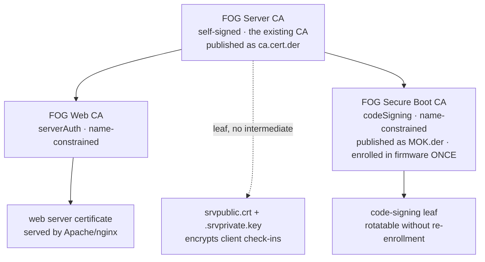

>[!warning] Traduction automatique
>Cette page a été traduite automatiquement et peut contenir des erreurs. En cas de doute, reportez-vous à [la version anglaise](https://docs.fogproject.org/en/latest/kb/reference/pki-zones).

# Infrastructure PKI de FOG

FOG utilise des certificats pour trois tâches sans rapport entre elles. Cette
page décrit comment ils sont maintenus séparés, ce que cela vous apporte, et
comment remplacer n'importe lequel d'entre eux par votre propre CA. Pour le
flux de signature Secure Boot en particulier (enrôlement des clients, rotation
des clés, Setup Mode), voir
[[secure-boot-signing|Secure Boot : signer FOS avec votre propre clé]]. Pour
Let's Encrypt/ACME et l'épinglage de certificat de fog-client, voir
[[external-ca-lets-encrypt|CA externe et certificats Let's Encrypt]]. Cette
page est la référence vers laquelle les deux autres renvoient.

>[!info] Disponibilité
>La séparation en zones décrite ici s'applique à chaque serveur, générée
>automatiquement — il n'y a pas d'option d'activation ni de second agencement
>entre lesquels choisir. **L'apport de votre propre CA par zone, l'émission de
>certificats pour les nœuds de stockage et l'enrôlement firmware en Setup Mode
>sont des ajouts de FOG 1.6**, signalés en ligne ci-dessous au fur et à mesure
>qu'ils apparaissent.

## Les trois zones

| Zone | Ce qu'elle protège | Durée de vie | Coût d'un changement |
|---|---|---|---|
| **Web TLS** | La connexion navigateur/API vers l'interface web de FOG | Feuille : 5 ans fixes (Web CA : 30 ans) | Aucun. Les navigateurs ont juste besoin que l'émetteur soit de confiance. |
| **Communication client** | Le pointage chiffré de fog-client auprès du serveur | 10 ans fixes | Moyen. Chaque client enregistré doit ré-épingler. |
| **Secure Boot** | La signature des noyaux FOS | CA (ce qui est enrôlé) : 30 ans · feuille : 5 ans | Élevé. Ré-enrôlement firmware sur chaque machine. |

La racine « FOG Server CA » elle-même est aussi fixée à 30 ans, comme les deux
intermédiaires — seuls les deux types de feuilles (web, Secure Boot) ont par
défaut une durée plus courte.

Elles n'ont rien en commun sinon que FOG les génère toutes les trois, et leurs
coûts diffèrent de plusieurs ordres de grandeur — c'est exactement pourquoi
elles ne partagent pas de matériel de clé.

## Pourquoi elles ont été séparées

Dans l'agencement historique, une seule CA auto-signée assurait les deux
premières tâches, et une seule feuille auto-signée la troisième. Cela
produisait deux problèmes de même nature :

**`.srvprivate.key` était la clé TLS du serveur web *et* la clé qui déchiffre
chaque poignée de main de fog-client.** `FOGBase::certDecrypt()` ouvre ce
chemin exact à chaque appel `authorize()`. Ainsi un renouvellement ACME, un
certificat acheté déposé en place, ou `--recreate-keys` installait un
certificat parfaitement valide et cassait silencieusement l'authentification
des clients, sans rien dans les journaux reliant les deux.

**La clé Secure Boot enrôlée était le certificat de signature lui-même.**
Parce que la chose présente dans le firmware était une feuille incapable de
rien émettre, faire tourner ou révoquer la clé de signature signifiait un
passage physique par MokManager sur chaque machine.

Les deux sont la même erreur : un seul fichier servant à la fois d'*ancre de
confiance* et de *clé opérationnelle* — la chose à ne jamais changer et la
chose que l'on veut changer couramment étaient le même objet. Les séparer est
aussi le correctif d'un avis de sécurité réel
([GHSA-94p8-jg9j-99v4](https://github.com/FOGProject/fogproject/security/advisories/GHSA-94p8-jg9j-99v4)) :
une clé de CA racine sans contrainte permettait à quiconque pouvait la lire de
forger des certificats de confiance pour des domaines arbitraires, ou de
signer des binaires arbitraires que Windows exécuterait sans avertissement.

## L'agencement



L'ancre est la CA que votre serveur possède déjà — rien au-dessus d'elle n'est
créé, donc `ca.cert.der` ne change pas et aucun fog-client ne ré-épingle.

>[!tip] Une conséquence utile
>Parce que le certificat que fog-client épingle **est** la racine, la Web CA
>se trouve sous quelque chose en quoi chaque client a déjà confiance. Faire confiance à
>`ca.cert.der` une fois valide aussi le certificat web que la Web CA émettra
>plus tard.

Sous `$fogprogramdir/pki/` (par défaut `/opt/fog/pki/`), un sous-dossier par
zone, chacun divisé en `ca/` (le matériel de CA propre à la zone) et `leaf/`
(ce que cette CA émet au quotidien) :

| Chemin | Ce que c'est |
|---|---|
| `root/ca/.fogCA.{key,pem}` | L'ancre. Clé jamais régénérée, `0400 root:root`. |
| `root/leaf/.srvprivate.key` | Lien symbolique → `$sslpath/.srvprivate.key` |
| `root/leaf/.srvpublic.crt` | Lien symbolique → `$sslpath/.srvpublic.crt` |
| `web/ca/.fogWebCA.{key,pem}` | Signe le certificat du vhost |
| `web/ca/.fogWebCAchain.pem` | CA + intermédiaire web |
| `web/leaf/.webLeaf.{key,pem}` | Ce que le serveur web sert réellement |
| `secureboot/ca/.fogSBCA.{key,pem,der}` | Signe la feuille de signature de code ; `.der` est le même certificat que publie `MOK.der` |
| `secureboot/leaf/sign.{key,pem}` | Ce avec quoi `sbsign` signe réellement |

`.srvprivate.key`/`.srvpublic.crt` restent exactement là où ils ont toujours
été — `root/leaf/` n'ajoute que des liens symboliques de découvrabilité vers
eux.

Une installation ayant déjà exécuté un agencement antérieur migre son matériel
de clés/certificats existant dans cette arborescence sur place — rien n'est
ré-émis, et les anciens chemins continuent de se résoudre via lien symbolique
partout où quelque chose pourrait encore les référencer directement.

## Ce qu'une mise à niveau change et ne change pas

| | |
|---|---|
| `pki/root/ca/.fogCA.pem` | **inchangé**, octet pour octet |
| `ca.cert.der` | **inchangé** — aucun client ne ré-épingle |
| `.srvprivate.key` | **inchangé** — l'authentification des clients n'est pas affectée |
| le certificat web | **nouveau**, émis par la Web CA, sur sa propre paire de clés |
| le MOK Secure Boot | **nouveau** — voir [[secure-boot-signing\|le guide Secure Boot]], celui-ci demande une action |

Le seul changement visible côté terminal est Secure Boot.

## Protection des clés privées

La clé privée de la CA était autrefois lisible par l'utilisateur web — une
exécution de code à distance dans l'application PHP pouvait lire la clé à
laquelle toute l'installation fait confiance. `_hardenPkiPermissions`
verrouille désormais la clé de CA de chaque zone après génération :

| Fichier | Mode | Pourquoi |
|---|---|---|
| `pki/root/ca/.fogCA.key` | `0400 root:root` | rien sur un serveur en fonctionnement n'en a besoin |
| `pki/secureboot/ca/.fogSBCA.key` | `0400 root:root` | idem |
| `pki/web/ca/.fogWebCA.key` | `0600 root:root` | utilisée uniquement par root, via l'assistant sudo |
| `.srvprivate.key` | `0640 root:<apache>` | `certDecrypt()` doit lire celle-ci |

>[!warning] C'est du pseudo-hors-ligne
>Cela protège les clés contre une compromission de l'application web, pas
>contre une compromission de la machine elle-même.

## Mettre une clé hors ligne

```bash
/opt/fog/pki/fog-offline-ca-key /mnt/vault                  # the CA key
/opt/fog/pki/fog-offline-ca-key /mnt/vault --zone secureboot
```

L'assistant copie la clé, vérifie que la copie correspond toujours au
certificat qui reste sur place, et seulement alors détruit l'original — c'est
la clé qui part, jamais le certificat.

>[!warning] C'est le certificat qui ne doit jamais bouger, pas la clé
>Cet avertissement concerne un fichier *différent* de celui que vous venez de
>mettre hors ligne. Tout ce qui se trouve sur le serveur se rattache au
>certificat de la CA, et l'installateur utilise sa présence — pas celle de la
>clé — pour reconnaître qu'une CA existe déjà. Déplacez ou supprimez le
>*certificat* (racine ou intermédiaire indifféremment) et l'exécution suivante
>forge une CA toute neuve à sa place, rendant orphelins chaque intermédiaire
>et chaque feuille en dessous, ainsi que chaque client qui fait déjà confiance
>à ce qui est enrôlé.

Au quotidien rien n'a besoin de la clé — seule l'émission d'un **nouvel**
intermédiaire, ou d'une nouvelle feuille sous un intermédiaire dont la propre
clé est hors ligne, en a besoin. L'installateur détecte une clé mise hors
ligne et indique quoi restaurer plutôt que d'échouer dans openssl.

## Renouvellement des feuilles

La feuille web et la feuille de signature Secure Boot ont par défaut une durée
de 5 ans — assez courte pour qu'une clé de feuille compromise expire d'elle-
même, assez longue pour que rien ne les renouvelle automatiquement. Pour faire
tourner l'une ou l'autre plus tôt :

```bash
/opt/fog/pki/renewal-helper --zone web
/opt/fog/pki/renewal-helper --zone secureboot
```

La feuille web est ré-émise depuis la Web CA en ligne et recharge le serveur
web. La feuille Secure Boot est ré-émise depuis la CA Secure Boot et ne
nécessite aucun rechargement — rien n'a à être ré-enrôlé dans le firmware,
parce que c'est l'intermédiaire qui est enrôlé, pas la feuille. Voir
[[secure-boot-signing#Renouveler ou retirer une clé|Faire tourner ou retirer une clé]]
pour les implications à l'échelle du parc.

L'une ou l'autre invocation refuse, et vous indique le chemin exact à
restaurer, si la clé privée de la CA de signature n'est pas sur ce serveur.
L'invocation de la feuille web refuse aussi sur une feuille gérée par ACME
(`acmeLeaf=yes`) — renouvelez celle-là via votre client ACME à la place ; voir
[[external-ca-lets-encrypt|CA externe et certificats Let's Encrypt]].

Rien ici ne s'exécute sur minuterie — branchez-le dans votre propre cron si
vous voulez un renouvellement sans intervention.

## Contraintes de noms

Les deux intermédiaires portent des `nameConstraints` et un
`extendedKeyUsage`, de sorte qu'aucun ne peut émettre hors de sa zone ni hors
de votre réseau :

```
Web CA:          extendedKeyUsage = serverAuth
Secure Boot CA:  extendedKeyUsage = codeSigning
both:            permitted DNS: this server's hostname and domain
                 permitted IP:  all RFC1918 ranges, plus this server's own
```

Étendez ou restreignez avec :

```bash
./installfog.sh --internal-domain branch.example.local   # repeatable
./installfog.sh --internal-subnet 10.20.30.0/24          # repeatable; REPLACES
                                                          # the RFC1918 default
```

>[!warning] Les contraintes sont fixées à l'émission de la CA, et une CA n'est jamais ré-émise
>Renommer le serveur, ou ajouter un `--extra-server-name` hors des domaines
>permis, produit un certificat valide que rien n'accepte. L'installateur
>vérifie la feuille contre son émetteur après signature et nomme le
>`rm -rf` qui permet de recréer la CA avec les nouvelles contraintes.

**Sur la CA Secure Boot les contraintes sont désactivables**, via
`--no-sb-name-constraints`. Elles ne contraignent rien d'important pour la
signature de code — une feuille de signature de code ne porte aucun nom que
quiconque résout — et elles se trouvent dans le seul certificat que l'UEFI et
shim analysent réellement. Le drapeau existe pour qu'un parc qui rejette la
chaîne se règle par la ré-émission d'un intermédiaire, pas par le
ré-enrôlement de chaque machine.

>[!note] Un piège apparenté, mesuré plutôt que supposé
>OpenSSL applique les contraintes DNS au **CN** du sujet quand un certificat
>ne porte aucun SAN DNS. Un CN de `evil.example.com` sous une contrainte
>`corp.local` est rejeté ; le CN de signature Secure Boot ne passe que parce
>que « FOG Project Secure Boot Signing » n'a pas la forme d'un nom d'hôte.
>S'appuyer là-dessus signifierait qu'un renommage de ce CN empêche le parc de
>démarrer, donc la feuille de signature porte un SAN DNS permis à la place.

## Apporter votre propre CA

>[!info] FOG 1.6
>L'apport de votre propre CA par zone est un ajout de FOG 1.6. Sur les
>versions antérieures, seul l'apport de votre propre clé/certificat de
>signature Secure Boot (une feuille, pas une CA) est disponible.

Chaque zone est remplaçable indépendamment par une CA ou une clé que vous
exploitez déjà — la zone Web (`--web-ca-*`, ou l'ancien `--external-ca`) et la
zone Secure Boot (`--secureboot-ca-cert`, ou une feuille plate via
`--secure-boot-key`/`--secure-boot-cert` sur les versions antérieures) ont
chacune leurs propres drapeaux et leurs propres pièges. **La zone de
communication client n'est pas remplaçable de cette façon, délibérément** —
elle est ancrée au certificat que chaque fog-client a déjà épinglé, donc la
remplacer signifie redéployer la confiance sur chaque machine enregistrée par
un autre moyen (GPO, réinstallation du client) ; il n'existe aucun chemin
intégré pour cela. Détail complet, commandes, et la distinction plate-vs-CA
pour Secure Boot : voir [[bringing-your-own-ca|Apporter votre propre CA]].

**Si votre CA porte `pathlen:0`** — chose ordinaire pour une entreprise à
émettre — elle ne peut pas ancrer un intermédiaire. L'installateur le détecte,
le dit, signe le certificat web directement depuis elle à la place, et laisse
Secure Boot sur sa clé auto-signée. Rien n'est cassé silencieusement.

## Nœuds de stockage

>[!info] FOG 1.6
>L'émission de certificats pour les nœuds de stockage est un ajout de FOG 1.6.

Un nœud de stockage générait autrefois sa propre `FOG Server CA` auto-signée
indépendante, si bien qu'un parc de cinq nœuds avait six CA sans rapport. Les
nœuds demandent désormais au maître un certificat émis par la Web CA — en
s'authentifiant avec le mot de passe de base de données fogstorage qu'ils
détiennent déjà, donc rien de nouveau n'a à être distribué.

Deux conséquences à connaître :

- **Le nœud doit d'abord être enregistré.** Un nœud que le maître ne connaît
  pas est refusé, à dessein.
- **Tout échec retombe sur un certificat auto-signé**, exactement comme
  avant, avec une explication — l'installation d'un nœud ne doit pas casser
  face à un maître pas encore mis à jour.

## Chemins des certificats

>[!info] FOG 1.6
>L'indirection par liens symboliques des chemins canoniques est un ajout de
>FOG 1.6.

Les propres consommateurs de FOG — le vhost, `sbsign`, `certDecrypt()` — ne
référencent jamais que des chemins canoniques fixes. Ces chemins peuvent être
des liens symboliques, donc les vrais fichiers peuvent vivre là où vous
conservez vos certificats :

```bash
sed -i "s|^sslprivkey=.*|sslprivkey='/etc/pki/fog/server.key'|" /opt/fog/.fogsettings
./installfog.sh -Y
```

Déplacer un certificat ne signifie alors jamais éditer le vhost.

>[!note]
>Les étiquettes SELinux suivent la **cible** du lien symbolique, donc un
>certificat hors des répertoires attendus peut nécessiter `restorecon` ou
>`semanage fcontext` sur le chemin réel. Et une clé privée déplacée dans un
>répertoire lisible par tous défait silencieusement la séparation dont dépend
>l'assistant de signature Secure Boot.

## HTTPS et netboot

Les récupérations netboot d'iPXE (`boot.php`, le noyau, l'initrd) ne sont pas
liées à la propre CA de FOG comme l'est fog-client :

| Certificat web émis par | Interface web / API / fog-client | Netboot iPXE |
|---|---|---|
| CA publique (Let's Encrypt) | HTTPS, de confiance nativement | **HTTPS fonctionne**, FQDN uniquement |
| La propre PKI de FOG (cette page) | HTTPS une fois `ca.cert.der` de confiance | HTTP |
| Votre PKI interne | HTTPS une fois votre racine de confiance | HTTP |

L'iPXE d'origine embarque un repli inconditionnel vers une CA publique
(`ca.ipxe.org`) qui contre-signe les racines publiques du monde réel — Let's
Encrypt inclus — au moment de la connexion, indépendamment du fait que FOG ait
reconstruit le binaire avec sa propre CA intégrée, et indépendamment du statut
d'enrôlement Secure Boot. Donc un certificat web d'une CA publique sur un FQDN
vous donne le netboot HTTPS avec **aucune reconstruction, et aucune perte du
shim Secure Boot signé.** Cela n'échoue que sur un réseau totalement isolé
sans route vers `ca.ipxe.org`.

Faire fonctionner le netboot HTTPS avec la propre CA de FOG ou votre CA
interne (non publiquement de confiance) signifie au contraire reconstruire
iPXE avec cette CA intégrée (`TRUST=`) — et ce binaire reconstruit n'est pas
celui signé de l'amont, donc il renonce au shim Secure Boot signé. La seule
façon d'obtenir à la fois le netboot HTTPS, Secure Boot et une CA interne est
d'enrôler cette CA directement dans le firmware UEFI (`db`/`KEK`/`PK`,
« Setup Mode » — voir [[secure-boot-signing|le guide Secure Boot]]), en
contournant entièrement shim. Il n'existe aucun mécanisme pour signer un
binaire iPXE reconstruit sur mesure avec le propre certificat de signature
Secure Boot de FOG — la chaîne signée ne couvre jamais que les binaires non
modifiés de l'amont.

Sur une installation **fraîche** avec HTTPS activé et la propre PKI de FOG, le
netboot reste automatiquement en HTTP pendant que tout le reste est en HTTPS,
évitant ce compromis par défaut. Un serveur **existant** conserve ce qu'il
fait déjà. Forcez dans un sens ou l'autre avec `--netboot-proto http|https`.

>[!note]
>Le Let's Encrypt public pour le netboot ne fonctionne que sur un FQDN dans un
>domaine que vous contrôlez — il n'a pas besoin d'être joignable publiquement,
>DNS-01 suffit — et uniquement sur ce FQDN exact, pas un nom d'hôte court ni
>une IP. Réglez `FOG_WEB_HOST` sur ce FQDN, sinon les URL de démarrage
>générées ne correspondront pas au certificat.

>[!info] FOG 1.6
>La séparation de protocole web/API-vs-netboot décrite ci-dessus
>(`netbootproto`, `--netboot-proto`) est un ajout de FOG 1.6, et sa prise en
>charge Nginx n'est pas vérifiée — voir [Non encore vérifié](#non-encore-vérifié).

## Secure Boot

La zone Secure Boot suit la même forme que la zone web : la CA émet une
**FOG Secure Boot CA**, cet intermédiaire est ce qui est enrôlé dans le
firmware (`MOK.der`), et il émet une **feuille de signature de code** de
courte durée qui signe réellement les noyaux FOS. `sbsign --addcert` intègre
l'intermédiaire dans la signature pour que shim puisse rattacher la feuille à
ce qui a été enrôlé.

L'enjeu est la rotation. Sous l'ancien modèle plat, le certificat enrôlé
*est* le signataire, donc remplacer une clé de signature signifie un passage
physique par MokManager sur chaque machine. Enrôler l'émetteur à la place
signifie que les feuilles peuvent être tournées ou ré-émises pendant que le
parc continue de démarrer.

Commencez par
[[secure-boot-signing|Secure Boot : signer FOS avec votre propre clé]] pour
les concepts et la rotation/le retrait d'une clé ; l'enrôlement lui-même est
divisé entre [[secure-boot-mok-enrollment|l'enrôlement MOK]] (toute version)
et [[secure-boot-setup-mode-enrollment|l'enrôlement en Setup Mode]] (FOG 1.6,
sans intervention).

>[!warning] Serveurs ayant déjà enrôlé un MOK plat
>Un serveur ayant généré un MOK auto-signé sous une version antérieure est
>déplacé sur l'intermédiaire, et toute machine ayant enrôlé l'ancienne clé
>doit enrôler une fois de plus. Cela n'affecte que les tout premiers testeurs
>de la refonte — voir
>[[secure-boot-signing#L'ancien MOK plat|la note dans le guide Secure Boot]].

## Non encore vérifié

- **Nginx.** Les changements de vhost de cette refonte (l'insertion du bloc
  géré, l'exclusion de redirection `netbootproto`) n'ont été exercés que sur
  Apache.
- **Secure Boot avec contraintes de noms, sur du matériel réel.**
- **L'émission de certificat de nœud contre une vraie seconde machine.** Le
  point de terminaison et l'assistant de signature sont chacun vérifiés
  isolément ; les deux moitiés n'ont pas été exécutées l'une contre l'autre à
  travers un réseau.

Si vous avez testé l'un de ces points et pouvez confirmer qu'il fonctionne (ou
non), ouvrez une pull request contre cette page — une édition en ligne sur
GitHub suffit — ou postez sur les [forums FOG](https://forums.fogproject.org/)
pour que cette page puisse être mise à jour avec un résultat confirmé plutôt
qu'une réserve.
